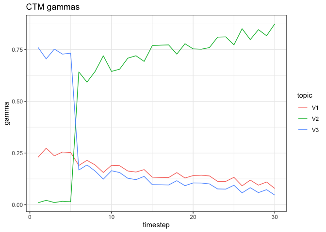
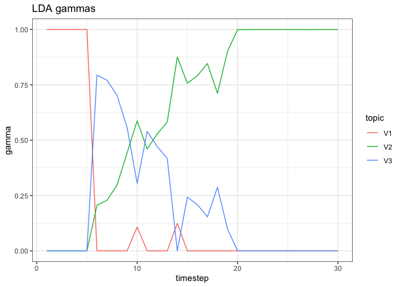
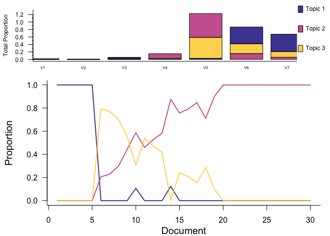

CTM
================

directional changepoint data
============================

``` r
directional_changepoint <- read.csv(here::here("data", "directional_changepoint.csv"), stringsAsFactors = F)


abund_mat <- directional_changepoint %>%
  as.data.frame() %>%
  mutate(year = row_number()) %>%
  tidyr::gather(-year, key = "species", value = "abundance") %>%
  group_by(year) %>%
  mutate(total_abund = sum(abundance)) %>%
  ungroup() %>%
  mutate(rel_abund = abundance / total_abund)

true_ts <- ggplot(data = abund_mat, aes(x = year, y = rel_abund, color = species)) +
  geom_line() +
  theme_bw() +
  theme(legend.position = "none") +
  scale_color_viridis_d() +
  ggtitle("Real TS data")+
  ylim(0,1)

true_ts
```


``` r
directional_changepoint <- as.matrix(directional_changepoint)


CTM_2 <- CTM(directional_changepoint, 3, control = list(seed = 4))
CTM_2@beta
```

    ##            [,1]       [,2]      [,3]      [,4]       [,5]       [,6]
    ## [1,]  -5.897385 -14.033690 -4.955455 -3.666565 -3.7065376 -0.1665337
    ## [2,] -11.462135 -77.570743 -3.911312 -2.034439 -0.2173777 -3.3927683
    ## [3,]  -4.409247  -4.735151 -3.303639 -7.312558 -3.8476052 -1.1040663
    ##            [,7]
    ## [1,] -2.3699339
    ## [2,] -4.5116865
    ## [3,] -0.5296904

``` r
LDA_2 <- LDA(directional_changepoint,3, control = list(seed = 4))
LDA_2@beta
```

    ##            [,1]        [,2]      [,3]      [,4]       [,5]       [,6]
    ## [1,]  -4.789655   -4.646554 -3.480560 -4.762154 -3.4770588 -0.8037805
    ## [2,] -27.292350 -154.742223 -3.717052 -2.070064 -0.4562389 -1.8531955
    ## [3,]  -4.684040 -130.246474 -6.364361 -3.967759 -0.5834744 -1.3412394
    ##            [,7]
    ## [1,] -0.7673944
    ## [2,] -2.8282057
    ## [3,] -1.8928424

``` r
ctm_gammas <- CTM_2@gamma %>%
  as.data.frame() %>%
  mutate(timestep = row_number()) %>%
  tidyr::gather(-timestep, key = "topic", value = "gamma")

ggplot(data = ctm_gammas, aes(x = timestep, y = gamma, color = topic)) + 
  geom_line() +
  ggtitle("CTM gammas") + 
  theme_bw()
```



``` r
lda_gammas <- LDA_2@gamma %>%
  as.data.frame() %>%
  mutate(timestep = row_number()) %>%
  tidyr::gather(-timestep, key = "topic", value = "gamma")

ggplot(data = lda_gammas, aes(x = timestep, y = gamma, color = topic)) + 
  geom_line() +
  ggtitle("LDA gammas") + theme_bw()
```



``` r
plot(LDATS::LDA_set_user_seeds(directional_changepoint, 3, 4))
```

    ## Running LDA with 3 topics (seed 4)


