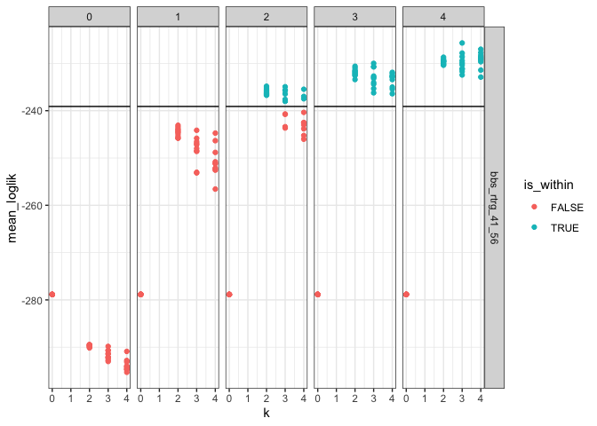
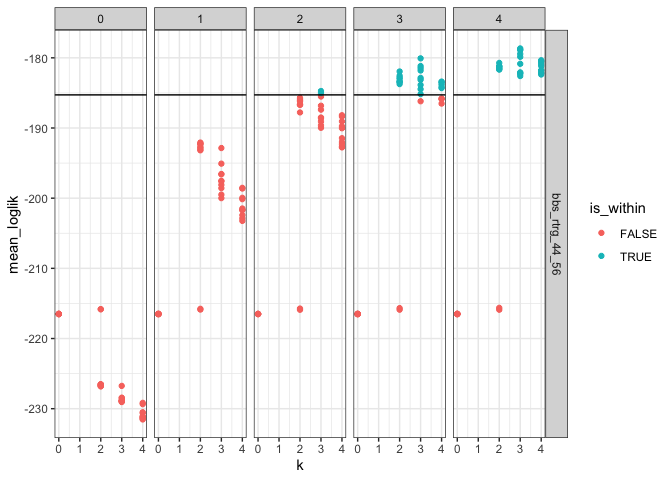
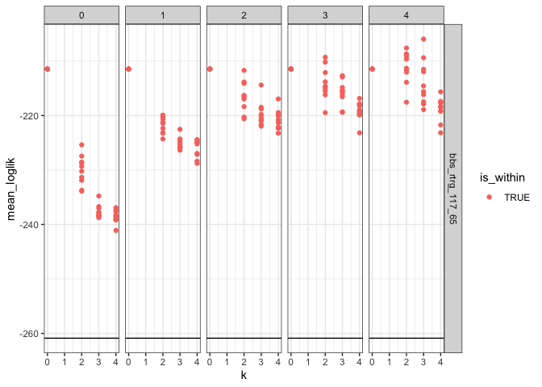
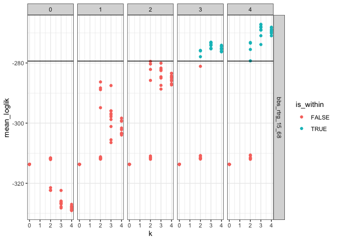
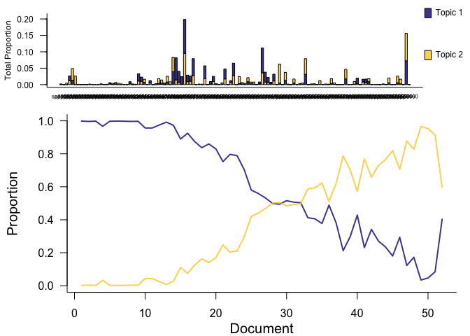
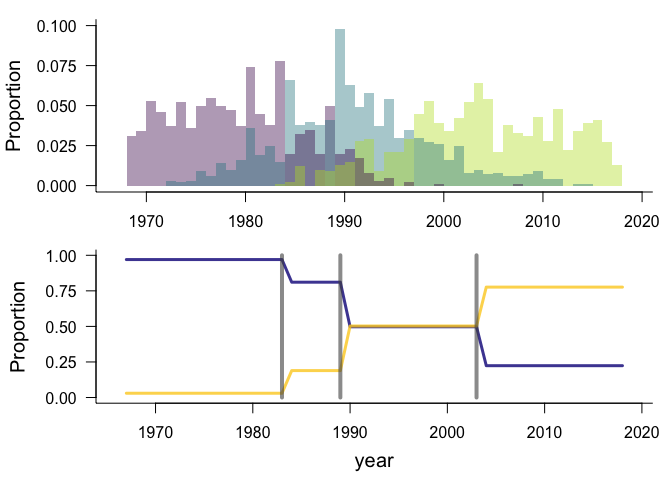

10 sites
================
Renata Diaz
2021-07-08

  - [Specs](#specs)
  - [63\_4](#section)
  - [128\_4](#section-1)
  - [129\_4](#section-2)
  - [213\_4](#section-3)
  - [102\_45](#section-4)
  - [41\_56](#section-5)
  - [44\_56](#section-6)
  - [117\_65](#section-7)
  - [15\_68](#section-8)
  - [22\_68](#section-9)

## Specs

``` r
  ldats_fit = target(fit_ldats_crossval(dataset, buffer = 2, k = ks, lda_seed = seeds, cpts = cpts, nit = 100),
                       transform = cross(
                         dataset = !!rlang::syms(datasets$target),
                         ks = !!c(0,2:4),
                         seeds = !!seq(2, 20, by = 2),
                         cpts = !!c(0:4),
                         return_full = F,
                         return_fits = F,
                         summarize_ll = F
                       ))
)
```

## 63\_4

    ## Joining, by = "dat_name"

<!-- -->

    ## Joining, by = "year"

    ## Joining, by = "cpt"

    ## Joining, by = "year"

    ## Joining, by = c("year", "species")

<div class="kable-table">

| k | lda\_seed | cpts | nit | mean\_loglik | se\_loglik | dat\_name        |    Mean | Median | Mode | Lower\_95% | Upper\_95% |   SD | MCMCerr |   AC10 |      ESS | cpt | nyears | width | width\_ratio | modal\_estimate | seg\_before | seg\_after | dissimilarity | overall\_r2 | species\_mean\_r2 |
| -: | --------: | ---: | --: | -----------: | ---------: | :--------------- | ------: | -----: | ---: | ---------: | ---------: | ---: | ------: | -----: | -------: | :-- | -----: | ----: | -----------: | --------------: | ----------: | ---------: | ------------: | ----------: | ----------------: |
| 2 |         4 |    1 | 100 |   \-172.9061 |   4.410981 | bbs\_rtrg\_63\_4 | 2003.38 |   2003 | 2004 |       1996 |       2011 | 4.25 |  0.1344 | 0.0164 | 761.7642 | 1   |     25 |    15 |          0.6 |            2004 |           1 |          2 |     0.2162273 |   0.8354658 |          0.789552 |

</div>

<!-- --><!-- -->

## 128\_4

    ## Joining, by = "dat_name"

<!-- -->

    ## Joining, by = "year"

    ## Joining, by = "cpt"

    ## Joining, by = "year"

    ## Joining, by = c("year", "species")

<div class="kable-table">

| k | lda\_seed | cpts | nit | mean\_loglik | se\_loglik | dat\_name         | Mean | Median | Mode | Lower\_95. | Upper\_95. | SD | MCMCerr | AC10 | ESS | cpt | nyears | width | width\_ratio | modal\_estimate | seg\_before | seg\_after | dissimilarity | overall\_r2 | species\_mean\_r2 |
| -: | --------: | ---: | --: | -----------: | ---------: | :---------------- | :--- | :----- | :--- | :--------- | :--------- | :- | :------ | :--- | --: | :-- | -----: | :---- | :----------- | :-------------- | :---------- | :--------- | :------------ | ----------: | ----------------: |
| 0 |         2 |    0 | 100 |   \-169.1066 |   9.442211 | bbs\_rtrg\_128\_4 | NA   | NA     | NA   | NA         | NA         | NA | NA      | NA   |   0 | NA  |     25 | NA    | NA           | NA              | NA          | NA         | NA            |    0.859627 |          0.859627 |

</div>

<!-- --><!-- -->

## 129\_4

    ## Joining, by = "dat_name"

<!-- -->

    ## Joining, by = "year"

    ## Joining, by = "cpt"

    ## Joining, by = "year"

    ## Joining, by = c("year", "species")

<div class="kable-table">

| k | lda\_seed | cpts | nit | mean\_loglik | se\_loglik | dat\_name         | Mean | Median | Mode | Lower\_95. | Upper\_95. | SD | MCMCerr | AC10 | ESS | cpt | nyears | width | width\_ratio | modal\_estimate | seg\_before | seg\_after | dissimilarity | overall\_r2 | species\_mean\_r2 |
| -: | --------: | ---: | --: | -----------: | ---------: | :---------------- | :--- | :----- | :--- | :--------- | :--------- | :- | :------ | :--- | --: | :-- | -----: | :---- | :----------- | :-------------- | :---------- | :--------- | :------------ | ----------: | ----------------: |
| 0 |         2 |    0 | 100 |   \-180.1387 |   7.365618 | bbs\_rtrg\_129\_4 | NA   | NA     | NA   | NA         | NA         | NA | NA      | NA   |   0 | NA  |     24 | NA    | NA           | NA              | NA          | NA         | NA            |   0.8533044 |         0.8533044 |

</div>

<!-- --><!-- -->

## 213\_4

    ## Joining, by = "dat_name"

<!-- -->

    ## Joining, by = "year"

    ## Joining, by = "cpt"

    ## Joining, by = "year"

    ## Joining, by = c("year", "species")

<div class="kable-table">

| k | lda\_seed | cpts | nit | mean\_loglik | se\_loglik | dat\_name         | Mean | Median | Mode | Lower\_95. | Upper\_95. | SD | MCMCerr | AC10 | ESS | cpt | nyears | width | width\_ratio | modal\_estimate | seg\_before | seg\_after | dissimilarity | overall\_r2 | species\_mean\_r2 |
| -: | --------: | ---: | --: | -----------: | ---------: | :---------------- | :--- | :----- | :--- | :--------- | :--------- | :- | :------ | :--- | --: | :-- | -----: | :---- | :----------- | :-------------- | :---------- | :--------- | :------------ | ----------: | ----------------: |
| 0 |         2 |    0 | 100 |   \-112.3292 |   6.947124 | bbs\_rtrg\_213\_4 | NA   | NA     | NA   | NA         | NA         | NA | NA      | NA   |   0 | NA  |     25 | NA    | NA           | NA              | NA          | NA         | NA            |   0.9033163 |         0.9033163 |

</div>

<!-- --><!-- -->

## 102\_45

    ## Joining, by = "dat_name"

<!-- -->

    ## Joining, by = "year"

    ## Joining, by = "cpt"

    ## Joining, by = "year"

    ## Joining, by = c("year", "species")

<div class="kable-table">

| k | lda\_seed | cpts | nit | mean\_loglik | se\_loglik | dat\_name          |    Mean | Median | Mode | Lower\_95% | Upper\_95% |   SD | MCMCerr |  AC10 |      ESS | cpt | nyears | width | width\_ratio | modal\_estimate | seg\_before | seg\_after | dissimilarity | overall\_r2 | species\_mean\_r2 |
| -: | --------: | ---: | --: | -----------: | ---------: | :----------------- | ------: | -----: | ---: | ---------: | ---------: | ---: | ------: | ----: | -------: | :-- | -----: | ----: | -----------: | --------------: | ----------: | ---------: | ------------: | ----------: | ----------------: |
| 2 |         8 |    1 | 100 |   \-272.4341 |   14.15777 | bbs\_rtrg\_102\_45 | 1999.71 |   1999 | 1998 |       1997 |       2004 | 2.29 |  0.0724 | 0.069 | 309.3292 | 1   |     30 |     7 |    0.2333333 |            1998 |           1 |          2 |     0.3050896 |    0.864444 |         0.6565895 |

</div>

<!-- --><!-- -->

## 41\_56

    ## Joining, by = "dat_name"

<!-- -->

    ## Joining, by = "year"

    ## Joining, by = "cpt"

    ## Joining, by = "year"

    ## Joining, by = c("year", "species")

<div class="kable-table">

| k | lda\_seed | cpts | nit | mean\_loglik | se\_loglik | dat\_name         |    Mean | Median | Mode | Lower\_95% | Upper\_95% |   SD | MCMCerr |   AC10 |      ESS | cpt | nyears | width | width\_ratio | modal\_estimate | seg\_before | seg\_after | dissimilarity | overall\_r2 | species\_mean\_r2 |
| -: | --------: | ---: | --: | -----------: | ---------: | :---------------- | ------: | -----: | ---: | ---------: | ---------: | ---: | ------: | -----: | -------: | :-- | -----: | ----: | -----------: | --------------: | ----------: | ---------: | ------------: | ----------: | ----------------: |
| 2 |         2 |    1 | 100 |   \-243.0851 |   7.155198 | bbs\_rtrg\_41\_56 | 1991.12 |   1991 | 1991 |       1984 |       1999 | 4.09 |  0.1293 | 0.0205 | 539.1642 | 1   |     53 |    15 |    0.2830189 |            1991 |           1 |          2 |     0.2610619 |   0.8402719 |          0.760591 |

</div>

<!-- --><!-- -->

## 44\_56

    ## Joining, by = "dat_name"

<!-- -->

    ## Joining, by = "year"

    ## Joining, by = "cpt"

    ## Joining, by = "year"

    ## Joining, by = c("year", "species")

<div class="kable-table">

| k | lda\_seed | cpts | nit | mean\_loglik | se\_loglik | dat\_name         |    Mean | Median | Mode | Lower\_95% | Upper\_95% |   SD | MCMCerr |   AC10 |      ESS | cpt | nyears | width | width\_ratio | modal\_estimate | seg\_before | seg\_after | dissimilarity | overall\_r2 | species\_mean\_r2 |
| -: | --------: | ---: | --: | -----------: | ---------: | :---------------- | ------: | -----: | ---: | ---------: | ---------: | ---: | ------: | -----: | -------: | :-- | -----: | ----: | -----------: | --------------: | ----------: | ---------: | ------------: | ----------: | ----------------: |
| 2 |        16 |    2 | 100 |   \-185.7043 |   3.704871 | bbs\_rtrg\_44\_56 | 1987.22 |   1987 | 1986 |       1978 |       1995 | 4.18 |  0.1322 | 0.0026 | 528.5929 | 1   |     44 |    17 |    0.3863636 |            1987 |           1 |          2 |     0.1985847 |    0.843037 |         0.7489043 |
| 2 |        16 |    2 | 100 |   \-185.7043 |   3.704871 | bbs\_rtrg\_44\_56 | 1999.54 |   1999 | 1998 |       1988 |       2009 | 5.57 |  0.1761 | 0.0978 | 230.9566 | 2   |     44 |    21 |    0.4772727 |            1998 |           2 |          3 |     0.1641009 |    0.843037 |         0.7489043 |

</div>

<!-- --><!-- -->

## 117\_65

    ## Joining, by = "dat_name"

<!-- -->

    ## Joining, by = "year"

    ## Joining, by = "cpt"

    ## Joining, by = "year"

    ## Joining, by = c("year", "species")

<div class="kable-table">

| k | lda\_seed | cpts | nit | mean\_loglik | se\_loglik | dat\_name          | Mean | Median | Mode | Lower\_95. | Upper\_95. | SD | MCMCerr | AC10 | ESS | cpt | nyears | width | width\_ratio | modal\_estimate | seg\_before | seg\_after | dissimilarity | overall\_r2 | species\_mean\_r2 |
| -: | --------: | ---: | --: | -----------: | ---------: | :----------------- | :--- | :----- | :--- | :--------- | :--------- | :- | :------ | :--- | --: | :-- | -----: | :---- | :----------- | :-------------- | :---------- | :--------- | :------------ | ----------: | ----------------: |
| 0 |         2 |    0 | 100 |   \-211.4607 |    26.9728 | bbs\_rtrg\_117\_65 | NA   | NA     | NA   | NA         | NA         | NA | NA      | NA   |   0 | NA  |     21 | NA    | NA           | NA              | NA          | NA         | NA            |   0.8636955 |         0.8636955 |

</div>

<!-- --><!-- -->

## 15\_68

    ## Joining, by = "dat_name"

<!-- -->

    ## Joining, by = "year"

    ## Joining, by = "cpt"

    ## Joining, by = "year"

    ## Joining, by = c("year", "species")

<div class="kable-table">

| k | lda\_seed | cpts | nit | mean\_loglik | se\_loglik | dat\_name         |    Mean | Median | Mode | Lower\_95% | Upper\_95% |   SD | MCMCerr |     AC10 |      ESS | cpt | nyears | width | width\_ratio | modal\_estimate | seg\_before | seg\_after | dissimilarity | overall\_r2 | species\_mean\_r2 |
| -: | --------: | ---: | --: | -----------: | ---------: | :---------------- | ------: | -----: | ---: | ---------: | ---------: | ---: | ------: | -------: | -------: | :-- | -----: | ----: | -----------: | --------------: | ----------: | ---------: | ------------: | ----------: | ----------------: |
| 2 |         6 |    1 | 100 |   \-286.3023 |   6.909513 | bbs\_rtrg\_15\_68 | 1990.16 |   1990 | 1990 |       1981 |       1999 | 4.62 |  0.1461 | \-0.0249 | 574.9912 | 1   |     52 |    18 |    0.3461538 |            1990 |           1 |          2 |     0.1939803 |   0.8757385 |          0.841843 |

</div>

<!-- --><!-- -->

## 22\_68

    ## Joining, by = "dat_name"

<!-- -->

    ## Joining, by = "year"

    ## Joining, by = "cpt"

    ## Joining, by = "year"

    ## Joining, by = c("year", "species")

<div class="kable-table">

| k | lda\_seed | cpts | nit | mean\_loglik | se\_loglik | dat\_name         | Mean | Median | Mode | Lower\_95. | Upper\_95. | SD | MCMCerr | AC10 | ESS | cpt | nyears | width | width\_ratio | modal\_estimate | seg\_before | seg\_after | dissimilarity | overall\_r2 | species\_mean\_r2 |
| -: | --------: | ---: | --: | -----------: | ---------: | :---------------- | :--- | :----- | :--- | :--------- | :--------- | :- | :------ | :--- | --: | :-- | -----: | :---- | :----------- | :-------------- | :---------- | :--------- | :------------ | ----------: | ----------------: |
| 0 |         2 |    0 | 100 |   \-190.6427 |    6.72621 | bbs\_rtrg\_22\_68 | NA   | NA     | NA   | NA         | NA         | NA | NA      | NA   |   0 | NA  |     51 | NA    | NA           | NA              | NA          | NA         | NA            |   0.8808034 |         0.8808034 |

</div>

<!-- --><!-- -->
