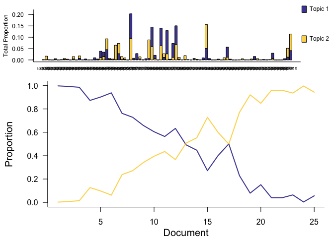
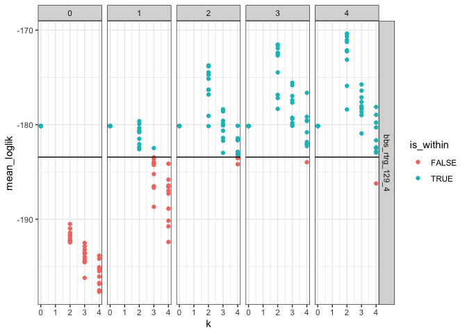
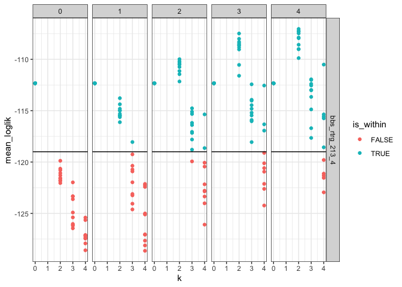
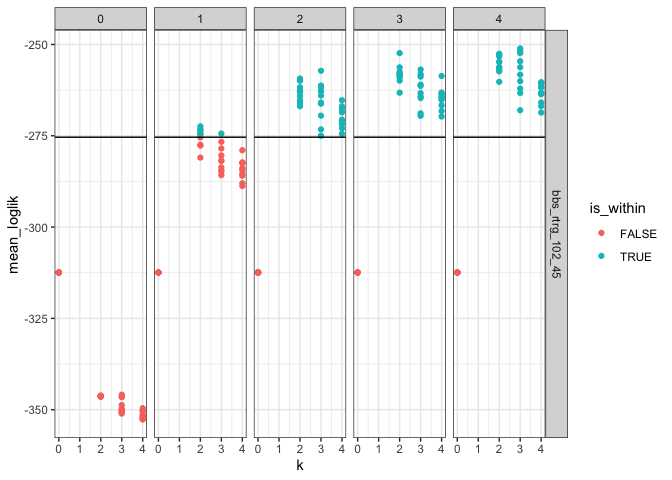
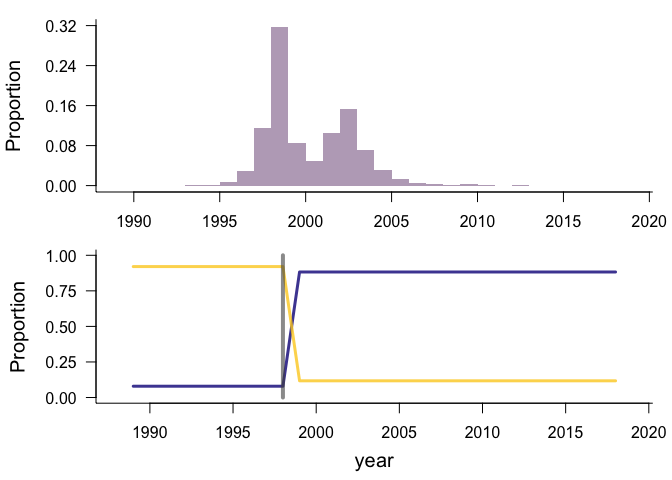
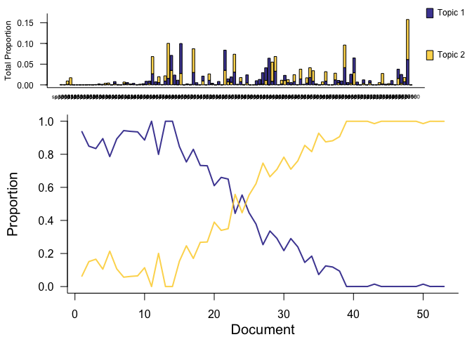
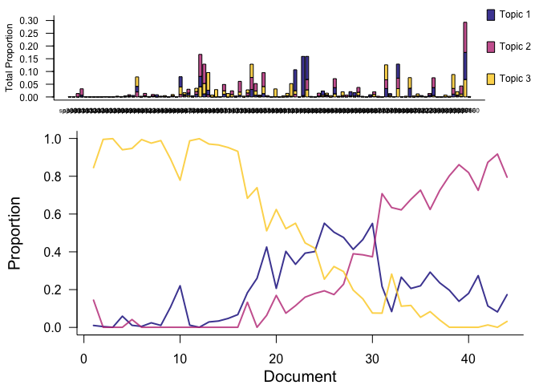
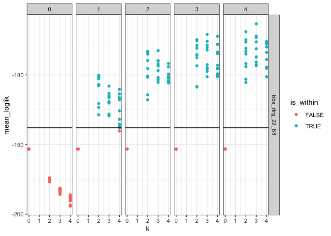

10 sites
================
Renata Diaz
2021-07-11

  - [Specs](#specs)
  - [63\_4](#section)
  - [128\_4](#section-1)
  - [129\_4](#section-2)
  - [213\_4](#section-3)
  - [102\_45](#section-4)
  - [41\_56](#section-5)
  - [44\_56](#section-6)
  - [117\_65](#section-7)
  - [15\_68](#section-8)
  - [22\_68](#section-9)

## Specs

``` r
  ldats_fit = target(fit_ldats_crossval(dataset, buffer = 2, k = ks, lda_seed = seeds, cpts = cpts, nit = 100),
                       transform = cross(
                         dataset = !!rlang::syms(datasets$target),
                         ks = !!c(0,2:4),
                         seeds = !!seq(2, 20, by = 2),
                         cpts = !!c(0:4),
                         return_full = F,
                         return_fits = F,
                         summarize_ll = F
                       ))
)
```

## 63\_4

    ## Joining, by = "dat_name"

<!-- -->

    ## Joining, by = "year"

    ## Joining, by = "cpt"

    ## Joining, by = "year"

    ## Joining, by = c("year", "species")

<div class="kable-table">

| k | lda\_seed | cpts | nit | mean\_loglik | se\_loglik | dat\_name        |    Mean | Median | Mode | Lower\_95% | Upper\_95% |   SD | MCMCerr |   AC10 |      ESS | cpt | nyears | width | width\_ratio | modal\_estimate | seg\_before | seg\_after | dissimilarity | overall\_r2 | species\_mean\_r2 |
| -: | --------: | ---: | --: | -----------: | ---------: | :--------------- | ------: | -----: | ---: | ---------: | ---------: | ---: | ------: | -----: | -------: | :-- | -----: | ----: | -----------: | --------------: | ----------: | ---------: | ------------: | ----------: | ----------------: |
| 2 |        14 |    2 | 100 |   \-165.7594 |   4.507601 | bbs\_rtrg\_63\_4 | 2000.26 |   2000 | 2000 |       1994 |       2008 | 4.03 |  0.1274 | 0.0325 | 380.9564 | 1   |     25 |    14 |         0.56 |            2000 |           1 |          2 |     0.1446976 |   0.8508927 |          0.789552 |
| 2 |        14 |    2 | 100 |   \-165.7594 |   4.507601 | bbs\_rtrg\_63\_4 | 2009.02 |   2009 | 2009 |       2003 |       2016 | 3.67 |  0.1161 | 0.0595 | 171.6412 | 2   |     25 |    13 |         0.52 |            2009 |           2 |          3 |     0.1581613 |   0.8508927 |          0.789552 |

</div>

<!-- --><!-- -->

## 128\_4

    ## Joining, by = "dat_name"

<!-- -->

    ## Joining, by = "year"

    ## Joining, by = "cpt"

    ## Joining, by = "year"

    ## Joining, by = c("year", "species")

<div class="kable-table">

| k | lda\_seed | cpts | nit | mean\_loglik | se\_loglik | dat\_name         | Mean | Median | Mode | Lower\_95. | Upper\_95. | SD | MCMCerr | AC10 | ESS | cpt | nyears | width | width\_ratio | modal\_estimate | seg\_before | seg\_after | dissimilarity | overall\_r2 | species\_mean\_r2 |
| -: | --------: | ---: | --: | -----------: | ---------: | :---------------- | :--- | :----- | :--- | :--------- | :--------- | :- | :------ | :--- | --: | :-- | -----: | :---- | :----------- | :-------------- | :---------- | :--------- | :------------ | ----------: | ----------------: |
| 0 |         2 |    0 | 100 |   \-169.1066 |   9.442211 | bbs\_rtrg\_128\_4 | NA   | NA     | NA   | NA         | NA         | NA | NA      | NA   |   0 | NA  |     25 | NA    | NA           | NA              | NA          | NA         | NA            |    0.859627 |          0.859627 |

</div>

<!-- --><!-- -->

## 129\_4

    ## Joining, by = "dat_name"

<!-- -->

    ## Joining, by = "year"

    ## Joining, by = "cpt"

    ## Joining, by = "year"

    ## Joining, by = c("year", "species")

<div class="kable-table">

| k | lda\_seed | cpts | nit | mean\_loglik | se\_loglik | dat\_name         | Mean | Median | Mode | Lower\_95. | Upper\_95. | SD | MCMCerr | AC10 | ESS | cpt | nyears | width | width\_ratio | modal\_estimate | seg\_before | seg\_after | dissimilarity | overall\_r2 | species\_mean\_r2 |
| -: | --------: | ---: | --: | -----------: | ---------: | :---------------- | :--- | :----- | :--- | :--------- | :--------- | :- | :------ | :--- | --: | :-- | -----: | :---- | :----------- | :-------------- | :---------- | :--------- | :------------ | ----------: | ----------------: |
| 0 |         2 |    0 | 100 |   \-180.1387 |   7.365618 | bbs\_rtrg\_129\_4 | NA   | NA     | NA   | NA         | NA         | NA | NA      | NA   |   0 | NA  |     24 | NA    | NA           | NA              | NA          | NA         | NA            |   0.8533044 |         0.8533044 |

</div>

<!-- --><!-- -->

## 213\_4

    ## Joining, by = "dat_name"

<!-- -->

    ## Joining, by = "year"

    ## Joining, by = "cpt"

    ## Joining, by = "year"

    ## Joining, by = c("year", "species")

<div class="kable-table">

| k | lda\_seed | cpts | nit | mean\_loglik | se\_loglik | dat\_name         | Mean | Median | Mode | Lower\_95. | Upper\_95. | SD | MCMCerr | AC10 | ESS | cpt | nyears | width | width\_ratio | modal\_estimate | seg\_before | seg\_after | dissimilarity | overall\_r2 | species\_mean\_r2 |
| -: | --------: | ---: | --: | -----------: | ---------: | :---------------- | :--- | :----- | :--- | :--------- | :--------- | :- | :------ | :--- | --: | :-- | -----: | :---- | :----------- | :-------------- | :---------- | :--------- | :------------ | ----------: | ----------------: |
| 0 |         2 |    0 | 100 |   \-112.3292 |   6.947124 | bbs\_rtrg\_213\_4 | NA   | NA     | NA   | NA         | NA         | NA | NA      | NA   |   0 | NA  |     25 | NA    | NA           | NA              | NA          | NA         | NA            |   0.9033163 |         0.9033163 |

</div>

<!-- --><!-- -->

## 102\_45

    ## Joining, by = "dat_name"

<!-- -->

    ## Joining, by = "year"

    ## Joining, by = "cpt"

    ## Joining, by = "year"

    ## Joining, by = c("year", "species")

<div class="kable-table">

| k | lda\_seed | cpts | nit | mean\_loglik | se\_loglik | dat\_name          |    Mean | Median | Mode | Lower\_95% | Upper\_95% |   SD | MCMCerr |   AC10 |      ESS | cpt | nyears | width | width\_ratio | modal\_estimate | seg\_before | seg\_after | dissimilarity | overall\_r2 | species\_mean\_r2 |
| -: | --------: | ---: | --: | -----------: | ---------: | :----------------- | ------: | -----: | ---: | ---------: | ---------: | ---: | ------: | -----: | -------: | :-- | -----: | ----: | -----------: | --------------: | ----------: | ---------: | ------------: | ----------: | ----------------: |
| 2 |         8 |    1 | 100 |   \-272.4341 |   14.15777 | bbs\_rtrg\_102\_45 | 1999.71 |   1999 | 1998 |       1996 |       2004 | 2.51 |  0.0794 | 0.0554 | 265.7651 | 1   |     30 |     8 |    0.2666667 |            1998 |           1 |          2 |     0.3050896 |    0.864444 |         0.6565895 |

</div>

<!-- --><!-- -->

## 41\_56

    ## Joining, by = "dat_name"

<!-- -->

    ## Joining, by = "year"

    ## Joining, by = "cpt"

    ## Joining, by = "year"

    ## Joining, by = c("year", "species")

<div class="kable-table">

| k | lda\_seed | cpts | nit | mean\_loglik | se\_loglik | dat\_name         |    Mean | Median | Mode | Lower\_95% | Upper\_95% |   SD | MCMCerr |   AC10 |      ESS | cpt | nyears | width | width\_ratio | modal\_estimate | seg\_before | seg\_after | dissimilarity | overall\_r2 | species\_mean\_r2 |
| -: | --------: | ---: | --: | -----------: | ---------: | :---------------- | ------: | -----: | ---: | ---------: | ---------: | ---: | ------: | -----: | -------: | :-- | -----: | ----: | -----------: | --------------: | ----------: | ---------: | ------------: | ----------: | ----------------: |
| 2 |         8 |    2 | 100 |   \-234.8347 |   6.784764 | bbs\_rtrg\_41\_56 | 1984.89 |   1986 | 1987 |       1971 |       1994 | 5.60 |  0.1771 | 0.0396 | 408.0390 | 1   |     53 |    23 |    0.4339623 |            1987 |           1 |          2 |     0.2276335 |   0.8487288 |          0.760591 |
| 2 |         8 |    2 | 100 |   \-234.8347 |   6.784764 | bbs\_rtrg\_41\_56 | 1999.68 |   1999 | 2003 |       1987 |       2014 | 7.15 |  0.2261 | 0.0159 | 515.2136 | 2   |     53 |    27 |    0.5094340 |            2004 |           2 |          3 |     0.0933377 |   0.8487288 |          0.760591 |

</div>

<!-- --><!-- -->

## 44\_56

    ## Joining, by = "dat_name"

<!-- -->

    ## Joining, by = "year"

    ## Joining, by = "cpt"

    ## Joining, by = "year"

    ## Joining, by = c("year", "species")

<div class="kable-table">

| k | lda\_seed | cpts | nit | mean\_loglik | se\_loglik | dat\_name         |    Mean | Median | Mode | Lower\_95% | Upper\_95% |   SD | MCMCerr |   AC10 |      ESS | cpt | nyears | width | width\_ratio | modal\_estimate | seg\_before | seg\_after | dissimilarity | overall\_r2 | species\_mean\_r2 |
| -: | --------: | ---: | --: | -----------: | ---------: | :---------------- | ------: | -----: | ---: | ---------: | ---------: | ---: | ------: | -----: | -------: | :-- | -----: | ----: | -----------: | --------------: | ----------: | ---------: | ------------: | ----------: | ----------------: |
| 3 |        12 |    2 | 100 |   \-184.7285 |   3.518338 | bbs\_rtrg\_44\_56 | 1987.10 |   1987 | 1986 |       1977 |       1997 | 4.82 |  0.1524 | 0.0286 | 418.4816 | 1   |     44 |    20 |    0.4545455 |            1986 |           1 |          2 |     0.2017658 |   0.8556224 |         0.7489043 |
| 3 |        12 |    2 | 100 |   \-184.7285 |   3.518338 | bbs\_rtrg\_44\_56 | 1999.65 |   1999 | 1998 |       1991 |       2009 | 4.62 |  0.1461 | 0.0488 | 324.9389 | 2   |     44 |    18 |    0.4090909 |            1998 |           2 |          3 |     0.2247044 |   0.8556224 |         0.7489043 |

</div>

<!-- --><!-- -->

## 117\_65

    ## Joining, by = "dat_name"

<!-- -->

    ## Joining, by = "year"

    ## Joining, by = "cpt"

    ## Joining, by = "year"

    ## Joining, by = c("year", "species")

<div class="kable-table">

| k | lda\_seed | cpts | nit | mean\_loglik | se\_loglik | dat\_name          | Mean | Median | Mode | Lower\_95. | Upper\_95. | SD | MCMCerr | AC10 | ESS | cpt | nyears | width | width\_ratio | modal\_estimate | seg\_before | seg\_after | dissimilarity | overall\_r2 | species\_mean\_r2 |
| -: | --------: | ---: | --: | -----------: | ---------: | :----------------- | :--- | :----- | :--- | :--------- | :--------- | :- | :------ | :--- | --: | :-- | -----: | :---- | :----------- | :-------------- | :---------- | :--------- | :------------ | ----------: | ----------------: |
| 0 |         2 |    0 | 100 |   \-211.4607 |    26.9728 | bbs\_rtrg\_117\_65 | NA   | NA     | NA   | NA         | NA         | NA | NA      | NA   |   0 | NA  |     21 | NA    | NA           | NA              | NA          | NA         | NA            |   0.8636955 |         0.8636955 |

</div>

<!-- --><!-- -->

## 15\_68

    ## Joining, by = "dat_name"

<!-- -->

    ## Joining, by = "year"

    ## Joining, by = "cpt"

    ## Joining, by = "year"

    ## Joining, by = c("year", "species")

<div class="kable-table">

| k | lda\_seed | cpts | nit | mean\_loglik | se\_loglik | dat\_name         |    Mean | Median | Mode | Lower\_95% | Upper\_95% |   SD | MCMCerr |     AC10 |      ESS | cpt | nyears | width | width\_ratio | modal\_estimate | seg\_before | seg\_after | dissimilarity | overall\_r2 | species\_mean\_r2 |
| -: | --------: | ---: | --: | -----------: | ---------: | :---------------- | ------: | -----: | ---: | ---------: | ---------: | ---: | ------: | -------: | -------: | :-- | -----: | ----: | -----------: | --------------: | ----------: | ---------: | ------------: | ----------: | ----------------: |
| 2 |        20 |    3 | 100 |   \-275.8126 |   6.151184 | bbs\_rtrg\_15\_68 | 1978.91 |   1979 | 1983 |       1968 |       1990 | 6.57 |  0.2078 | \-0.0093 | 345.8121 | 1   |     52 |    22 |    0.4230769 |            1977 |           1 |          2 |     0.0399427 |   0.8840877 |          0.841843 |
| 2 |        20 |    3 | 100 |   \-275.8126 |   6.151184 | bbs\_rtrg\_15\_68 | 1990.39 |   1990 | 1989 |       1975 |       2005 | 7.48 |  0.2365 |   0.0578 | 188.8480 | 2   |     52 |    30 |    0.5769231 |            1989 |           2 |          3 |     0.1621584 |   0.8840877 |          0.841843 |
| 2 |        20 |    3 | 100 |   \-275.8126 |   6.151184 | bbs\_rtrg\_15\_68 | 2003.15 |   2003 | 2003 |       1989 |       2016 | 7.90 |  0.2498 |   0.0232 | 295.3596 | 3   |     52 |    27 |    0.5192308 |            2011 |           3 |          4 |     0.0888027 |   0.8840877 |          0.841843 |

</div>

<!-- --><!-- -->

## 22\_68

    ## Joining, by = "dat_name"

<!-- -->

    ## Joining, by = "year"

    ## Joining, by = "cpt"

    ## Joining, by = "year"

    ## Joining, by = c("year", "species")

<div class="kable-table">

| k | lda\_seed | cpts | nit | mean\_loglik | se\_loglik | dat\_name         |    Mean | Median | Mode | Lower\_95% | Upper\_95% |  SD | MCMCerr |   AC10 |      ESS | cpt | nyears | width | width\_ratio | modal\_estimate | seg\_before | seg\_after | dissimilarity | overall\_r2 | species\_mean\_r2 |
| -: | --------: | ---: | --: | -----------: | ---------: | :---------------- | ------: | -----: | ---: | ---------: | ---------: | --: | ------: | -----: | -------: | :-- | -----: | ----: | -----------: | --------------: | ----------: | ---------: | ------------: | ----------: | ----------------: |
| 2 |        14 |    1 | 100 |   \-180.0323 |   7.797625 | bbs\_rtrg\_22\_68 | 1984.29 |   1982 | 1982 |       1974 |       2000 | 6.8 |   0.215 | 0.0011 | 450.0218 | 1   |     51 |    26 |    0.5098039 |            1982 |           1 |          2 |     0.2101003 |   0.9089122 |         0.8808034 |

</div>

<!-- --><!-- -->
