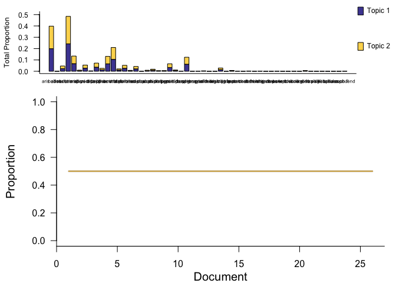

Portal annuals
================
Renata Diaz
2021-07-07

  - [Specs](#specs)
  - [winter](#winter)
  - [summer](#summer)

## Specs

``` r
   methods <- drake::drake_plan(
    ldats_fit = target(fit_ldats_crossval(dataset, buffer = 2, k = ks, lda_seed = seeds, cpts = cpts, nit = 100),
                       transform = cross(
                         dataset = !!rlang::syms(datasets$target),
                         ks = !!c(0,2:5),
                         seeds = !!seq(2, 100, by = 2),
                         cpts = !!c(0:4),
                         return_full = F,
                         return_fits = F,
                         summarize_ll = F
                       )),
```

    ## Joining, by = "dat_name"

<!-- -->

## winter

    ## Joining, by = "year"

    ## Joining, by = "cpt"

    ## Joining, by = "year"

    ## Joining, by = c("year", "species")

<div class="kable-table">

| k | lda\_seed | cpts | nit | mean\_loglik | se\_loglik | dat\_name           |    Mean | Median | Mode | Lower\_95% | Upper\_95% |   SD | MCMCerr |   AC10 |      ESS | cpt | nyears | width | width\_ratio | modal\_estimate | seg\_before | seg\_after | dissimilarity | overall\_r2 | species\_mean\_r2 |
| -: | --------: | ---: | --: | -----------: | ---------: | :------------------ | ------: | -----: | ---: | ---------: | ---------: | ---: | ------: | -----: | -------: | :-- | -----: | ----: | -----------: | --------------: | ----------: | ---------: | ------------: | ----------: | ----------------: |
| 2 |        28 |    2 | 100 |   \-1870.255 |   521.1112 | winter\_CC\_annuals | 1995.13 |   1995 | 1995 |       1990 |       1999 | 2.45 |  0.0775 | 0.0790 | 213.5659 | 1   |     26 |     9 |    0.3461538 |            1997 |           1 |          2 |     0.5990332 |   0.3378945 |         0.2422645 |
| 2 |        28 |    2 | 100 |   \-1870.255 |   521.1112 | winter\_CC\_annuals | 2005.30 |   2005 | 1998 |       1994 |       2017 | 7.02 |  0.2220 | 0.0703 | 223.8941 | 2   |     26 |    23 |    0.8846154 |            2013 |           2 |          3 |     0.0065182 |   0.3378945 |         0.2422645 |

</div>

<!-- --><!-- -->

<div class="kable-table">

| topic | species   |      prop | topic\_rank |
| :---- | :-------- | --------: | ----------: |
| V1    | hapl grac | 0.7648339 |           1 |
| V1    | erio aber | 0.0840134 |           2 |
| V1    | eria diff | 0.0663522 |           3 |
| V1    | vulp octo | 0.0187866 |           4 |
| V2    | erod cicu | 0.2924020 |           1 |
| V2    | astr nutt | 0.1718366 |           2 |
| V2    | chae stev | 0.1367089 |           3 |
| V2    | lesq gord | 0.1090980 |           4 |

</div>

    ## Joining, by = "year"

    ## Joining, by = "cpt"

    ## Joining, by = "year"

    ## Joining, by = c("year", "species")

<div class="kable-table">

| k | lda\_seed | cpts | nit | mean\_loglik | se\_loglik | dat\_name           |    Mean | Median | Mode | Lower\_95% | Upper\_95% |   SD | MCMCerr |   AC10 |      ESS | cpt | nyears | width | width\_ratio | modal\_estimate | seg\_before | seg\_after | dissimilarity | overall\_r2 | species\_mean\_r2 |
| -: | --------: | ---: | --: | -----------: | ---------: | :------------------ | ------: | -----: | ---: | ---------: | ---------: | ---: | ------: | -----: | -------: | :-- | -----: | ----: | -----------: | --------------: | ----------: | ---------: | ------------: | ----------: | ----------------: |
| 2 |        94 |    2 | 100 |   \-2519.017 |   756.2338 | winter\_EE\_annuals | 1994.63 |   1994 | 1993 |       1990 |       2000 | 2.95 |  0.0933 | 0.0816 | 303.9290 | 1   |     27 |    10 |    0.3703704 |            1993 |           1 |          2 |     0.3628510 |   0.5369984 |         0.3921912 |
| 2 |        94 |    2 | 100 |   \-2519.017 |   756.2338 | winter\_EE\_annuals | 2005.30 |   2006 | 1997 |       1994 |       2018 | 7.59 |  0.2400 | 0.0671 | 171.5457 | 2   |     27 |    24 |    0.8888889 |            1995 |           2 |          3 |     0.2327235 |   0.5369984 |         0.3921912 |

</div>

<!-- --><!-- -->

<div class="kable-table">

| topic | species   |      prop | topic\_rank |
| :---- | :-------- | --------: | ----------: |
| V1    | erod cicu | 0.4411626 |           1 |
| V1    | astr nutt | 0.2266369 |           2 |
| V1    | lesq gord | 0.0740993 |           3 |
| V1    | erio aber | 0.0550191 |           4 |
| V2    | hapl grac | 0.7581819 |           1 |
| V2    | eria diff | 0.0807321 |           2 |
| V2    | erio aber | 0.0464280 |           3 |
| V2    | astr nutt | 0.0309030 |           4 |

</div>

## summer

    ## Joining, by = "year"

    ## Joining, by = "cpt"

    ## Joining, by = "year"

    ## Joining, by = c("year", "species")

<div class="kable-table">

| k | lda\_seed | cpts | nit | mean\_loglik | se\_loglik | dat\_name           | Mean | Median | Mode | Lower\_95. | Upper\_95. | SD | MCMCerr | AC10 | ESS | cpt | nyears | width | width\_ratio | modal\_estimate | seg\_before | seg\_after | dissimilarity | overall\_r2 | species\_mean\_r2 |
| -: | --------: | ---: | --: | -----------: | ---------: | :------------------ | :--- | :----- | :--- | :--------- | :--------- | :- | :------ | :--- | --: | :-- | -----: | :---- | :----------- | :-------------- | :---------- | :--------- | :------------ | ----------: | ----------------: |
| 0 |         2 |    0 | 100 |   \-3297.154 |   1231.419 | summer\_CC\_annuals | NA   | NA     | NA   | NA         | NA         | NA | NA      | NA   |   0 | NA  |     25 | NA    | NA           | NA              | NA          | NA         | NA            |   0.3089993 |         0.3089993 |

</div>

<!-- --><!-- -->

    ## Joining, by = "year"

    ## Joining, by = "cpt"

    ## Joining, by = "year"

    ## Joining, by = c("year", "species")

<div class="kable-table">

| k | lda\_seed | cpts | nit | mean\_loglik | se\_loglik | dat\_name           | Mean | Median | Mode | Lower\_95. | Upper\_95. | SD | MCMCerr | AC10 | ESS | cpt | nyears | width | width\_ratio | modal\_estimate | seg\_before | seg\_after | dissimilarity | overall\_r2 | species\_mean\_r2 |
| -: | --------: | ---: | --: | -----------: | ---------: | :------------------ | :--- | :----- | :--- | :--------- | :--------- | :- | :------ | :--- | --: | :-- | -----: | :---- | :----------- | :-------------- | :---------- | :--------- | :------------ | ----------: | ----------------: |
| 0 |         2 |    0 | 100 |    \-3833.49 |   1090.141 | summer\_EE\_annuals | NA   | NA     | NA   | NA         | NA         | NA | NA      | NA   |   0 | NA  |     26 | NA    | NA           | NA              | NA          | NA         | NA            |   0.3459892 |         0.3459892 |

</div>

<!-- --><!-- -->
