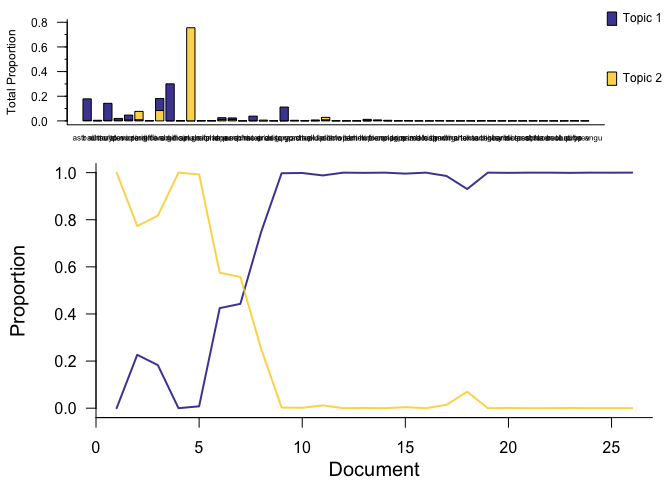

Portal annuals
================
Renata Diaz
2021-05-24

  - [Specs](#specs)
  - [winter](#winter)
  - [summer](#summer)

## Specs

``` r
methods <- drake::drake_plan(
  ldats_fit = target(fit_ldats_crossval(dataset, buffer = 2, k = ks, lda_seed = seeds, cpts = cpts, nit = 500),
                     transform = cross(
                       dataset = !!rlang::syms(datasets$target),
                       ks = !!c(2:5),
                       seeds = !!seq(2, 4, by = 2),
                       cpts = !!c(0:4),
                       return_full = F,
                       return_fits = F,
                       summarize_ll = F
                     )))
```

    ## Joining, by = "dat_name"

<!-- -->

## winter

    ## Joining, by = "year"

    ## Joining, by = "cpt"

    ## Joining, by = "year"

    ## Joining, by = c("year", "species")

<div class="kable-table">

| k | lda\_seed | cpts | nit | mean\_loglik | se\_loglik | dat\_name           |    Mean | Median | Mode | Lower\_95% | Upper\_95% |   SD | MCMCerr |   AC10 |      ESS | cpt | nyears | width | width\_ratio | modal\_estimate | seg\_before | seg\_after | dissimilarity | overall\_r2 | species\_mean\_r2 |
| -: | --------: | ---: | --: | -----------: | ---------: | :------------------ | ------: | -----: | ---: | ---------: | ---------: | ---: | ------: | -----: | -------: | :-- | -----: | ----: | -----------: | --------------: | ----------: | ---------: | ------------: | ----------: | ----------------: |
| 2 |         4 |    2 | 500 |   \-2091.411 |   647.0686 | winter\_CC\_annuals | 1994.87 |   1995 | 1994 |       1990 |       1999 | 2.43 |  0.0768 | 0.0361 | 213.8638 | 1   |     26 |     9 |    0.3461538 |            1994 |           1 |          2 |     0.4120024 |     0.35676 |         0.2422645 |
| 2 |         4 |    2 | 500 |   \-2091.411 |   647.0686 | winter\_CC\_annuals | 2004.73 |   2004 | 1997 |       1995 |       2017 | 7.21 |  0.2280 | 0.0572 | 287.9303 | 2   |     26 |    22 |    0.8461538 |            1997 |           2 |          3 |     0.2932767 |     0.35676 |         0.2422645 |

</div>

<!-- --><!-- -->

## summer

    ## Joining, by = "year"

    ## Joining, by = "cpt"

    ## Joining, by = "year"

    ## Joining, by = c("year", "species")

<div class="kable-table">

| k | lda\_seed | cpts | nit | mean\_loglik | se\_loglik | dat\_name           | Mean | Median | Mode | Lower\_95. | Upper\_95. | SD | MCMCerr | AC10 | ESS | cpt | nyears | width | width\_ratio | modal\_estimate | seg\_before | seg\_after | dissimilarity | overall\_r2 | species\_mean\_r2 |
| -: | --------: | ---: | --: | -----------: | ---------: | :------------------ | :--- | :----- | :--- | :--------- | :--------- | :- | :------ | :--- | --: | :-- | -----: | :---- | :----------- | :-------------- | :---------- | :--------- | :------------ | ----------: | ----------------: |
| 2 |         2 |    0 | 500 |   \-3151.713 |   1201.655 | summer\_CC\_annuals | NA   | NA     | NA   | NA         | NA         | NA | NA      | NA   |   0 | NA  |     25 | NA    | NA           | NA              | NA          | NA         | NA            |   0.2460731 |         0.3089993 |

</div>

<!-- --><!-- -->
