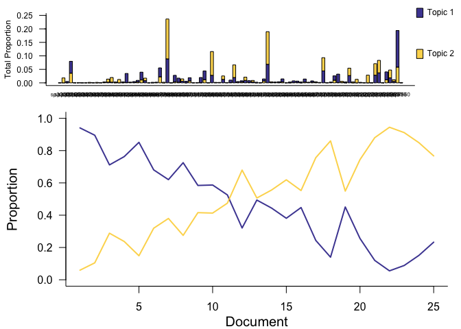
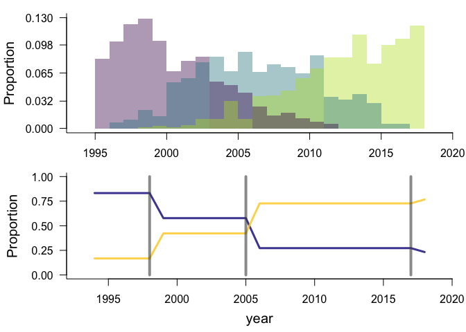
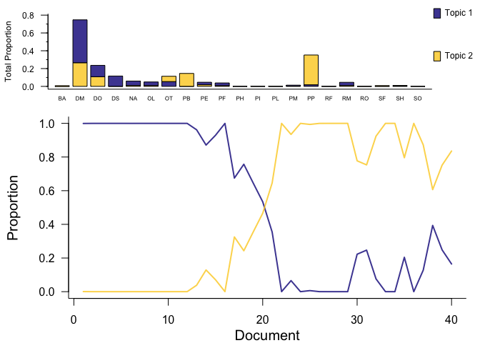

Portal rats + Hartland birds
================
Renata Diaz
2021-05-24

  - [Specs](#specs)
  - [BBS](#bbs)
  - [Portal](#portal)

## Specs

``` r
methods <- drake::drake_plan(
  ldats_fit = target(fit_ldats_crossval(dataset, buffer = 2, k = ks, lda_seed = seeds, cpts = cpts, nit = 100),
                     transform = cross(
                       dataset = !!rlang::syms(datasets$target),
                       ks = !!c(2:5),
                       seeds = !!seq(2, 20, by = 2),
                       cpts = !!c(0:4),
                       return_full = F,
                       return_fits = F,
                       summarize_ll = F
                     ))
)
```

    ## Joining, by = "dat_name"

<!-- -->

## BBS

    ## Joining, by = "year"

    ## Joining, by = "cpt"

    ## Joining, by = "year"

    ## Joining, by = c("year", "species")

<div class="kable-table">

| k | lda\_seed | cpts | nit | mean\_loglik | se\_loglik | dat\_name          |    Mean | Median | Mode | Lower\_95% | Upper\_95% |   SD | MCMCerr |     AC10 |      ESS | cpt | nyears | width | width\_ratio | modal\_estimate | seg\_before | seg\_after | dissimilarity | overall\_r2 | species\_mean\_r2 |
| -: | --------: | ---: | --: | -----------: | ---------: | :----------------- | ------: | -----: | ---: | ---------: | ---------: | ---: | ------: | -------: | -------: | :-- | -----: | ----: | -----------: | --------------: | ----------: | ---------: | ------------: | ----------: | ----------------: |
| 2 |        10 |    3 | 100 |   \-156.6049 |     2.4848 | bbs\_rtrg\_102\_18 | 1999.58 | 1998.5 | 1997 |       1995 |       2007 | 3.89 |  0.1230 | \-0.0300 | 293.7215 | 1   |     25 |    12 |         0.48 |            1996 |           1 |          2 |     0.0226622 |   0.9127335 |         0.8895563 |
| 2 |        10 |    3 | 100 |   \-156.6049 |     2.4848 | bbs\_rtrg\_102\_18 | 2005.43 | 2005.0 | 2002 |       1996 |       2013 | 4.61 |  0.1458 |   0.0483 | 102.0001 | 2   |     25 |    17 |         0.68 |            1999 |           2 |          3 |     0.0946593 |   0.9127335 |         0.8895563 |
| 2 |        10 |    3 | 100 |   \-156.6049 |     2.4848 | bbs\_rtrg\_102\_18 | 2011.37 | 2012.0 | 2017 |       2004 |       2017 | 4.26 |  0.1347 |   0.0017 | 283.9146 | 3   |     25 |    13 |         0.52 |            2010 |           3 |          4 |     0.1144688 |   0.9127335 |         0.8895563 |

</div>

<!-- --><!-- -->

## Portal

    ## Joining, by = "year"

    ## Joining, by = "cpt"

    ## Joining, by = "year"

    ## Joining, by = c("year", "species")

<div class="kable-table">

| k | lda\_seed | cpts | nit | mean\_loglik | se\_loglik | dat\_name        |    Mean | Median | Mode | Lower\_95% | Upper\_95% |   SD | MCMCerr |   AC10 |     ESS | cpt | nyears | width | width\_ratio | modal\_estimate | seg\_before | seg\_after | dissimilarity | overall\_r2 | species\_mean\_r2 |
| -: | --------: | ---: | --: | -----------: | ---------: | :--------------- | ------: | -----: | ---: | ---------: | ---------: | ---: | ------: | -----: | ------: | :-- | -----: | ----: | -----------: | --------------: | ----------: | ---------: | ------------: | ----------: | ----------------: |
| 2 |         8 |    1 | 100 |   \-205.9714 |   17.45038 | control\_rodents | 1996.57 |   1997 | 1997 |       1993 |       1999 | 1.85 |  0.0585 | 0.0537 | 481.997 | 1   |     40 |     6 |         0.15 |            1997 |           1 |          2 |     0.4010865 |   0.8251993 |         0.7036599 |

</div>

<!-- --><!-- -->
