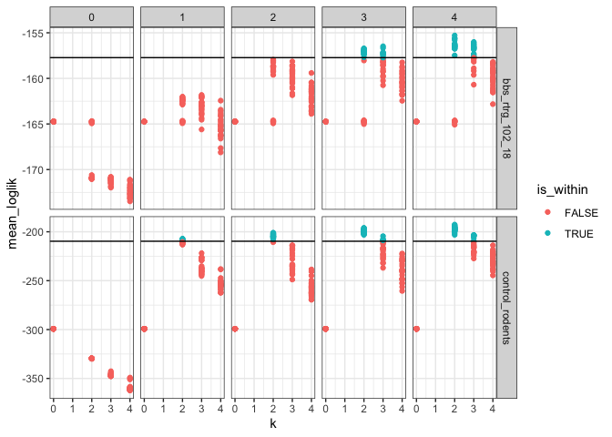

Portal rats + Hartland birds
================
Renata Diaz
2021-06-08

  - [Specs](#specs)
  - [BBS](#bbs)
  - [Portal](#portal)

## Specs

``` r
  ldats_fit = target(fit_ldats_crossval(dataset, buffer = 2, k = ks, lda_seed = seeds, cpts = cpts, nit = 100),
                       transform = cross(
                         dataset = !!rlang::syms(datasets$target),
                         ks = !!c(0,2:4),
                         seeds = !!seq(2, 50, by = 2),
                         cpts = !!c(0:4),
                         return_full = F,
                         return_fits = F,
                         summarize_ll = F
                       ))
)
```

    ## Joining, by = "dat_name"

<!-- -->

## BBS

    ## Joining, by = "year"

    ## Joining, by = "cpt"

    ## Joining, by = "year"

    ## Joining, by = c("year", "species")

<div class="kable-table">

| k | lda\_seed | cpts | nit | mean\_loglik | se\_loglik | dat\_name          |    Mean | Median | Mode | Lower\_95% | Upper\_95% |   SD | MCMCerr |   AC10 |       ESS | cpt | nyears | width | width\_ratio | modal\_estimate | seg\_before | seg\_after | dissimilarity | overall\_r2 | species\_mean\_r2 |
| -: | --------: | ---: | --: | -----------: | ---------: | :----------------- | ------: | -----: | ---: | ---------: | ---------: | ---: | ------: | -----: | --------: | :-- | -----: | ----: | -----------: | --------------: | ----------: | ---------: | ------------: | ----------: | ----------------: |
| 2 |        14 |    3 | 100 |   \-156.7058 |    2.42617 | bbs\_rtrg\_102\_18 | 1999.93 |   1999 | 1998 |       1995 |       2007 | 3.66 |  0.1157 | 0.0343 | 168.90702 | 1   |     25 |    12 |         0.48 |            2003 |           1 |          2 |     0.1064246 |   0.9121069 |         0.8895563 |
| 2 |        14 |    3 | 100 |   \-156.7058 |    2.42617 | bbs\_rtrg\_102\_18 | 2005.92 |   2006 | 2005 |       1999 |       2014 | 4.32 |  0.1366 | 0.1010 |  98.96483 | 2   |     25 |    15 |         0.60 |            2007 |           2 |          3 |     0.0525105 |   0.9121069 |         0.8895563 |
| 2 |        14 |    3 | 100 |   \-156.7058 |    2.42617 | bbs\_rtrg\_102\_18 | 2011.93 |   2013 | 2017 |       2004 |       2017 | 3.98 |  0.1259 | 0.0097 | 266.67070 | 3   |     25 |    13 |         0.52 |            2011 |           3 |          4 |     0.0402261 |   0.9121069 |         0.8895563 |

</div>

<!-- --><!-- -->

## Portal

    ## Joining, by = "year"

    ## Joining, by = "cpt"

    ## Joining, by = "year"

    ## Joining, by = c("year", "species")

<div class="kable-table">

| k | lda\_seed | cpts | nit | mean\_loglik | se\_loglik | dat\_name        |    Mean | Median | Mode | Lower\_95% | Upper\_95% |   SD | MCMCerr |   AC10 |      ESS | cpt | nyears | width | width\_ratio | modal\_estimate | seg\_before | seg\_after | dissimilarity | overall\_r2 | species\_mean\_r2 |
| -: | --------: | ---: | --: | -----------: | ---------: | :--------------- | ------: | -----: | ---: | ---------: | ---------: | ---: | ------: | -----: | -------: | :-- | -----: | ----: | -----------: | --------------: | ----------: | ---------: | ------------: | ----------: | ----------------: |
| 2 |         4 |    1 | 100 |   \-207.0134 |   17.37574 | control\_rodents | 1996.58 |   1997 | 1997 |       1993 |       1999 | 1.81 |  0.0572 | 0.0465 | 553.4217 | 1   |     40 |     6 |         0.15 |            1997 |           1 |          2 |      0.400603 |     0.82522 |         0.7036599 |

</div>

<!-- --><!-- -->
