Hybrid results 10/2020
================

Including history of the crossval approach, how I’ve arrived at a
combined crossval + AIC approach, and what I see as paths from here….

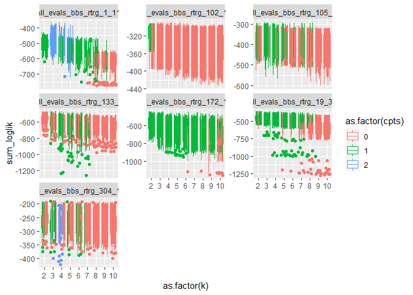<!-- -->

    ## `summarise()` regrouping output by 'dataset', 'k', 'seed' (override with `.groups` argument)

<!-- -->

    ## # A tibble: 14 x 6
    ## # Groups:   dataset [7]
    ##    dataset                       k  seed  cpts mean_sum_ll dat_rank
    ##    <chr>                     <int> <int> <int>       <dbl>    <int>
    ##  1 all_evals_bbs_rtrg_304_17     2     8     0       -254.        1
    ##  2 all_evals_bbs_rtrg_304_17     6    10     0       -255.        2
    ##  3 all_evals_bbs_rtrg_102_18     2     6     1       -314.        1
    ##  4 all_evals_bbs_rtrg_102_18     2    10     1       -314.        2
    ##  5 all_evals_bbs_rtrg_105_4      3    12     1       -379.        1
    ##  6 all_evals_bbs_rtrg_105_4      3    18     1       -384.        2
    ##  7 all_evals_bbs_rtrg_19_35      2    12     1       -443.        1
    ##  8 all_evals_bbs_rtrg_19_35      2    22     1       -445.        2
    ##  9 all_evals_bbs_rtrg_1_11       3     8     2       -464.        1
    ## 10 all_evals_bbs_rtrg_1_11       3    12     2       -467.        2
    ## 11 all_evals_bbs_rtrg_133_6      2    14     0       -545.        1
    ## 12 all_evals_bbs_rtrg_133_6      2     8     0       -546.        2
    ## 13 all_evals_bbs_rtrg_172_14     2    22     1       -577.        1
    ## 14 all_evals_bbs_rtrg_172_14     2     2     1       -577.        2

Let’s look at these in terms of, what was the winning dynamic?

    ## # A tibble: 7 x 7
    ## # Groups:   dataset [7]
    ##   dataset                  k  seed  cpts mean_sum_ll dat_rank dynamic           
    ##   <chr>                <int> <int> <int>       <dbl>    <int> <chr>             
    ## 1 all_evals_bbs_rtrg_~     2     8     0       -254.        1 2 topics, 0 chang~
    ## 2 all_evals_bbs_rtrg_~     2    14     0       -545.        1 2 topics, 0 chang~
    ## 3 all_evals_bbs_rtrg_~     2     6     1       -314.        1 2 topics, 1 chang~
    ## 4 all_evals_bbs_rtrg_~     2    12     1       -443.        1 2 topics, 1 chang~
    ## 5 all_evals_bbs_rtrg_~     2    22     1       -577.        1 2 topics, 1 chang~
    ## 6 all_evals_bbs_rtrg_~     3    12     1       -379.        1 3 topics, 1 chang~
    ## 7 all_evals_bbs_rtrg_~     3     8     2       -464.        1 3 topics, 2 chang~

My thinking is as follows.

Any k, 0 changepoints: the model is not picking up on any strong
temporal structure and is defaulting to a species mean for the whole TS.
This can be, things essentially don’t change, **or** that the change
does not fit neatly into chunks over time. Topics in this case just tell
us how the LDA best described the species arrangements, but aren’t
inherently meaningful.

2 topics and 1 changepoint: I suspect, but want to confirm, that this
means we have two states/regimes for the community. Typically I expect
this to have two topics, one of which is dominant before the changepoint
and one that is dominant after. Some things to look at in these models
are (1) how well-resolved the estimate for the changepoint is and (2)
how different the 2 topics are. Re: (1), if the change occurs gradually
or idiosyncratically we a priori expect a broader distribution of
estimates for the changepoint location compared to the scenario where
the change occurs suddenly. Re: (2), the topics have to be *fairly*
different in order for it to be worth the complexity to fit them, but
the ways in which they differ could be informative. They could be
totally different species, or the same species in quite different
proportions. They could be driven by the most abundant species, or by
rare species that are showing a very strong pattern.

Anything else - here, we are finding one with 3 topics and 1
changepoint, and one with 3 topics and 2 changepoints. I have less
intuition for what this means “generally” and want to look at the
models.

## 2 topics and 1 changepoint

### 102\_18

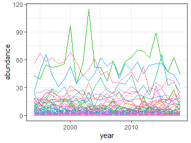<!-- -->

    ## Running LDA with 2 topics (seed 6)

    ## Running TS model with 1 changepoints and equation gamma ~ 1 on LDA model

    ##   Estimating changepoint distribution

    ##   Estimating regressor distribution

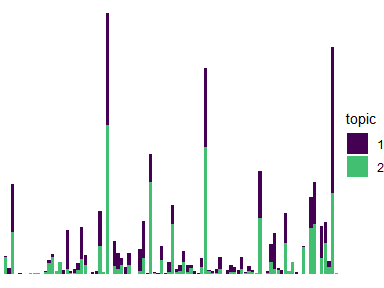<!-- -->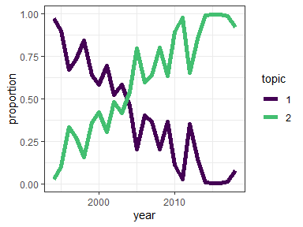<!-- -->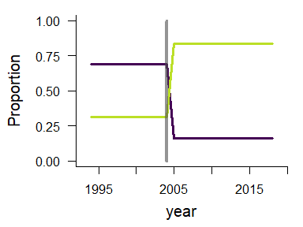<!-- -->

    ## `stat_bin()` using `bins = 30`. Pick better value with `binwidth`.

    ## Warning: Removed 2 rows containing missing values (geom_bar).

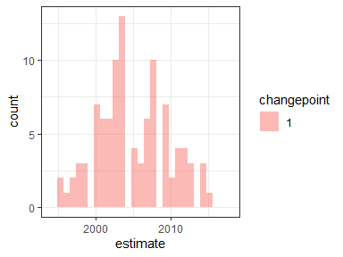<!-- -->

### 19\_35

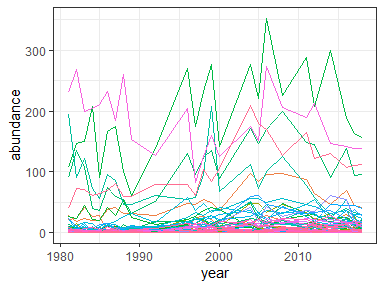<!-- -->

    ## Running LDA with 2 topics (seed 12)

    ## Running TS model with 1 changepoints and equation gamma ~ 1 on LDA model

    ##   Estimating changepoint distribution

    ##   Estimating regressor distribution

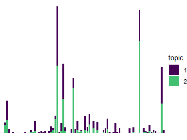<!-- -->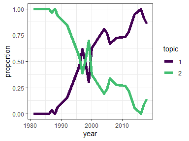<!-- -->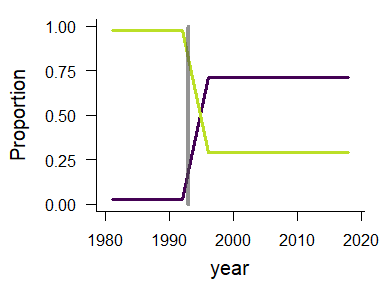<!-- -->

    ## `stat_bin()` using `bins = 30`. Pick better value with `binwidth`.

    ## Warning: Removed 2 rows containing missing values (geom_bar).

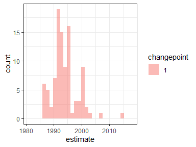<!-- -->

### 172\_14

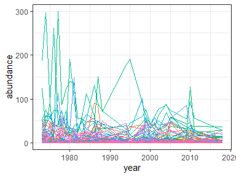<!-- -->

    ## Running LDA with 2 topics (seed 22)

    ## Running TS model with 1 changepoints and equation gamma ~ 1 on LDA model

    ##   Estimating changepoint distribution

    ##   Estimating regressor distribution

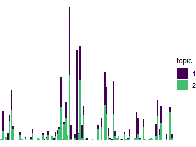<!-- -->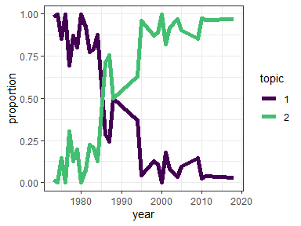<!-- -->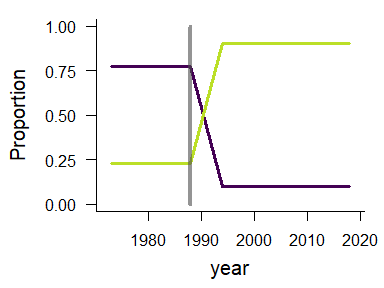<!-- -->

    ## `stat_bin()` using `bins = 30`. Pick better value with `binwidth`.

    ## Warning: Removed 2 rows containing missing values (geom_bar).

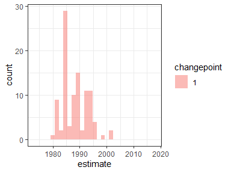<!-- -->

## 3 topics and 1 changepoint

### 105\_4

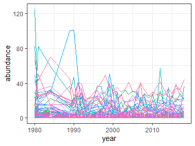<!-- -->

    ## Running LDA with 3 topics (seed 12)

    ## Running TS model with 1 changepoints and equation gamma ~ 1 on LDA model

    ##   Estimating changepoint distribution

    ##   Estimating regressor distribution

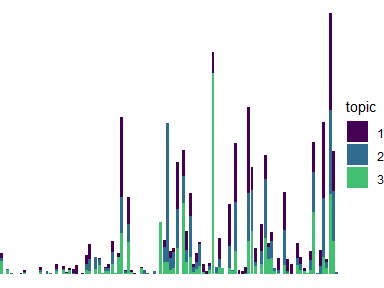<!-- -->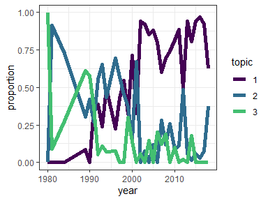<!-- -->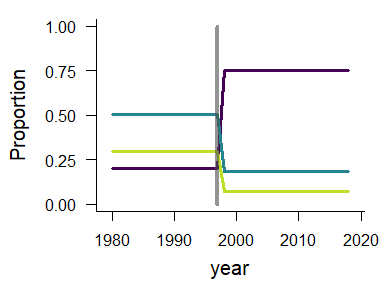<!-- -->

    ## `stat_bin()` using `bins = 30`. Pick better value with `binwidth`.

    ## Warning: Removed 2 rows containing missing values (geom_bar).

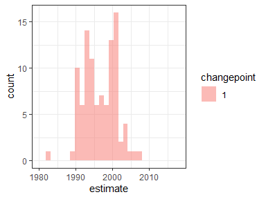<!-- -->

## 3 topics and 2 changepoints

### 1\_11

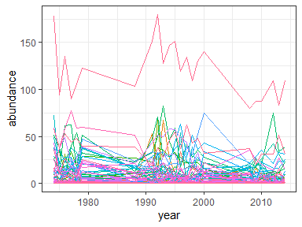<!-- -->

    ## Running LDA with 3 topics (seed 8)

    ## Running TS model with 2 changepoints and equation gamma ~ 1 on LDA model

    ##   Estimating changepoint distribution

    ##   Estimating regressor distribution

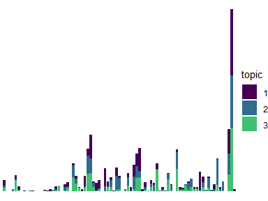<!-- -->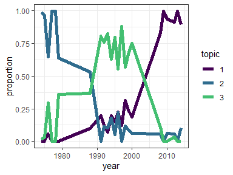<!-- -->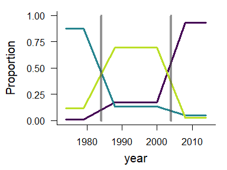<!-- -->

    ## `stat_bin()` using `bins = 30`. Pick better value with `binwidth`.

    ## Warning: Removed 4 rows containing missing values (geom_bar).

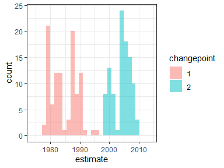<!-- -->
