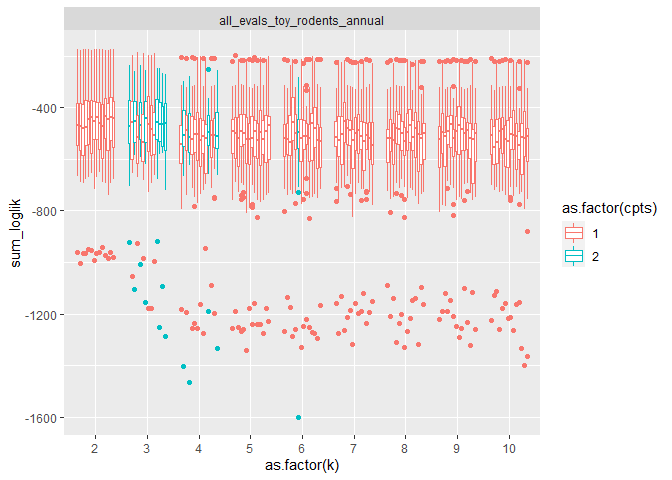
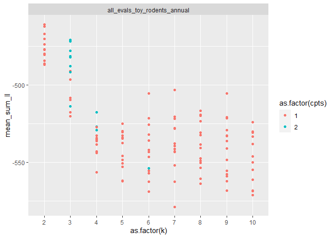
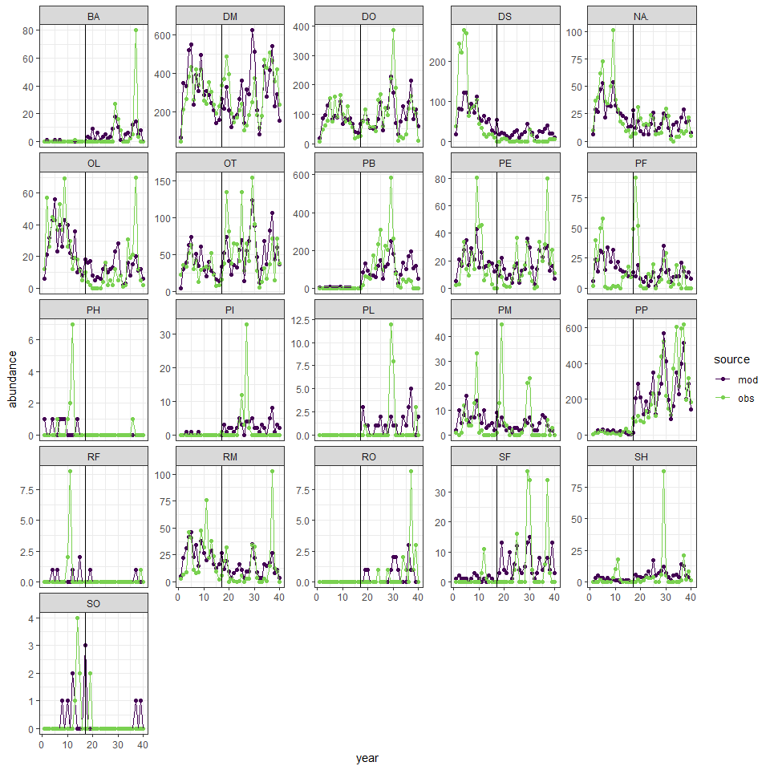
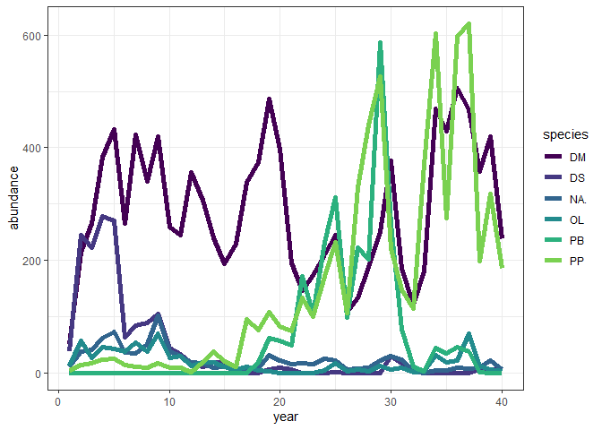

Hybrid results 10/2020
================

Including history of the crossval approach, how I’ve arrived at a
combined crossval + AIC approach, and what I see as paths from here….

<!-- -->

    ## `summarise()` regrouping output by 'dataset', 'k', 'seed' (override with `.groups` argument)

<!-- -->

    ## # A tibble: 5 x 6
    ## # Groups:   dataset [1]
    ##   dataset                          k  seed  cpts mean_sum_ll dat_rank
    ##   <chr>                        <int> <int> <int>       <dbl>    <int>
    ## 1 all_evals_toy_rodents_annual     2     6     1       -461.        1
    ## 2 all_evals_toy_rodents_annual     2    30     1       -462.        2
    ## 3 all_evals_toy_rodents_annual     2    24     1       -467.        3
    ## 4 all_evals_toy_rodents_annual     2    18     1       -470.        4
    ## 5 all_evals_toy_rodents_annual     3    18     2       -471.        5

<!-- -->

    ## Running LDA with 2 topics (seed 6)

<!-- --><!-- --><!-- -->

    ## Running TS model with 1 changepoints and equation gamma ~ 1 on LDA model k: 2, seed: 6

    ##   Estimating changepoint distribution

    ##   Estimating regressor distribution

<!-- -->

    ## `stat_bin()` using `bins = 30`. Pick better value with `binwidth`.

    ## Warning: Removed 2 rows containing missing values (geom_bar).

<!-- -->

    ## Joining, by = "segment"

<!-- -->

    ## # A tibble: 21 x 5
    ##              X1         X2 species   diff      ratio
    ##           <dbl>      <dbl> <chr>    <dbl>      <dbl>
    ##  1 0.337        0.0180     PP      0.319       18.7 
    ##  2 0.265        0.482      DM      0.217        1.82
    ##  3 0.145        0.00000326 PB      0.145    44505.  
    ##  4 0.0000000254 0.115      DS      0.115  4526115.  
    ##  5 0.00982      0.0498     NA.     0.0400       5.07
    ##  6 0.00875      0.0407     OL      0.0319       4.65
    ##  7 0.00901      0.0363     RM      0.0273       4.03
    ##  8 0.00796      0.0304     PF      0.0225       3.83
    ##  9 0.107        0.128      DO      0.0209       1.20
    ## 10 0.0180       0.0282     PE      0.0102       1.57
    ## # ... with 11 more rows

<!-- -->
