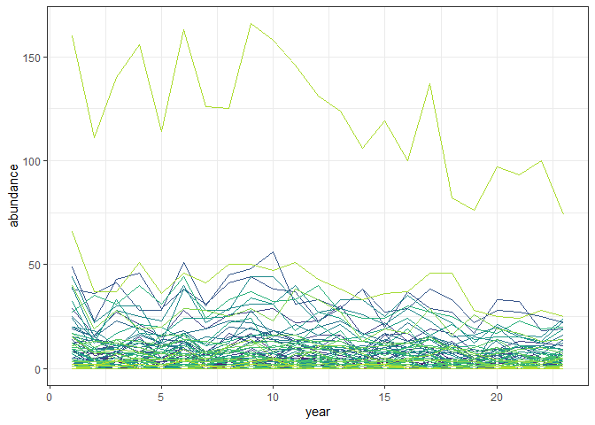
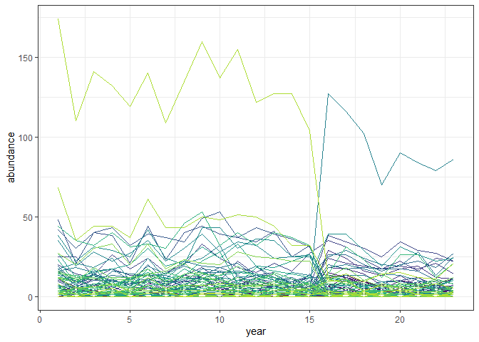
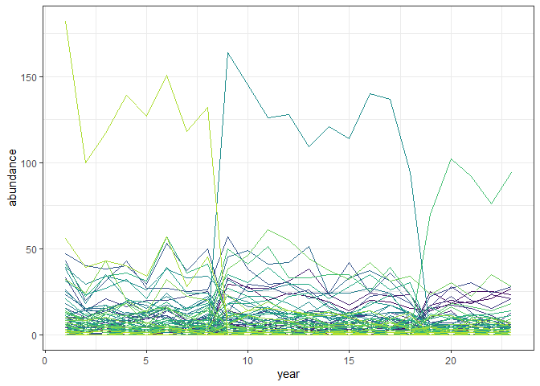

New toy datasets
================

``` r
bbs_dat <- MATSS::get_bbs_route_region_data(path = "C:\\\\Users\\\\diaz.renata\\\\Documents\\\\Datasets/breed-bird-survey-prepped/route1region11.RDS")

bbs_abunds <- rowSums(bbs_dat$abundance)

bbs_s0 <- ncol(bbs_dat$abundance)

bbs_mean_abunds <- colMeans(bbs_dat$abundance)
```

So a BBS dataset might have 23 timesteps and 82 species, with abundances
like 681.4347826.

``` r
set.seed(1977)

mean_abunds <- as.vector(bbs_mean_abunds) / sum(bbs_mean_abunds)

rmultinom(1, bbs_abunds[1], mean_abunds)
```

    ##       [,1]
    ##  [1,]    0
    ##  [2,]   10
    ##  [3,]    0
    ##  [4,]    0
    ##  [5,]    2
    ##  [6,]   23
    ##  [7,]    3
    ##  [8,]    0
    ##  [9,]    0
    ## [10,]    0
    ## [11,]    0
    ## [12,]    2
    ## [13,]    0
    ## [14,]    0
    ## [15,]    1
    ## [16,]    2
    ## [17,]    0
    ## [18,]    2
    ## [19,]    2
    ## [20,]    5
    ## [21,]    6
    ## [22,]    0
    ## [23,]   11
    ## [24,]   12
    ## [25,]    1
    ## [26,]   27
    ## [27,]   18
    ## [28,]    9
    ## [29,]    2
    ## [30,]   10
    ## [31,]   43
    ## [32,]   59
    ## [33,]    4
    ## [34,]    4
    ## [35,]    6
    ## [36,]    0
    ## [37,]   21
    ## [38,]    4
    ## [39,]   15
    ## [40,]    1
    ## [41,]   15
    ## [42,]   11
    ## [43,]    0
    ## [44,]    5
    ## [45,]   15
    ## [46,]    3
    ## [47,]   28
    ## [48,]   34
    ## [49,]   37
    ## [50,]    1
    ## [51,]    8
    ## [52,]    0
    ## [53,]    7
    ## [54,]    7
    ## [55,]   22
    ## [56,]    1
    ## [57,]    2
    ## [58,]    0
    ## [59,]   22
    ## [60,]    4
    ## [61,]    0
    ## [62,]   38
    ## [63,]    2
    ## [64,]    1
    ## [65,]   10
    ## [66,]    9
    ## [67,]   16
    ## [68,]    6
    ## [69,]    3
    ## [70,]    9
    ## [71,]   13
    ## [72,]    1
    ## [73,]    9
    ## [74,]    4
    ## [75,]   11
    ## [76,]   33
    ## [77,]    3
    ## [78,]    7
    ## [79,]    0
    ## [80,]   65
    ## [81,]  181
    ## [82,]    3

``` r
static_ts <- t(apply(as.matrix(bbs_abunds), MARGIN = 1, FUN = function(ts_abund, mean_abunds) return(rmultinom(1, ts_abund, mean_abunds)), mean_abunds = mean_abunds)) %>%
  as.data.frame() 

static_ts_long <- static_ts %>%
  mutate(year = row_number()) %>%
  tidyr::pivot_longer(-year, names_to = "species", values_to = "abundance")


ggplot(static_ts_long, aes(year, abundance, color = species)) +
  geom_line() +
  scale_color_viridis_d(end = .9) +
  theme_bw() +
  theme(legend.position = "none") 
```

<!-- -->

``` r
changepoint_ts <- rbind(
   t(apply(as.matrix(bbs_abunds[1:15]), MARGIN = 1, FUN = function(ts_abund, mean_abunds) return(rmultinom(1, ts_abund, mean_abunds)), mean_abunds = mean_abunds)),
    t(apply(as.matrix(bbs_abunds[16:23]), MARGIN = 1, FUN = function(ts_abund, mean_abunds) return(rmultinom(1, ts_abund, mean_abunds)), mean_abunds = sample(mean_abunds, size = 82, replace = F))
    )
) %>%
  as.data.frame()


changepoint_ts_long <- changepoint_ts %>%
  mutate(year = row_number()) %>%
  tidyr::pivot_longer(-year, names_to = "species", values_to = "abundance")

ggplot(changepoint_ts_long, aes(year, abundance, color = species)) +
  geom_line() +
  scale_color_viridis_d(end = .9) +
  theme_bw() +
  theme(legend.position = "none") 
```

<!-- -->

``` r
two_changepoint_ts <- rbind(
   t(apply(as.matrix(bbs_abunds[1:8]), MARGIN = 1, FUN = function(ts_abund, mean_abunds) return(rmultinom(1, ts_abund, mean_abunds)), mean_abunds = mean_abunds)),
    t(apply(as.matrix(bbs_abunds[9:18]), MARGIN = 1, FUN = function(ts_abund, mean_abunds) return(rmultinom(1, ts_abund, mean_abunds)), mean_abunds = sample(mean_abunds, size = 82, replace = F))),
   t(apply(as.matrix(bbs_abunds[19:23]), MARGIN = 1, FUN = function(ts_abund, mean_abunds) return(rmultinom(1, ts_abund, mean_abunds)), mean_abunds = sample(mean_abunds, size = 82, replace = F)))
) %>%
  as.data.frame()


two_changepoint_ts_long <- two_changepoint_ts %>%
  mutate(year = row_number()) %>%
  tidyr::pivot_longer(-year, names_to = "species", values_to = "abundance")

ggplot(two_changepoint_ts_long, aes(year, abundance, color = species)) +
  geom_line() +
  scale_color_viridis_d(end = .9) +
  theme_bw() +
  theme(legend.position = "none") 
```

<!-- -->

``` r
write.csv(changepoint_ts, here::here("analysis", "toy_datasets", "new_changepoint.csv"), row.names = F)

write.csv(two_changepoint_ts, here::here("analysis", "toy_datasets", "new_two_changepoint.csv"), row.names = F)

write.csv(static_ts, here::here("analysis", "toy_datasets", "new_static.csv"), row.names = F)
```
