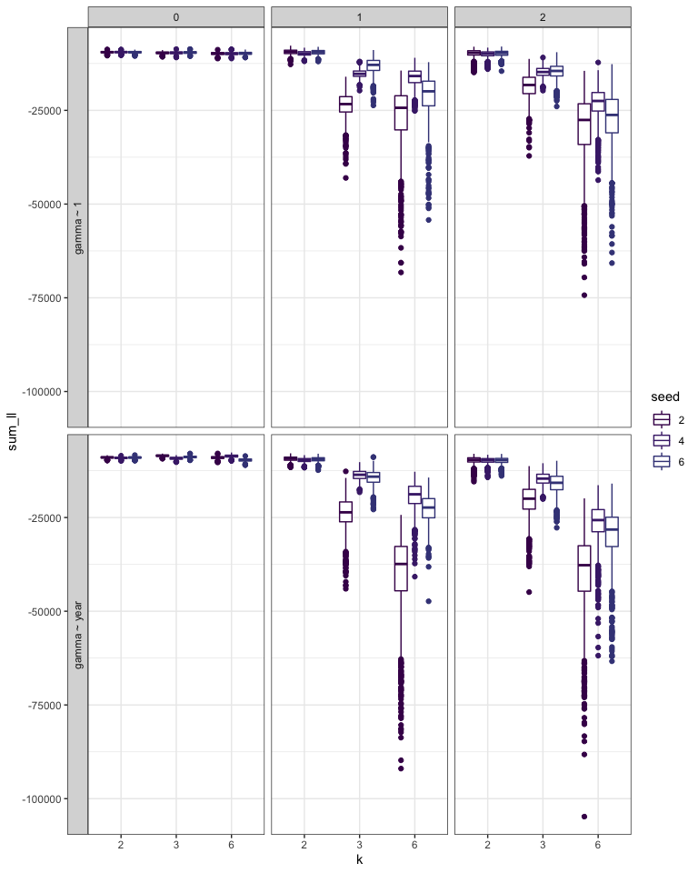
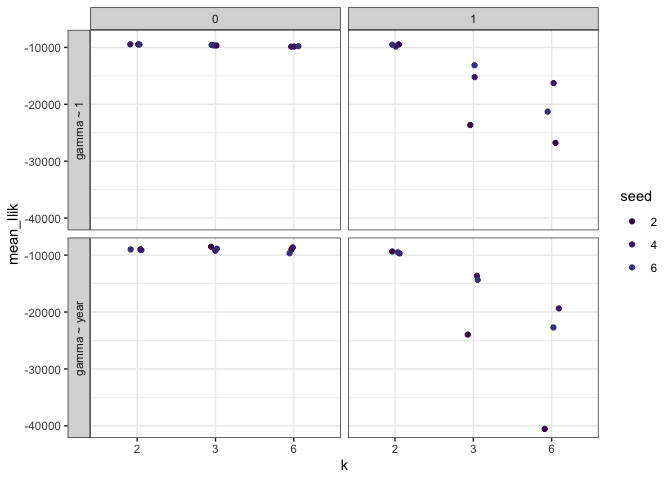

Composite LL
================

``` r
loadd(composite_ll, cache = cache)
```

``` r
composite_ll <- composite_ll %>%
  mutate(k = as.factor(k),
         ncpt = as.factor(ncpt),
         seed = as.factor(seed))

all_var <- ggplot(data = composite_ll, aes(x = seed, y = sum_ll, color = k, group = seed)) +
  geom_boxplot() +
  facet_wrap(facets = c("ncpt", "form", "k")) +
  theme_bw() +
  scale_color_viridis_d(end = .8)

all_var
```



``` r
smooth_draws <- composite_ll %>%
  group_by(k, seed, form, ncpt) %>%
  summarize(mean_llik = mean(sum_ll)) %>%
  ungroup() 

sd_plot <- ggplot(data = smooth_draws, aes(x = k, y = mean_llik, color = k, group = k)) +
  geom_boxplot() +
  facet_wrap(facets = c("ncpt", "form")) +
  theme_bw() +
  scale_color_viridis_d(end = .8)

sd_plot
```


