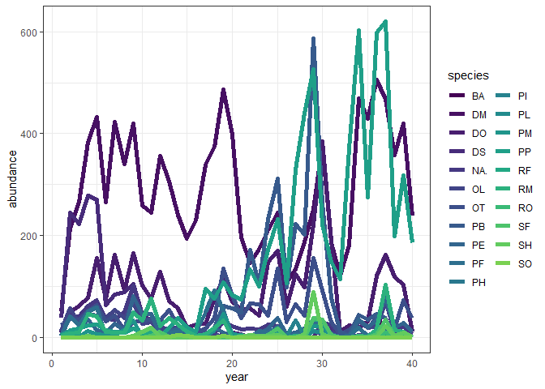
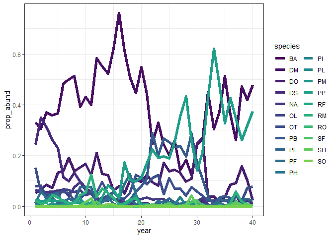
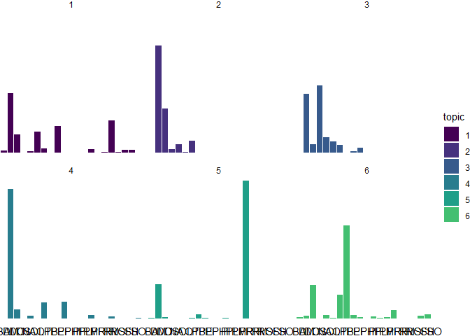
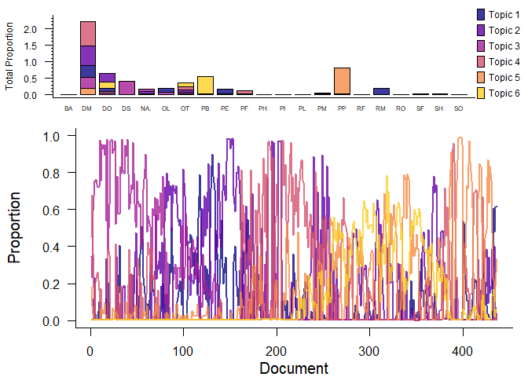
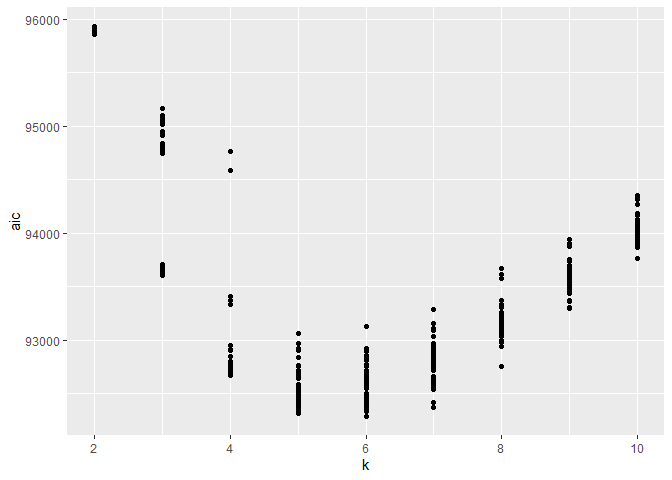

Annual rats: classic v hybrid
================

<!-- --><!-- -->

## ldats classic

<!-- --><!-- --><!-- -->

    ## Running TS model with 0 changepoints and equation gamma ~ 1 on LDA model

    ## Running TS model with 1 changepoints and equation gamma ~ 1 on LDA model

    ##   Estimating changepoint distribution

    ##   Estimating regressor distribution

    ## Running TS model with 2 changepoints and equation gamma ~ 1 on LDA model

    ##   Estimating changepoint distribution

    ##   Estimating regressor distribution

    ## Running TS model with 3 changepoints and equation gamma ~ 1 on LDA model

    ##   Estimating changepoint distribution

    ##   Estimating regressor distribution

    ## Running TS model with 4 changepoints and equation gamma ~ 1 on LDA model

    ##   Estimating changepoint distribution

    ##   Estimating regressor distribution

    ## Running TS model with 5 changepoints and equation gamma ~ 1 on LDA model

    ##   Estimating changepoint distribution

    ##   Estimating regressor distribution

<!-- -->

    ## `stat_bin()` using `bins = 30`. Pick better value with `binwidth`.

    ## Warning: Removed 2 rows containing missing values (geom_bar).

<!-- --><!-- -->

    ##     k seed      aic
    ## 1   6   34 112465.5
    ## 2   6   32 112466.2
    ## 3   6   12 112490.9
    ## 4   6  222 112494.4
    ## 5   6  156 112497.2
    ## 6   6   52 112497.5
    ## 7   6  300 112508.6
    ## 8   6  196 112516.5
    ## 9   6   10 112521.8
    ## 10  6  362 112527.9
    ## 11  6  246 112528.0
    ## 12  6  152 112531.4
    ## 13  6  200 112531.7
    ## 14  6   28 112533.3
    ## 15  6  114 112533.5
    ## 16  6  122 112533.5
    ## 17  6  398 112533.7
    ## 18  6   54 112539.3
    ## 19  6  330 112539.4
    ## 20  6   74 112541.4
    ## 21  6  248 112542.5
    ## 22  6  378 112543.9
    ## 23  6  108 112544.1
    ## 24  6  124 112545.5
    ## 25  6   50 112546.0
    ## 26  6  130 112547.1
    ## 27  6   70 112547.4
    ## 28  6  110 112553.4
    ## 29  6  136 112553.7
    ## 30  6  174 112557.1
    ## 31  6   20 112557.9
    ## 32  6  228 112558.3
    ## 33  6  332 112560.5
    ## 34  6  358 112561.4
    ## 35  6  262 112564.2
    ## 36  6   78 112565.8
    ## 37  6  168 112565.9
    ## 38  6   84 112566.5
    ## 39  6  162 112567.3
    ## 40  6  258 112568.3
    ## 41  6  138 112570.2
    ## 42  6  218 112571.3
    ## 43  6  326 112572.6
    ## 44  6  206 112574.6
    ## 45  6   94 112575.7
    ## 46  6  338 112576.6
    ## 47  6  382 112576.7
    ## 48  6    4 112578.7
    ## 49  6  386 112578.7
    ## 50  6   36 112580.6
    ## 51  6   44 112584.0
    ## 52  6  278 112586.2
    ## 53  6  166 112586.7
    ## 54  6   72 112588.9
    ## 55  6  250 112597.0
    ## 56  6   88 112600.1
    ## 57  6  336 112605.3
    ## 58  6  214 112606.5
    ## 59  6  230 112607.5
    ## 60  6  134 112607.9
    ## 61  6   26 112615.7
    ## 62  6  188 112621.7
    ## 63  6  342 112621.7
    ## 64  6    6 112622.0
    ## 65  6  142 112627.7
    ## 66  6  270 112630.0
    ## 67  6  272 112631.3
    ## 68  6  304 112635.0
    ## 69  6  146 112635.6
    ## 70  6  364 112646.0
    ## 71  6  154 112649.6
    ## 72  6   82 112650.7
    ## 73  6  374 112653.7
    ## 74  6  340 112657.3
    ## 75  6  290 112669.9
    ## 76  6  298 112673.7
    ## 77  6   40 112675.2
    ## 78  6  388 112676.5
    ## 79  6  178 112677.5
    ## 80  6  150 112680.4
    ## 81  6   68 112683.7
    ## 82  6  252 112689.6
    ## 83  6  244 112692.1
    ## 84  6  296 112696.1
    ## 85  6  348 112696.7
    ## 86  6  190 112698.6
    ## 87  6  140 112699.1
    ## 88  6  176 112701.4
    ## 89  6  118 112703.6
    ## 90  6  240 112705.0
    ## 91  6  354 112705.7
    ## 92  6  370 112706.4
    ## 93  6  116 112709.6
    ## 94  6   80 112711.3
    ## 95  6   66 112711.4
    ## 96  6  360 112713.2
    ## 97  6  220 112721.8
    ## 98  6  294 112724.9
    ## 99  6   64 112727.2
    ## 100 6   48 112728.1
    ## 101 6  328 112728.4
    ## 102 6  302 112730.8
    ## 103 6  286 112736.0
    ## 104 6   24 112747.6
    ## 105 6   42 112748.1
    ## 106 6    2 112748.3
    ## 107 6  268 112749.4
    ## 108 6  292 112774.9
    ## 109 6  106 112786.1
    ## 110 6  236 112789.4
    ## 111 6  324 112791.1
    ## 112 6  396 112791.7
    ## 113 6  102 112793.7
    ## 114 6  352 112801.2
    ## 115 6  104 112801.2
    ## 116 6  172 112802.3
    ## 117 6  144 112803.2
    ## 118 6  186 112807.1
    ## 119 6  392 112807.1
    ## 120 6   58 112807.9
    ## 121 6  128 112813.7
    ## 122 6  256 112823.5
    ## 123 6  160 112825.3
    ## 124 6  380 112828.5
    ## 125 6  232 112834.6
    ## 126 6  212 112835.1
    ## 127 6   30 112837.2
    ## 128 6  276 112844.9
    ## 129 6   62 112846.7
    ## 130 6  100 112848.7
    ## 131 6  254 112849.0
    ## 132 6   92 112849.8
    ## 133 6  288 112851.0
    ## 134 6   98 112851.3
    ## 135 6   38 112851.6
    ## 136 6  182 112852.7
    ## 137 6  158 112855.6
    ## 138 6  264 112862.8
    ## 139 6  260 112866.4
    ## 140 6   18 112869.4
    ## 141 6  372 112871.3
    ## 142 6  390 112874.8
    ## 143 6  400 112877.0
    ## 144 6  238 112884.3
    ## 145 6  216 112884.6
    ## 146 6  170 112887.4
    ## 147 6  126 112891.3
    ## 148 6   56 112892.5
    ## 149 6  208 112897.2
    ## 150 6  164 112897.4
    ## 151 6  344 112907.4
    ## 152 6  226 112912.6
    ## 153 6  280 112913.0
    ## 154 6  224 112925.3
    ## 155 6   16 112927.1
    ## 156 6  306 112930.3
    ## 157 6  184 112934.5
    ## 158 6   90 112937.2
    ## 159 6  320 112938.5
    ## 160 6  368 112941.8
    ## 161 6   46 112941.8
    ## 162 6  356 112947.8
    ## 163 6  316 112953.4
    ## 164 6   96 112953.5
    ## 165 6   22 112954.2
    ## 166 6  376 112959.6
    ## 167 6  242 112961.4
    ## 168 6  266 112964.3
    ## 169 6  310 112981.8
    ## 170 6  112 112986.5
    ## 171 6  282 112986.9
    ## 172 6  194 112994.2
    ## 173 6  234 113000.4
    ## 174 6  384 113001.5
    ## 175 6  346 113001.9
    ## 176 6  180 113003.0
    ## 177 6   76 113018.0
    ## 178 6  334 113020.5
    ## 179 6  318 113027.9
    ## 180 6  350 113044.1
    ## 181 6  322 113045.6
    ## 182 6  204 113061.7
    ## 183 6   86 113080.8
    ## 184 6  148 113082.2
    ## 185 6  284 113082.2
    ## 186 6  192 113090.8
    ## 187 6  394 113107.2
    ## 188 6    8 113108.8
    ## 189 6   14 113114.0
    ## 190 6  366 113122.3
    ## 191 6  308 113127.3
    ## 192 6  312 113149.4
    ## 193 6  202 113164.1
    ## 194 6  120 113166.7
    ## 195 6   60 113176.9
    ## 196 6  274 113178.5
    ## 197 6  210 113190.1
    ## 198 6  314 113262.1
    ## 199 6  198 114072.1
    ## 200 6  132 114095.8

<!-- --><!-- -->

    ## Running TS model with 0 changepoints and equation gamma ~ 1 on LDA model

    ## Running TS model with 1 changepoints and equation gamma ~ 1 on LDA model

    ##   Estimating changepoint distribution

    ##   Estimating regressor distribution

    ## Running TS model with 2 changepoints and equation gamma ~ 1 on LDA model

    ##   Estimating changepoint distribution

    ##   Estimating regressor distribution

    ## Running TS model with 3 changepoints and equation gamma ~ 1 on LDA model

    ##   Estimating changepoint distribution

    ##   Estimating regressor distribution

    ## Running TS model with 4 changepoints and equation gamma ~ 1 on LDA model

    ##   Estimating changepoint distribution

    ##   Estimating regressor distribution

    ## Running TS model with 5 changepoints and equation gamma ~ 1 on LDA model

    ##   Estimating changepoint distribution

    ##   Estimating regressor distribution

<!-- -->

    ## `stat_bin()` using `bins = 30`. Pick better value with `binwidth`.

    ## Warning: Removed 2 rows containing missing values (geom_bar).

<!-- --><!-- -->

<!-- --><!-- --><!-- -->
