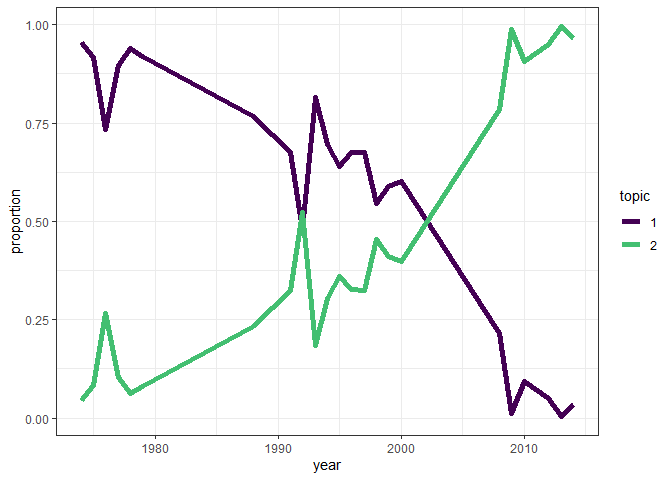
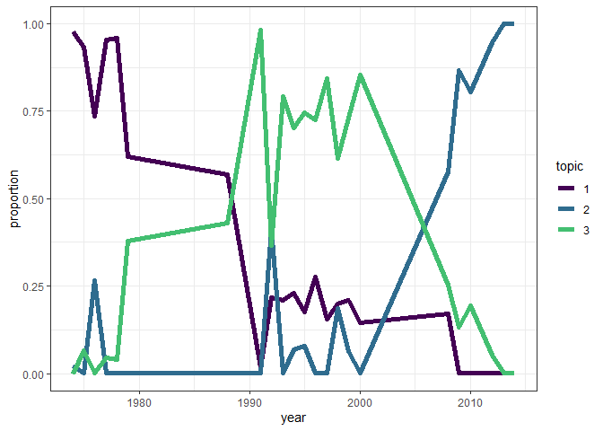
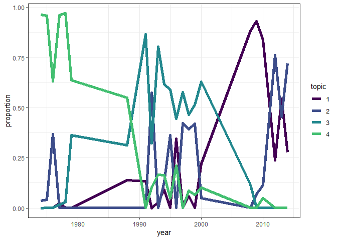
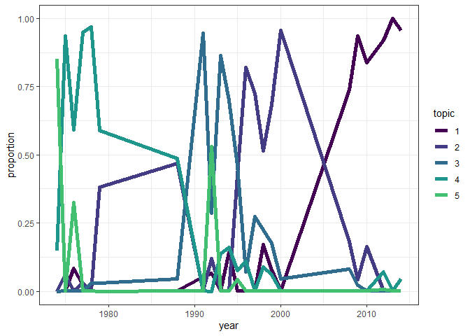

Results
================

``` r
loadd(bbs_rtrg_1_11, cache = cache)

totaln <- bbs_rtrg_1_11$abundance %>%
  mutate(totaln = rowSums(.)) %>%
  mutate(year = bbs_rtrg_1_11$covariates$year)

abund_long <- totaln %>%
  select(-totaln) %>%
  tidyr::pivot_longer(-year, names_to = "species", values_to = "count") %>%
  left_join(select(totaln, year, totaln)) %>%
  mutate(prop = count / totaln)
```

    ## Joining, by = "year"

``` r
ggplot(abund_long, aes(year, prop, color = species)) +
  geom_line() +
  theme_bw() +
  scale_color_viridis_d() +
  theme(legend.position = "none")
```

<!-- -->

``` r
all_evals <- read.csv(here::here("all_evals_bbs_rtrg_1_11.csv"))
all_evals <- all_evals %>%
  mutate(k = as.factor(k),
         seed = as.factor(seed),
         cpts = as.factor(cpts),
         cpts_seed_k = paste0(cpts, "_", seed, "_", k),
         cpts_k = paste0(k, "_", cpts))


# ggplot(all_evals, aes(x = k, y = loglik, group = cpts_seed_k, color = cpts)) +
#   geom_jitter(width = 0, alpha = .01) +
# #  facet_wrap(vars(cpts)) +
#   theme_bw() +
#   ggtitle("All models loglikelihood")

all_evals_summary <- all_evals %>%
  group_by(k, seed, cpts, cpts_seed_k, cpts_k, mean_loglik) %>%
  summarize(mean_ll = mean(loglik, na.rm = T),
            upper_97_ll = quantile(loglik, probs = .975, na.rm= T),
            lower_2_ll = quantile(loglik, probs = .025, na.rm =T),
            n_infinite = sum(is.infinite(loglik)),
            n_na = sum(is.na(loglik))) %>%
  ungroup() %>%
  arrange(desc(mean_loglik))
```

    ## `summarise()` regrouping output by 'k', 'seed', 'cpts', 'cpts_seed_k', 'cpts_k' (override with `.groups` argument)

``` r
ggplot(all_evals_summary, aes(x = cpts, y = mean_loglik, color = cpts)) +
  geom_point() +
facet_wrap(vars(k), nrow = 1) +
  theme_bw() +
  ggtitle("All models loglikelihood")
```

<!-- -->

``` r
highest_low_95 = max(all_evals_summary$lower_2_ll)

all_evals_summary <- all_evals_summary %>%
  mutate(in_95 = upper_97_ll >= highest_low_95)

head(all_evals_summary)
```

<div class="kable-table">

| k | seed | cpts | cpts\_seed\_k | cpts\_k | mean\_loglik |   mean\_ll | upper\_97\_ll | lower\_2\_ll | n\_infinite | n\_na | in\_95 |
| :- | :--- | :--- | :------------ | :------ | -----------: | ---------: | ------------: | -----------: | ----------: | ----: | :----- |
| 3 | 30   | 2    | 2\_30\_3      | 3\_2    |   \-5573.931 | \-5589.182 |    \-5039.125 |   \-6183.494 |           0 |     1 | TRUE   |
| 3 | 114  | 2    | 2\_114\_3     | 3\_2    |   \-5586.718 | \-5588.888 |    \-5078.362 |   \-6245.065 |           0 |     4 | TRUE   |
| 3 | 140  | 2    | 2\_140\_3     | 3\_2    |   \-5628.473 | \-5559.349 |    \-5113.640 |   \-6076.477 |           0 |     7 | TRUE   |
| 3 | 8    | 2    | 2\_8\_3       | 3\_2    |   \-5653.260 | \-5686.590 |    \-5045.429 |   \-6434.138 |           0 |    14 | TRUE   |
| 3 | 70   | 2    | 2\_70\_3      | 3\_2    |   \-5658.658 | \-5578.024 |    \-5209.741 |   \-6206.367 |           0 |    11 | TRUE   |
| 4 | 176  | 2    | 2\_176\_4     | 4\_2    |   \-5679.831 | \-5653.665 |    \-5178.633 |   \-6225.267 |           0 |     1 | TRUE   |

</div>

``` r
all_evals_summary[1:15,]
```

<div class="kable-table">

| k | seed | cpts | cpts\_seed\_k | cpts\_k | mean\_loglik |   mean\_ll | upper\_97\_ll | lower\_2\_ll | n\_infinite | n\_na | in\_95 |
| :- | :--- | :--- | :------------ | :------ | -----------: | ---------: | ------------: | -----------: | ----------: | ----: | :----- |
| 3 | 30   | 2    | 2\_30\_3      | 3\_2    |   \-5573.931 | \-5589.182 |    \-5039.125 |   \-6183.494 |           0 |     1 | TRUE   |
| 3 | 114  | 2    | 2\_114\_3     | 3\_2    |   \-5586.718 | \-5588.888 |    \-5078.362 |   \-6245.065 |           0 |     4 | TRUE   |
| 3 | 140  | 2    | 2\_140\_3     | 3\_2    |   \-5628.473 | \-5559.349 |    \-5113.640 |   \-6076.477 |           0 |     7 | TRUE   |
| 3 | 8    | 2    | 2\_8\_3       | 3\_2    |   \-5653.260 | \-5686.590 |    \-5045.429 |   \-6434.138 |           0 |    14 | TRUE   |
| 3 | 70   | 2    | 2\_70\_3      | 3\_2    |   \-5658.658 | \-5578.024 |    \-5209.741 |   \-6206.367 |           0 |    11 | TRUE   |
| 4 | 176  | 2    | 2\_176\_4     | 4\_2    |   \-5679.831 | \-5653.665 |    \-5178.633 |   \-6225.267 |           0 |     1 | TRUE   |
| 3 | 100  | 2    | 2\_100\_3     | 3\_2    |   \-5689.462 | \-5674.167 |    \-5287.222 |   \-6419.909 |           0 |     7 | TRUE   |
| 3 | 12   | 2    | 2\_12\_3      | 3\_2    |   \-5689.485 | \-5693.960 |    \-5189.623 |   \-6397.838 |           0 |    14 | TRUE   |
| 3 | 104  | 2    | 2\_104\_3     | 3\_2    |   \-5693.657 | \-5678.442 |    \-5314.032 |   \-6178.807 |           0 |     6 | TRUE   |
| 3 | 66   | 2    | 2\_66\_3      | 3\_2    |   \-5706.247 | \-5671.256 |    \-5281.434 |   \-6262.293 |           0 |    13 | TRUE   |
| 4 | 26   | 2    | 2\_26\_4      | 4\_2    |   \-5721.939 | \-5680.183 |    \-5250.074 |   \-6450.900 |           0 |     0 | TRUE   |
| 4 | 118  | 2    | 2\_118\_4     | 4\_2    |   \-5727.140 | \-5703.147 |    \-5223.795 |   \-6309.083 |           0 |     5 | TRUE   |
| 3 | 176  | 2    | 2\_176\_3     | 3\_2    |   \-5727.715 | \-5725.845 |    \-5187.788 |   \-6281.225 |           0 |     7 | TRUE   |
| 3 | 4    | 2    | 2\_4\_3       | 3\_2    |   \-5730.578 | \-5720.395 |    \-5207.252 |   \-6440.602 |           0 |    17 | TRUE   |
| 3 | 164  | 2    | 2\_164\_3     | 3\_2    |   \-5731.853 | \-5759.238 |    \-5252.639 |   \-6356.033 |           0 |    10 | TRUE   |

</div>

``` r
ggplot(filter(all_evals, cpts_seed_k %in% all_evals_summary$cpts_seed_k[1:25]), aes(x = k, y = loglik, group = cpts_seed_k, color = cpts)) +
  geom_boxplot() +
#  facet_wrap(vars(cpts)) +
  theme_bw() +
  ggtitle("Best 25 models loglikelihood")
```

    ## Warning: Removed 202 rows containing non-finite values (stat_boxplot).

<!-- -->

``` r
ggplot(filter(all_evals, cpts_seed_k %in% filter(all_evals_summary, in_95)$cpts_seed_k), aes(x = k, y = loglik, group = cpts_seed_k, color = cpts)) +
  geom_boxplot() +
#  facet_wrap(vars(cpts)) +
  theme_bw() +
  ggtitle("Models w/LL overlapping top 95%")
```

    ## Warning: Removed 7012 rows containing non-finite values (stat_boxplot).

<!-- -->

``` r
some_ldas <- LDATS::LDA_set_user_seeds(bbs_rtrg_1_11$abundance, topics = c(2:5), seed = 2)
```

    ## Running LDA with 2 topics (seed 2)

    ## Running LDA with 3 topics (seed 2)

    ## Running LDA with 4 topics (seed 2)

    ## Running LDA with 5 topics (seed 2)

``` r
for(i in 1:length(some_ldas)) {
  print(plot_lda_year(some_ldas[[i]], covariate_data = bbs_rtrg_1_11$covariates$year))
}
```

<!-- --><!-- --><!-- --><!-- -->

<!-- First note the considerable spread. Looks like 2 topics wins handily, but that 0, 1, or 2 changepoints perform similarly. Increasing the number of iterations and/or aggregate estimates might decrease some of this spread. Increasing `nit` gives the model the chance to find the best place to put the changepoints. These models are run with just 100 iterations, for speed/debugging reasons, but 1000 or 10000 may be preferable. (Just a thought, for speed reasons - seems like another 99000 iterations will not make the k = 14 models do better; so once you narrow down to a general state space you could scale up the iterations dramatically to choose among changepoint models). Increasing `nevals` - especially once you have more iterations - might refine the sampling around the LL for any given model.  -->

<!-- The highest mean LL is for the model: 2_140_3 -->

<!-- 2 changepoints, seed 106, 2 topics. -->

<!-- ```{r} -->

<!-- #plot(ldas_only$`k: 14, seed: 8`) -->

<!-- lda_2_106 <- LDATS::LDA_set_user_seeds(bbs_rtrg_1_11$abundance, 2, 106) -->

<!-- plot_lda_comp(lda_2_106) -->

<!-- plot_lda_year(lda_2_106, bbs_rtrg_1_11$covariates$year) -->

<!-- ``` -->

<!-- Most of the difference between topics seems to come in the details - both have a big contribution, close to 50-50, from some really common species. Then there are several rare species that are all topic 1 or topic 2. There might be a way to quantify this. -->

<!-- ```{r} -->

<!-- ts_2_106 <- LDATS::TS_on_LDA(lda_2_106, as.data.frame(bbs_rtrg_1_11$covariates), timename = 'year', formulas = ~ 1, nchangepoints = c(0:2), control = LDATS::TS_control(nit = 1000)) -->

<!-- for(i in 1:3) { -->

<!-- plot(ts_2_106[[i]], selection = "mode") -->

<!-- } -->

<!-- select_w_aicc <- LDATS::select_TS(ts_2_106, control = list(LDATS::TS_control(measurer = "AICc"))) -->

<!-- library(LDATS) -->

<!-- plot(select_w_aicc) -->

<!-- ``` -->

<!-- Note that the uncertainty around the cpt locations corresponds mostly to the gappyness of the time series.  -->

<!-- ```{r} -->

<!-- #  -->

<!-- # lda_14_8 <- LDATS::LDA_set_user_seeds(bbs_rtrg_1_11$abundance, 14, 8) -->

<!-- # plot_lda_comp(lda_14_8) -->

<!-- #  -->

<!-- # plot_lda_year(lda_14_8, bbs_rtrg_1_11$covariates$year) -->

<!-- # #  -->

<!-- # # loadd(ldats_fit_bbs_rtrg_1_11_2L_6_1L) -->

<!-- # #  -->

<!-- # # for(i in 1:23){ -->

<!-- # #   plot(ldats_fit_bbs_rtrg_1_11_2L_6_1L[[i]]$fitted_lda) -->

<!-- # # plot(ldats_fit_bbs_rtrg_1_11_2L_6_1L[[i]]$fitted_ts, selection = "mode") -->

<!-- # # } -->

<!-- #  -->

<!-- # ts_14_8 <- LDATS::TS_on_LDA(lda_14_8, as.data.frame(bbs_rtrg_1_11$covariates), timename = 'year', formulas = ~ 1, nchangepoints = c(0:2), control = LDATS::TS_control(nit = 1000)) -->

<!-- #  -->

<!-- # for(i in 1:length(ts_14_8)) { -->

<!-- #   plot(ts_14_8[[i]]) -->

<!-- # } -->

<!-- ``` -->

``` r
DBI::dbDisconnect(db)
rm(cache)
```
