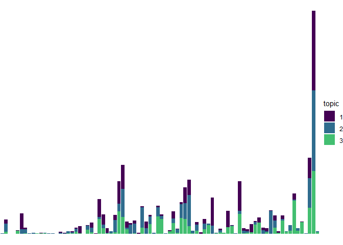
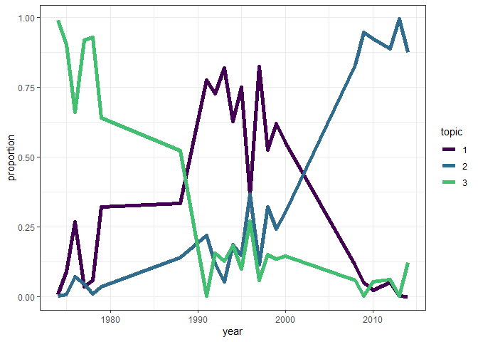
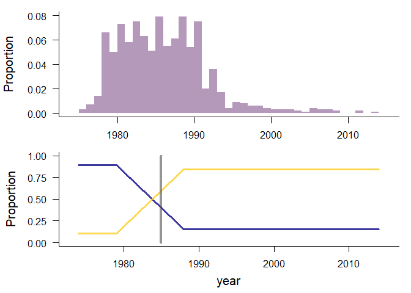

Results
================

``` r
loadd(bbs_rtrg_1_11, cache = cache)

totaln <- bbs_rtrg_1_11$abundance %>%
  mutate(totaln = rowSums(.)) %>%
  mutate(year = bbs_rtrg_1_11$covariates$year)

abund_long <- totaln %>%
  select(-totaln) %>%
  tidyr::pivot_longer(-year, names_to = "species", values_to = "count") %>%
  left_join(select(totaln, year, totaln)) %>%
  mutate(prop = count / totaln)
```

    ## Joining, by = "year"

``` r
ggplot(abund_long, aes(year, prop, color = species)) +
  geom_line() +
  theme_bw() +
  scale_color_viridis_d() +
  theme(legend.position = "none")
```

<!-- -->

``` r
all_evals <- read.csv(here::here("all_evals_bbs_rtrg_1_11.csv"))
all_evals <- all_evals %>%
  mutate(k = as.factor(k),
         seed = as.factor(seed),
         cpts = as.factor(cpts),
         cpts_seed_k = paste0(cpts, "_", seed, "_", k),
         cpts_k = paste0(k, "_", cpts))


# ggplot(all_evals, aes(x = k, y = loglik, group = cpts_seed_k, color = cpts)) +
#   geom_jitter(width = 0, alpha = .01) +
# #  facet_wrap(vars(cpts)) +
#   theme_bw() +
#   ggtitle("All models loglikelihood")

all_evals_summary <- all_evals %>%
  group_by(k, seed, cpts, cpts_seed_k, cpts_k) %>%
  summarize(mean_ll = mean(loglik),
            upper_97_ll = quantile(loglik, probs = .975),
            lower_2_ll = quantile(loglik, probs = .025),
            n_infinite = sum(is.infinite(loglik))) %>%
  ungroup() %>%
  arrange(desc(mean_ll))
```

    ## `summarise()` regrouping output by 'k', 'seed', 'cpts', 'cpts_seed_k' (override with `.groups` argument)

``` r
ggplot(all_evals_summary, aes(x = cpts, y = mean_ll, color = cpts)) +
  geom_point() +
facet_wrap(vars(k), nrow = 1) +
  theme_bw() +
  ggtitle("All models loglikelihood")
```

<!-- -->

``` r
highest_low_95 = max(all_evals_summary$lower_2_ll)

all_evals_summary <- all_evals_summary %>%
  mutate(in_95 = upper_97_ll >= highest_low_95)

head(all_evals_summary)
```

    ## # A tibble: 6 x 10
    ##   k     seed  cpts  cpts_seed_k cpts_k mean_ll upper_97_ll lower_2_ll n_infinite
    ##   <fct> <fct> <fct> <chr>       <chr>    <dbl>       <dbl>      <dbl>      <int>
    ## 1 2     106   2     2_106_2     2_2     -8797.      -7335.    -10208.          0
    ## 2 2     78    2     2_78_2      2_2     -8822.      -7487.    -10320.          0
    ## 3 2     148   0     0_148_2     2_0     -8967.      -8565.     -9382.          0
    ## 4 2     168   2     2_168_2     2_2     -8976.      -7603.    -10947.          0
    ## 5 2     148   1     1_148_2     2_1     -9057.      -8594.     -9556.          0
    ## 6 2     148   2     2_148_2     2_2     -9090.      -8646.     -9558.          0
    ## # ... with 1 more variable: in_95 <lgl>

``` r
all_evals_summary[1:15,]
```

    ## # A tibble: 15 x 10
    ##    k     seed  cpts  cpts_seed_k cpts_k mean_ll upper_97_ll lower_2_ll
    ##    <fct> <fct> <fct> <chr>       <chr>    <dbl>       <dbl>      <dbl>
    ##  1 2     106   2     2_106_2     2_2     -8797.      -7335.    -10208.
    ##  2 2     78    2     2_78_2      2_2     -8822.      -7487.    -10320.
    ##  3 2     148   0     0_148_2     2_0     -8967.      -8565.     -9382.
    ##  4 2     168   2     2_168_2     2_2     -8976.      -7603.    -10947.
    ##  5 2     148   1     1_148_2     2_1     -9057.      -8594.     -9556.
    ##  6 2     148   2     2_148_2     2_2     -9090.      -8646.     -9558.
    ##  7 2     42    1     1_42_2      2_1     -9100.      -7957.    -10472.
    ##  8 2     78    1     1_78_2      2_1     -9140.      -7721.    -10443.
    ##  9 2     154   1     1_154_2     2_1     -9159.      -7758.    -10554.
    ## 10 2     176   2     2_176_2     2_2     -9172.      -8032.    -10451.
    ## 11 2     154   2     2_154_2     2_2     -9194.      -7603.    -11183.
    ## 12 2     6     1     1_6_2       2_1     -9201.      -8010.    -10787.
    ## 13 2     104   2     2_104_2     2_2     -9210.      -7604.    -11149.
    ## 14 2     36    2     2_36_2      2_2     -9227.      -7537.    -10569.
    ## 15 2     168   1     1_168_2     2_1     -9276.      -7640.    -10600.
    ## # ... with 2 more variables: n_infinite <int>, in_95 <lgl>

``` r
ggplot(filter(all_evals, cpts_seed_k %in% all_evals_summary$cpts_seed_k[1:25]), aes(x = k, y = loglik, group = cpts_seed_k, color = cpts)) +
  geom_boxplot() +
#  facet_wrap(vars(cpts)) +
  theme_bw() +
  ggtitle("Best 25 models loglikelihood")
```

<!-- -->

``` r
ggplot(filter(all_evals, cpts_seed_k %in% filter(all_evals_summary, in_95)$cpts_seed_k), aes(x = k, y = loglik, group = cpts_seed_k, color = cpts)) +
  geom_boxplot() +
#  facet_wrap(vars(cpts)) +
  theme_bw() +
  ggtitle("Models w/LL overlapping top 95%")
```

<!-- -->

The highest mean LL is for the model: 2\_106\_2

2 changepoints, seed 106, 2 topics.

``` r
#plot(ldas_only$`k: 14, seed: 8`)

lda_2_106 <- LDATS::LDA_set_user_seeds(bbs_rtrg_1_11$abundance, 2, 106)
```

    ## Running LDA with 2 topics (seed 106)

``` r
plot_lda_comp(lda_2_106)
```

<!-- -->

``` r
plot_lda_year(lda_2_106, bbs_rtrg_1_11$covariates$year)
```

<!-- -->

``` r
ts_2_106 <- LDATS::TS_on_LDA(lda_2_106, as.data.frame(bbs_rtrg_1_11$covariates), timename = 'year', formulas = ~ 1, nchangepoints = c(0:2), control = LDATS::TS_control(nit = 1000))
```

    ## Running TS model with 0 changepoints and equation gamma ~ 1 on LDA model k: 2, seed: 106

    ## Running TS model with 1 changepoints and equation gamma ~ 1 on LDA model k: 2, seed: 106

    ##   Estimating changepoint distribution

    ##   Estimating regressor distribution

    ## Running TS model with 2 changepoints and equation gamma ~ 1 on LDA model k: 2, seed: 106

    ##   Estimating changepoint distribution

    ##   Estimating regressor distribution

``` r
for(i in 1:3) {
plot(ts_2_106[[i]], selection = "mode")
}
```

<!-- --><!-- --><!-- -->

``` r
# 
# lda_14_8 <- LDATS::LDA_set_user_seeds(bbs_rtrg_1_11$abundance, 14, 8)
# plot_lda_comp(lda_14_8)
# 
# plot_lda_year(lda_14_8, bbs_rtrg_1_11$covariates$year)
# # 
# # loadd(ldats_fit_bbs_rtrg_1_11_2L_6_1L)
# # 
# # for(i in 1:23){
# #   plot(ldats_fit_bbs_rtrg_1_11_2L_6_1L[[i]]$fitted_lda)
# # plot(ldats_fit_bbs_rtrg_1_11_2L_6_1L[[i]]$fitted_ts, selection = "mode")
# # }
# 
# ts_14_8 <- LDATS::TS_on_LDA(lda_14_8, as.data.frame(bbs_rtrg_1_11$covariates), timename = 'year', formulas = ~ 1, nchangepoints = c(0:2), control = LDATS::TS_control(nit = 1000))
# 
# for(i in 1:length(ts_14_8)) {
#   plot(ts_14_8[[i]])
# }
```

``` r
DBI::dbDisconnect(db)
rm(cache)
```
