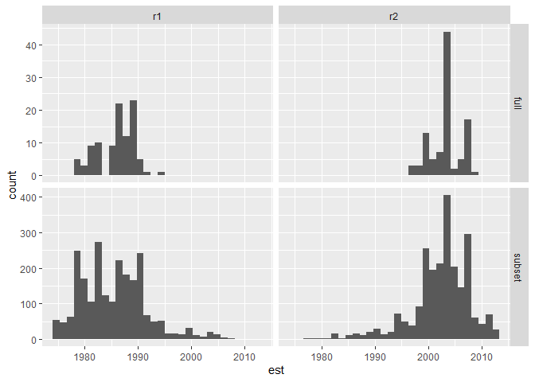

Results
================

``` r
loadd(bbs_rtrg_1_11, cache = cache)

totaln <- bbs_rtrg_1_11$abundance %>%
  mutate(totaln = rowSums(.)) %>%
  mutate(year = bbs_rtrg_1_11$covariates$year)

abund_long <- totaln %>%
  select(-totaln) %>%
  tidyr::pivot_longer(-year, names_to = "species", values_to = "count") %>%
  left_join(select(totaln, year, totaln)) %>%
  mutate(prop = count / totaln)
```

    ## Joining, by = "year"

``` r
ggplot(abund_long, aes(year, prop, color = species)) +
  geom_line() +
  theme_bw() +
  scale_color_viridis_d() +
  theme(legend.position = "none")
```

<!-- -->

``` r
all_evals <- read.csv(here::here("all_evals_bbs_rtrg_1_11.csv"))
all_evals <- all_evals %>%
  mutate(k = as.factor(k),
         seed = as.factor(seed),
         cpts = as.factor(cpts),
         cpts_seed_k = paste0(cpts, "_", seed, "_", k),
         cpts_k = paste0(k, "_", cpts))


# ggplot(all_evals, aes(x = k, y = loglik, group = cpts_seed_k, color = cpts)) +
#   geom_jitter(width = 0, alpha = .01) +
# #  facet_wrap(vars(cpts)) +
#   theme_bw() +
#   ggtitle("All models loglikelihood")

all_evals_summary <- all_evals %>%
  group_by(k, seed, cpts, cpts_seed_k, cpts_k, mean_loglik) %>%
  summarize(mean_ll = mean(loglik, na.rm = T),
            upper_97_ll = quantile(loglik, probs = .975, na.rm= T),
            lower_2_ll = quantile(loglik, probs = .025, na.rm =T),
            n_infinite = sum(is.infinite(loglik)),
            n_na = sum(is.na(loglik))) %>%
  ungroup() %>%
  arrange(desc(mean_loglik))
```

    ## `summarise()` regrouping output by 'k', 'seed', 'cpts', 'cpts_seed_k', 'cpts_k' (override with `.groups` argument)

``` r
ggplot(all_evals_summary, aes(x = cpts, y = mean_loglik, color = cpts)) +
  geom_point() +
facet_wrap(vars(k), nrow = 1) +
  theme_bw() +
  ggtitle("All models loglikelihood")
```

<!-- -->

``` r
highest_low_95 = max(all_evals_summary$lower_2_ll)

all_evals_summary <- all_evals_summary %>%
  mutate(in_95 = upper_97_ll >= highest_low_95)

head(all_evals_summary)
```

<div class="kable-table">

| k | seed | cpts | cpts\_seed\_k | cpts\_k | mean\_loglik |   mean\_ll | upper\_97\_ll | lower\_2\_ll | n\_infinite | n\_na | in\_95 |
| :- | :--- | :--- | :------------ | :------ | -----------: | ---------: | ------------: | -----------: | ----------: | ----: | :----- |
| 3 | 30   | 2    | 2\_30\_3      | 3\_2    |   \-5573.931 | \-5589.182 |    \-5039.125 |   \-6183.494 |           0 |     1 | TRUE   |
| 3 | 114  | 2    | 2\_114\_3     | 3\_2    |   \-5586.718 | \-5588.888 |    \-5078.362 |   \-6245.065 |           0 |     4 | TRUE   |
| 3 | 140  | 2    | 2\_140\_3     | 3\_2    |   \-5628.473 | \-5559.349 |    \-5113.640 |   \-6076.477 |           0 |     7 | TRUE   |
| 3 | 8    | 2    | 2\_8\_3       | 3\_2    |   \-5653.260 | \-5686.590 |    \-5045.429 |   \-6434.138 |           0 |    14 | TRUE   |
| 3 | 70   | 2    | 2\_70\_3      | 3\_2    |   \-5658.658 | \-5578.024 |    \-5209.741 |   \-6206.367 |           0 |    11 | TRUE   |
| 4 | 176  | 2    | 2\_176\_4     | 4\_2    |   \-5679.831 | \-5653.665 |    \-5178.633 |   \-6225.267 |           0 |     1 | TRUE   |

</div>

``` r
all_evals_summary[1:15,]
```

<div class="kable-table">

| k | seed | cpts | cpts\_seed\_k | cpts\_k | mean\_loglik |   mean\_ll | upper\_97\_ll | lower\_2\_ll | n\_infinite | n\_na | in\_95 |
| :- | :--- | :--- | :------------ | :------ | -----------: | ---------: | ------------: | -----------: | ----------: | ----: | :----- |
| 3 | 30   | 2    | 2\_30\_3      | 3\_2    |   \-5573.931 | \-5589.182 |    \-5039.125 |   \-6183.494 |           0 |     1 | TRUE   |
| 3 | 114  | 2    | 2\_114\_3     | 3\_2    |   \-5586.718 | \-5588.888 |    \-5078.362 |   \-6245.065 |           0 |     4 | TRUE   |
| 3 | 140  | 2    | 2\_140\_3     | 3\_2    |   \-5628.473 | \-5559.349 |    \-5113.640 |   \-6076.477 |           0 |     7 | TRUE   |
| 3 | 8    | 2    | 2\_8\_3       | 3\_2    |   \-5653.260 | \-5686.590 |    \-5045.429 |   \-6434.138 |           0 |    14 | TRUE   |
| 3 | 70   | 2    | 2\_70\_3      | 3\_2    |   \-5658.658 | \-5578.024 |    \-5209.741 |   \-6206.367 |           0 |    11 | TRUE   |
| 4 | 176  | 2    | 2\_176\_4     | 4\_2    |   \-5679.831 | \-5653.665 |    \-5178.633 |   \-6225.267 |           0 |     1 | TRUE   |
| 3 | 100  | 2    | 2\_100\_3     | 3\_2    |   \-5689.462 | \-5674.167 |    \-5287.222 |   \-6419.909 |           0 |     7 | TRUE   |
| 3 | 12   | 2    | 2\_12\_3      | 3\_2    |   \-5689.485 | \-5693.960 |    \-5189.623 |   \-6397.838 |           0 |    14 | TRUE   |
| 3 | 104  | 2    | 2\_104\_3     | 3\_2    |   \-5693.657 | \-5678.442 |    \-5314.032 |   \-6178.807 |           0 |     6 | TRUE   |
| 3 | 66   | 2    | 2\_66\_3      | 3\_2    |   \-5706.247 | \-5671.256 |    \-5281.434 |   \-6262.293 |           0 |    13 | TRUE   |
| 4 | 26   | 2    | 2\_26\_4      | 4\_2    |   \-5721.939 | \-5680.183 |    \-5250.074 |   \-6450.900 |           0 |     0 | TRUE   |
| 4 | 118  | 2    | 2\_118\_4     | 4\_2    |   \-5727.140 | \-5703.147 |    \-5223.795 |   \-6309.083 |           0 |     5 | TRUE   |
| 3 | 176  | 2    | 2\_176\_3     | 3\_2    |   \-5727.715 | \-5725.845 |    \-5187.788 |   \-6281.225 |           0 |     7 | TRUE   |
| 3 | 4    | 2    | 2\_4\_3       | 3\_2    |   \-5730.578 | \-5720.395 |    \-5207.252 |   \-6440.602 |           0 |    17 | TRUE   |
| 3 | 164  | 2    | 2\_164\_3     | 3\_2    |   \-5731.853 | \-5759.238 |    \-5252.639 |   \-6356.033 |           0 |    10 | TRUE   |

</div>

``` r
ggplot(filter(all_evals, cpts_seed_k %in% all_evals_summary$cpts_seed_k[1:25]), aes(x = k, y = loglik, group = cpts_seed_k, color = cpts)) +
  geom_boxplot() +
#  facet_wrap(vars(cpts)) +
  theme_bw() +
  ggtitle("Best 25 models loglikelihood")
```

    ## Warning: Removed 202 rows containing non-finite values (stat_boxplot).

<!-- -->

``` r
ggplot(filter(all_evals, cpts_seed_k %in% filter(all_evals_summary, in_95)$cpts_seed_k), aes(x = k, y = loglik, group = cpts_seed_k, color = cpts)) +
  geom_boxplot() +
#  facet_wrap(vars(cpts)) +
  theme_bw() +
  ggtitle("Models w/LL overlapping top 95%")
```

    ## Warning: Removed 7012 rows containing non-finite values (stat_boxplot).

<!-- -->

``` r
# 
# some_ldas <- LDATS::LDA_set_user_seeds(bbs_rtrg_1_11$abundance, topics = c(2:5), seed = 2)
# 
# for(i in 1:length(some_ldas)) {
#   print(plot_lda_year(some_ldas[[i]], covariate_data = bbs_rtrg_1_11$covariates$year))
# }
```

# `{r} #  loadd(ldats_fit_bbs_rtrg_1_11_2_2_1L, cache = cache) # loadd(ldats_eval_ldats_fit_bbs_rtrg_1_11_2_2_1L, cache = cache) #  # lls <- lapply(ldats_fit_bbs_rtrg_1_11_2_2_1L, FUN = function(alist) #   return(data.frame(ll = alist$test_logliks, timestep = alist$test_timestep))) # names(lls) <- 1:length(lls) #  # lls <- bind_rows(lls) #  # lls <- lls %>% #   group_by(timestep) %>% #   mutate(ts_mean = mean(ll)) #  # lls_mean <- lls  %>% #   select(timestep, ts_mean) %>% #   distinct() %>% #   select(ts_mean)  #  # ggplot(lls, aes(timestep, ll, group = timestep)) +geom_boxplot() + geom_point(aes(timestep, ts_mean), color = "green") + #   geom_hline(yintercept = mean(lls_mean$ts_mean), color = "pink") #  #  # ggplot(ldats_eval_ldats_fit_bbs_rtrg_1_11_2_2_1L, aes(x = 1, y = loglik)) + #   geom_boxplot() + #   geom_hline(yintercept = mean(lls_mean$ts_mean) * 23, color = "pink") #  #`

<!-- ```{r random ts on lda} -->

<!-- an_lda <- LDATS::LDA_set_user_seeds(bbs_rtrg_1_11$abundance, 2, 1) -->

<!-- a_ts <- LDATS::TS_on_LDA(an_lda, as.data.frame(bbs_rtrg_1_11$covariates), formulas = ~ 1, nchangepoints = c(0:3), timename = "year", control = LDATS::TS_control(nit = 100)) -->

<!-- ts_lls <- lapply(a_ts, FUN = function(a_ts_fit) return(data.frame(cpts = a_ts_fit$nchangepoints, ll = a_ts_fit$lls))) -->

<!-- ts_lls <- bind_rows(ts_lls) -->

<!-- ts_lls <- ts_lls %>% -->

<!--   group_by(cpts) %>% -->

<!--   mutate(mean_ll = mean(ll), -->

<!--             bottom2 = quantile(ll, probs = .025), -->

<!--             top97 = quantile(ll, probs = .975)) %>% -->

<!--   ungroup() -->

<!-- ggplot(ts_lls, aes(x = cpts, y = ll, group = cpts)) + -->

<!--   geom_boxplot() + -->

<!--   geom_point(aes(cpts, bottom2), color = "red") + -->

<!--   geom_point(aes(cpts, top97), color = "red") + -->

<!--   geom_point(aes(cpts, mean_ll), color = "green") -->

<!-- ``` -->

<!-- So you do see, spread causing overlapping 95% intervals for the loglikelihoods for models that we would distinguish between using AIC. -->

<!-- In this case I'm not confident using AIC or AICc for final selection because the models are not fit to the same data. -->

<!-- However you could fit *another* TS model to the *full* ts to see if that lands you somewhere other than the highest mean ll on the crossval.  -->

## Getting back to a single model

The best-fit from the ones run so far is 2 changepoints, 3 topics, seed
= 30. However the best one **in my local cache right now** is for seed =
4.

``` r
loadd(ldats_fit_bbs_rtrg_1_11_3L_4_2L, cache= cache)
loadd(ldats_eval_ldats_fit_bbs_rtrg_1_11_3L_4_2L, cache= cache)

full_lda <- LDATS::LDA_set_user_seeds(ldats_fit_bbs_rtrg_1_11_3L_4_2L[[1]]$full$abundance, 3, 4)
```

    ## Running LDA with 3 topics (seed 4)

``` r
plot_lda_comp(full_lda)
```

<!-- -->

``` r
plot_lda_year(full_lda, covariate_data = ldats_fit_bbs_rtrg_1_11_3L_4_2L[[1]]$full$covariates$year)
```

<!-- -->

``` r
full_ts <- LDATS::TS_on_LDA(full_lda, as.data.frame(ldats_fit_bbs_rtrg_1_11_3L_4_2L[[1]]$full$covariates), ~1, 2, "year", control=LDATS::TS_control(nit=100))
```

    ## Running TS model with 2 changepoints and equation gamma ~ 1 on LDA model k: 3, seed: 4

    ##   Estimating changepoint distribution

    ##   Estimating regressor distribution

``` r
plot(full_ts[[1]])
```

<!-- -->

``` r
full_rhos <- full_ts[[1]]$rhos

subset_rhos <- lapply(ldats_fit_bbs_rtrg_1_11_3L_4_2L, FUN = function(ldats_fit) return(cbind(ldats_fit$fitted_ts$rhos, ldats_fit$test$covariates$year[1])))

subset_rhos <- lapply(subset_rhos, FUN = function(s_r) return(as.data.frame(s_r)))

names(subset_rhos) <- 1:length(subset_rhos)

subset_rhos <- bind_rows(subset_rhos)

subset_rhos <- subset_rhos %>%
  rename(r1 = V1,
         r2 = V2,
         testyear = V3) %>%
  tidyr::pivot_longer(-testyear, names_to = "cpt", values_to = "est") %>%
  mutate(source = "subset")


full_rhos <- as.data.frame(full_rhos) %>%
  rename(r1 = V1,
         r2 = V2) %>%
  mutate(source = "full") %>%
  tidyr::pivot_longer(-source, names_to = "cpt", values_to = "est") %>%
  mutate(testyear = NA)


all_rhos <- rbind(full_rhos, subset_rhos)

ggplot(all_rhos, aes(est)) +
  geom_histogram() +
  facet_grid(rows = vars(source), cols = vars(cpt), scales = "free_y") 
```

    ## `stat_bin()` using `bins = 30`. Pick better value with `binwidth`.

<!-- -->

``` r
all_rhos %>%
  group_by(source, cpt) %>%
  summarize(mean_est = mean(est))
```

    ## `summarise()` regrouping output by 'source' (override with `.groups` argument)

<div class="kable-table">

| source | cpt | mean\_est |
| :----- | :-- | --------: |
| full   | r1  |  1985.970 |
| full   | r2  |  2003.310 |
| subset | r1  |  1985.498 |
| subset | r2  |  2002.429 |

</div>

In this case, if we take all the rho estimates across the subsetted
models and compare them to the rho estimates from a single TS fit to the
full TS, we get the same estimates for rho.

``` r
full_preds <- lapply(1:100, FUN = get_preds, subsetted_dataset_item = ldats_fit_bbs_rtrg_1_11_3L_4_2L[[1]], fitted_ts = full_ts[[1]])
```

    ## Joining, by = "segment"
    ## Joining, by = "segment"
    ## Joining, by = "segment"
    ## Joining, by = "segment"
    ## Joining, by = "segment"
    ## Joining, by = "segment"
    ## Joining, by = "segment"
    ## Joining, by = "segment"
    ## Joining, by = "segment"
    ## Joining, by = "segment"
    ## Joining, by = "segment"
    ## Joining, by = "segment"
    ## Joining, by = "segment"
    ## Joining, by = "segment"
    ## Joining, by = "segment"
    ## Joining, by = "segment"
    ## Joining, by = "segment"
    ## Joining, by = "segment"
    ## Joining, by = "segment"
    ## Joining, by = "segment"
    ## Joining, by = "segment"
    ## Joining, by = "segment"
    ## Joining, by = "segment"
    ## Joining, by = "segment"
    ## Joining, by = "segment"
    ## Joining, by = "segment"
    ## Joining, by = "segment"
    ## Joining, by = "segment"
    ## Joining, by = "segment"
    ## Joining, by = "segment"
    ## Joining, by = "segment"
    ## Joining, by = "segment"
    ## Joining, by = "segment"
    ## Joining, by = "segment"
    ## Joining, by = "segment"
    ## Joining, by = "segment"
    ## Joining, by = "segment"
    ## Joining, by = "segment"
    ## Joining, by = "segment"
    ## Joining, by = "segment"
    ## Joining, by = "segment"
    ## Joining, by = "segment"
    ## Joining, by = "segment"
    ## Joining, by = "segment"
    ## Joining, by = "segment"
    ## Joining, by = "segment"
    ## Joining, by = "segment"
    ## Joining, by = "segment"
    ## Joining, by = "segment"
    ## Joining, by = "segment"
    ## Joining, by = "segment"
    ## Joining, by = "segment"
    ## Joining, by = "segment"
    ## Joining, by = "segment"
    ## Joining, by = "segment"
    ## Joining, by = "segment"
    ## Joining, by = "segment"
    ## Joining, by = "segment"
    ## Joining, by = "segment"
    ## Joining, by = "segment"
    ## Joining, by = "segment"
    ## Joining, by = "segment"
    ## Joining, by = "segment"
    ## Joining, by = "segment"
    ## Joining, by = "segment"
    ## Joining, by = "segment"
    ## Joining, by = "segment"
    ## Joining, by = "segment"
    ## Joining, by = "segment"
    ## Joining, by = "segment"
    ## Joining, by = "segment"
    ## Joining, by = "segment"
    ## Joining, by = "segment"
    ## Joining, by = "segment"
    ## Joining, by = "segment"
    ## Joining, by = "segment"
    ## Joining, by = "segment"
    ## Joining, by = "segment"
    ## Joining, by = "segment"
    ## Joining, by = "segment"
    ## Joining, by = "segment"
    ## Joining, by = "segment"
    ## Joining, by = "segment"
    ## Joining, by = "segment"
    ## Joining, by = "segment"
    ## Joining, by = "segment"
    ## Joining, by = "segment"
    ## Joining, by = "segment"
    ## Joining, by = "segment"
    ## Joining, by = "segment"
    ## Joining, by = "segment"
    ## Joining, by = "segment"
    ## Joining, by = "segment"
    ## Joining, by = "segment"
    ## Joining, by = "segment"
    ## Joining, by = "segment"
    ## Joining, by = "segment"
    ## Joining, by = "segment"
    ## Joining, by = "segment"
    ## Joining, by = "segment"

``` r
full_preds <- bind_rows(full_preds)

full_preds$topic_est <- paste0(full_preds$topic, full_preds$estimate)

ggplot(full_preds, aes(year, prop, color= topic, group = topic_est)) +
  geom_line(alpha = .012)
```

<!-- -->

``` r
rho_preds <- get_preds(subsetted_dataset_item = ldats_fit_bbs_rtrg_1_11_3L_4_2L[[1]], fitted_ts = full_ts[[1]], rho = c(1985, 2003))
```

    ## Joining, by = "segment"

``` r
ggplot(rho_preds, aes(year, prop, color= topic, group = topic)) +
  geom_line() +
  theme_bw()
```

<!-- -->

``` r
DBI::dbDisconnect(db)
rm(cache)
```
