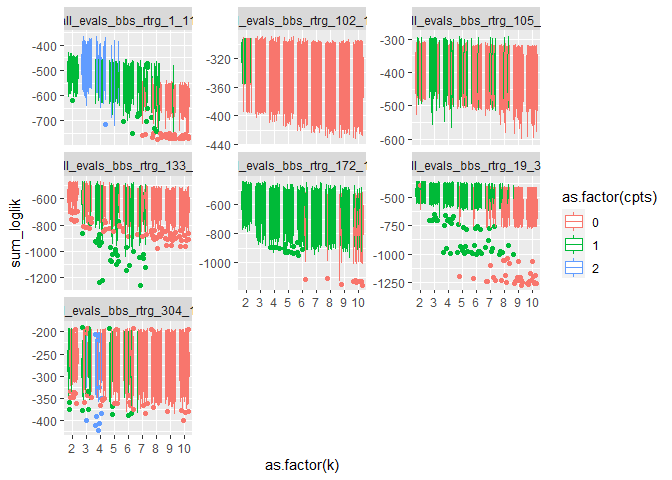
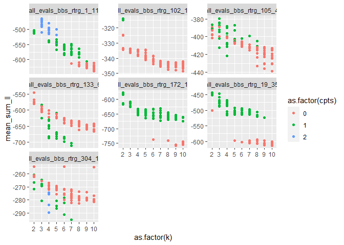

Hybrid results 10/2020
================

Including history of the crossval approach, how I’ve arrived at a
combined crossval + AIC approach, and what I see as paths from here….

<!-- -->

    ## `summarise()` regrouping output by 'dataset', 'k', 'seed' (override with `.groups` argument)

<!-- -->

    ## # A tibble: 6 x 6
    ## # Groups:   dataset [2]
    ##   dataset                       k  seed  cpts mean_sum_ll dat_rank
    ##   <chr>                     <int> <int> <int>       <dbl>    <int>
    ## 1 all_evals_bbs_rtrg_304_17     2     8     0       -254.        1
    ## 2 all_evals_bbs_rtrg_304_17     6    10     0       -255.        2
    ## 3 all_evals_bbs_rtrg_304_17    10    10     0       -255.        3
    ## 4 all_evals_bbs_rtrg_304_17     2    18     1       -261.        4
    ## 5 all_evals_bbs_rtrg_304_17     2     4     0       -261.        5
    ## 6 all_evals_bbs_rtrg_102_18     2     6     1       -314.        1

## 105\_4

    ## # A tibble: 6 x 6
    ## # Groups:   dataset [1]
    ##   dataset                      k  seed  cpts mean_sum_ll dat_rank
    ##   <chr>                    <int> <int> <int>       <dbl>    <int>
    ## 1 all_evals_bbs_rtrg_105_4     3    12     1       -379.        1
    ## 2 all_evals_bbs_rtrg_105_4     3    18     1       -384.        2
    ## 3 all_evals_bbs_rtrg_105_4     3    20     1       -385.        3
    ## 4 all_evals_bbs_rtrg_105_4     2    14     1       -387.        4
    ## 5 all_evals_bbs_rtrg_105_4     5    14     1       -387.        5
    ## 6 all_evals_bbs_rtrg_105_4     3     2     1       -387.        6

<!-- -->

    ## Running LDA with 3 topics (seed 12)

<!-- --><!-- -->

    ## Running TS model with 1 changepoints and equation gamma ~ 1 on LDA model k: 3, seed: 12

    ##   Estimating changepoint distribution

    ##   Estimating regressor distribution

<!-- -->

    ## `stat_bin()` using `bins = 30`. Pick better value with `binwidth`.

<!-- -->

### 304\_17

    ## # A tibble: 6 x 6
    ## # Groups:   dataset [1]
    ##   dataset                       k  seed  cpts mean_sum_ll dat_rank
    ##   <chr>                     <int> <int> <int>       <dbl>    <int>
    ## 1 all_evals_bbs_rtrg_304_17     2     8     0       -254.        1
    ## 2 all_evals_bbs_rtrg_304_17     6    10     0       -255.        2
    ## 3 all_evals_bbs_rtrg_304_17    10    10     0       -255.        3
    ## 4 all_evals_bbs_rtrg_304_17     2    18     1       -261.        4
    ## 5 all_evals_bbs_rtrg_304_17     2     4     0       -261.        5
    ## 6 all_evals_bbs_rtrg_304_17     2    22     0       -261.        6

<!-- -->

    ## Running LDA with 2 topics (seed 8)

    ## Running LDA with 6 topics (seed 10)

    ## Running LDA with 10 topics (seed 10)

    ## Running TS model with 0 changepoints and equation gamma ~ 1 on LDA model k: 2, seed: 8

    ## Running TS model with 0 changepoints and equation gamma ~ 1 on LDA model k: 6, seed: 10

    ## Running TS model with 0 changepoints and equation gamma ~ 1 on LDA model k: 10, seed: 10

<!-- --><!-- --><!-- --><!-- --><!-- --><!-- --><!-- --><!-- --><!-- -->
