Hybrid results 10/2020
================

Including history of the crossval approach, how I’ve arrived at a
combined crossval + AIC approach, and what I see as paths from here….

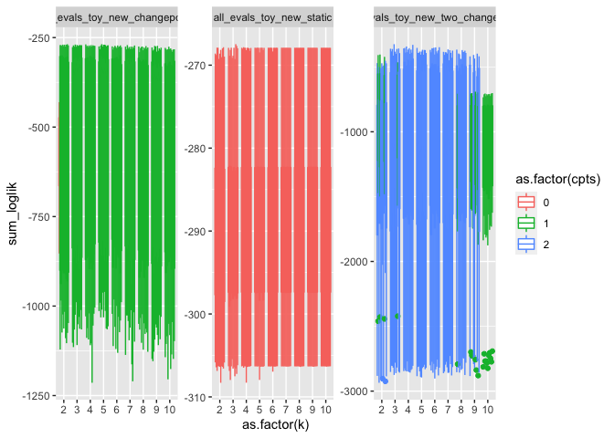<!-- -->

    ## `summarise()` regrouping output by 'dataset', 'k', 'seed' (override with `.groups` argument)

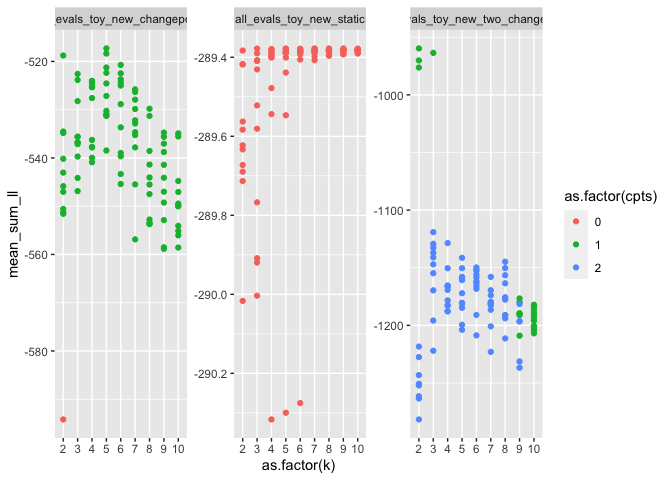<!-- -->

    ## # A tibble: 15 x 6
    ## # Groups:   dataset [3]
    ##    dataset                               k  seed  cpts mean_sum_ll dat_rank
    ##    <chr>                             <int> <int> <int>       <dbl>    <int>
    ##  1 all_evals_toy_new_static              8    16     0       -289.        1
    ##  2 all_evals_toy_new_static              9    16     0       -289.        2
    ##  3 all_evals_toy_new_static              5    16     0       -289.        3
    ##  4 all_evals_toy_new_static              3    16     0       -289.        4
    ##  5 all_evals_toy_new_static             10    16     0       -289.        5
    ##  6 all_evals_toy_new_changepoint         5    18     1       -517.        1
    ##  7 all_evals_toy_new_changepoint         5     2     1       -518.        2
    ##  8 all_evals_toy_new_changepoint         2    20     1       -519.        3
    ##  9 all_evals_toy_new_changepoint         6    14     1       -521.        4
    ## 10 all_evals_toy_new_changepoint         5    10     1       -521.        5
    ## 11 all_evals_toy_new_two_changepoint     2    12     1       -960.        1
    ## 12 all_evals_toy_new_two_changepoint     3     4     1       -964.        2
    ## 13 all_evals_toy_new_two_changepoint     2     4     1       -970.        3
    ## 14 all_evals_toy_new_two_changepoint     2    16     1       -976.        4
    ## 15 all_evals_toy_new_two_changepoint     3    12     2      -1119.        5

## New static

<!-- -->

    ## # A tibble: 5 x 6
    ## # Groups:   dataset [1]
    ##   dataset                      k  seed  cpts mean_sum_ll dat_rank
    ##   <chr>                    <int> <int> <int>       <dbl>    <int>
    ## 1 all_evals_toy_new_static     8    16     0       -289.        1
    ## 2 all_evals_toy_new_static     9    16     0       -289.        2
    ## 3 all_evals_toy_new_static     5    16     0       -289.        3
    ## 4 all_evals_toy_new_static     3    16     0       -289.        4
    ## 5 all_evals_toy_new_static    10    16     0       -289.        5

    ## Running LDA with 3 topics (seed 16)

    ## Running LDA with 5 topics (seed 16)

    ## Running LDA with 8 topics (seed 16)

    ## Running LDA with 9 topics (seed 16)

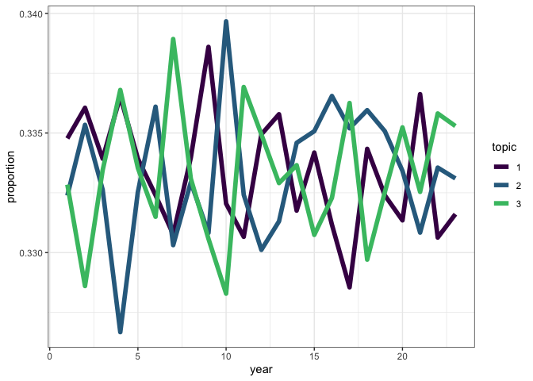<!-- --><!-- -->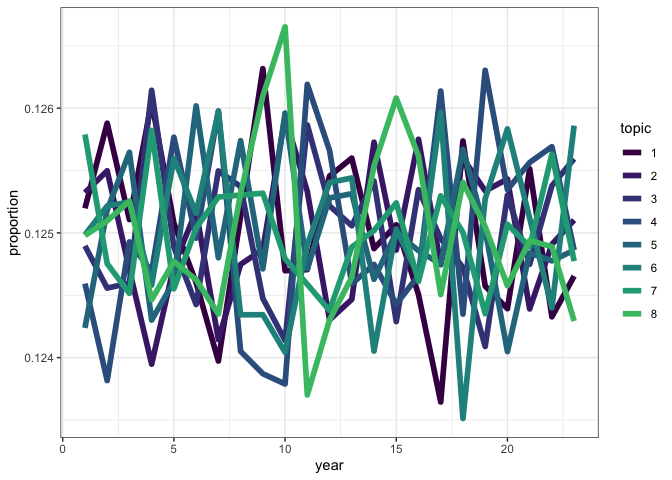<!-- -->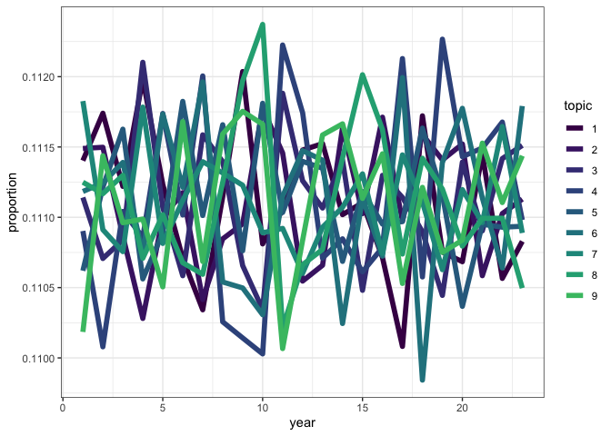<!-- -->

    ## Running TS model with 0 changepoints and equation gamma ~ 1 on LDA model k: 3, seed: 16

    ## Running TS model with 0 changepoints and equation gamma ~ 1 on LDA model k: 5, seed: 16

    ## Running TS model with 0 changepoints and equation gamma ~ 1 on LDA model k: 8, seed: 16

    ## Running TS model with 0 changepoints and equation gamma ~ 1 on LDA model k: 9, seed: 16

<!-- -->

    ## NULL

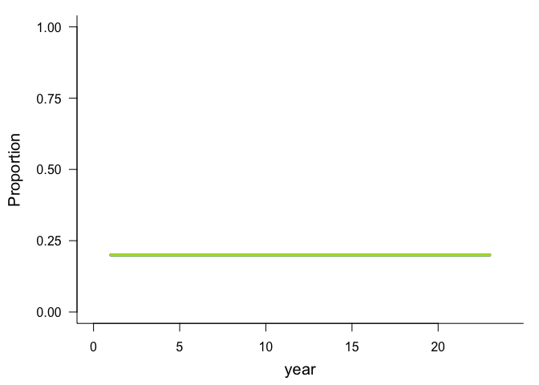<!-- -->

    ## NULL

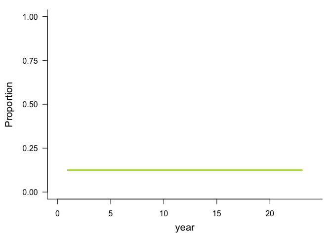<!-- -->

    ## NULL

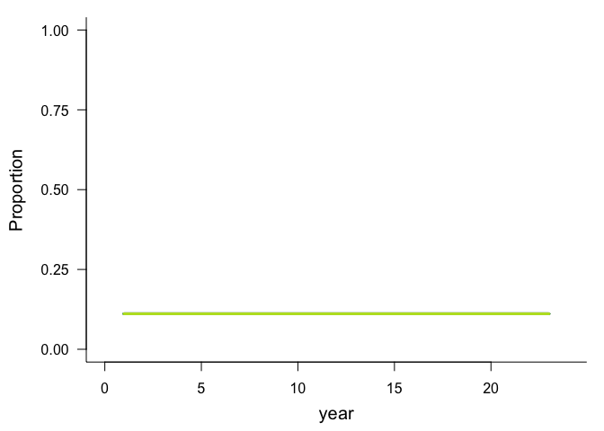<!-- -->

    ## NULL

## New changepoint

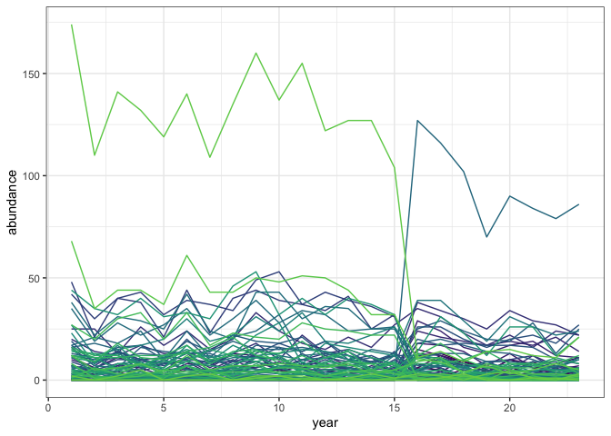<!-- -->

    ## # A tibble: 5 x 6
    ## # Groups:   dataset [1]
    ##   dataset                           k  seed  cpts mean_sum_ll dat_rank
    ##   <chr>                         <int> <int> <int>       <dbl>    <int>
    ## 1 all_evals_toy_new_changepoint     5    18     1       -517.        1
    ## 2 all_evals_toy_new_changepoint     5     2     1       -518.        2
    ## 3 all_evals_toy_new_changepoint     2    20     1       -519.        3
    ## 4 all_evals_toy_new_changepoint     6    14     1       -521.        4
    ## 5 all_evals_toy_new_changepoint     5    10     1       -521.        5

    ## Running LDA with 5 topics (seed 18)

    ## Running LDA with 2 topics (seed 20)

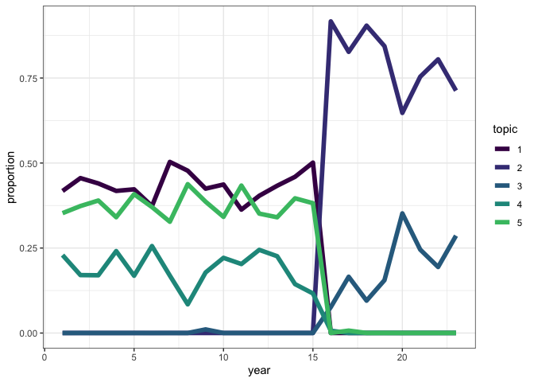<!-- -->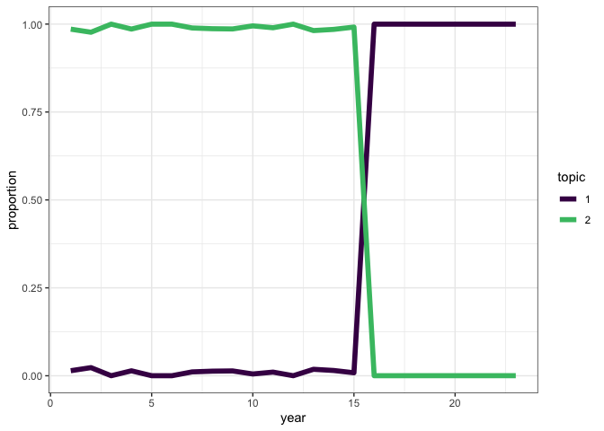<!-- -->

    ## Running TS model with 1 changepoints and equation gamma ~ 1 on LDA model k: 5, seed: 18

    ##   Estimating changepoint distribution

    ##   Estimating regressor distribution

    ## Running TS model with 1 changepoints and equation gamma ~ 1 on LDA model k: 2, seed: 20

    ##   Estimating changepoint distribution

    ##   Estimating regressor distribution

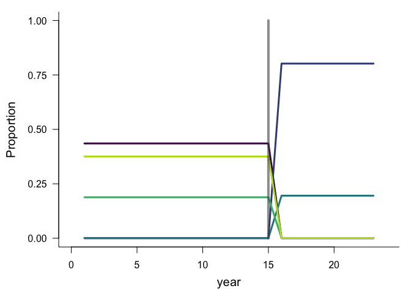<!-- -->

    ## `stat_bin()` using `bins = 30`. Pick better value with `binwidth`.

    ## Warning: Removed 2 rows containing missing values (geom_bar).

<!-- -->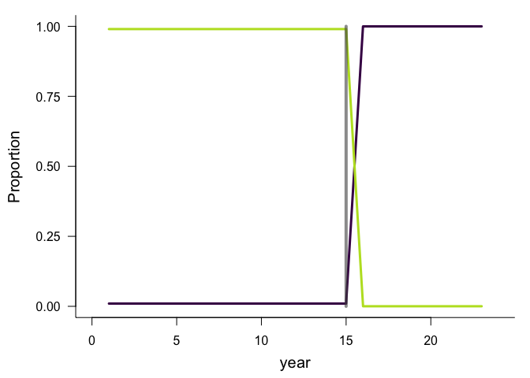<!-- -->

    ## `stat_bin()` using `bins = 30`. Pick better value with `binwidth`.

    ## Warning: Removed 2 rows containing missing values (geom_bar).

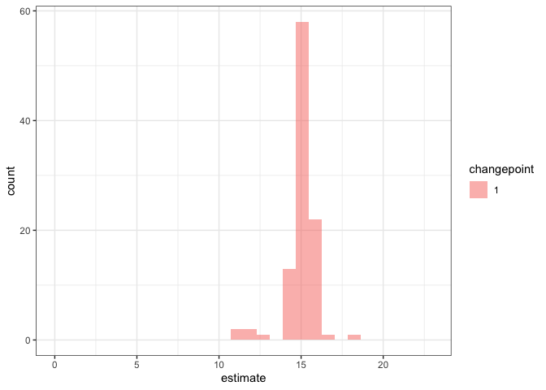<!-- -->

## New two changepoint

<!-- --><!-- -->

    ## # A tibble: 5 x 6
    ## # Groups:   dataset [1]
    ##   dataset                               k  seed  cpts mean_sum_ll dat_rank
    ##   <chr>                             <int> <int> <int>       <dbl>    <int>
    ## 1 all_evals_toy_new_two_changepoint     2    12     1       -960.        1
    ## 2 all_evals_toy_new_two_changepoint     3     4     1       -964.        2
    ## 3 all_evals_toy_new_two_changepoint     2     4     1       -970.        3
    ## 4 all_evals_toy_new_two_changepoint     2    16     1       -976.        4
    ## 5 all_evals_toy_new_two_changepoint     3    12     2      -1119.        5

    ## Running LDA with 2 topics (seed 12)

    ## Running LDA with 3 topics (seed 4)

    ## Running LDA with 3 topics (seed 12)

<!-- --><!-- --><!-- -->

    ## Running TS model with 1 changepoints and equation gamma ~ 1 on LDA model k: 2, seed: 12

    ##   Estimating changepoint distribution

    ##   Estimating regressor distribution

    ## Running TS model with 1 changepoints and equation gamma ~ 1 on LDA model k: 3, seed: 4

    ##   Estimating changepoint distribution

    ##   Estimating regressor distribution

    ## Running TS model with 2 changepoints and equation gamma ~ 1 on LDA model k: 3, seed: 12

    ##   Estimating changepoint distribution

    ##   Estimating regressor distribution

<!-- -->

    ## `stat_bin()` using `bins = 30`. Pick better value with `binwidth`.

    ## Warning: Removed 2 rows containing missing values (geom_bar).

<!-- --><!-- -->

    ## `stat_bin()` using `bins = 30`. Pick better value with `binwidth`.

    ## Warning: Removed 2 rows containing missing values (geom_bar).

<!-- --><!-- -->

    ## `stat_bin()` using `bins = 30`. Pick better value with `binwidth`.

    ## Warning: Removed 4 rows containing missing values (geom_bar).

<!-- -->

For the data I (intended) to contrive to have two changepoints, the LDA
seems to have found a way to split into just **2** topics that capture
most of the change. I am not sure how it has done this, but I’m not
completely surprised. It is very hard to engineer topic structure over
time.
