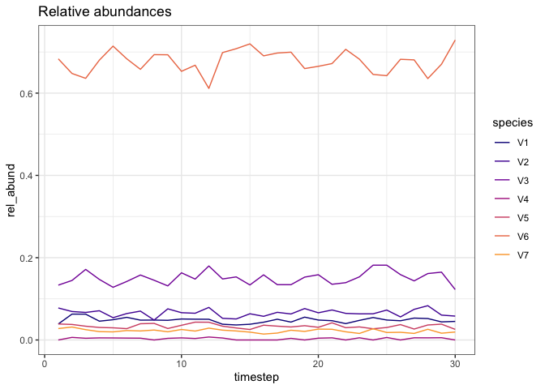
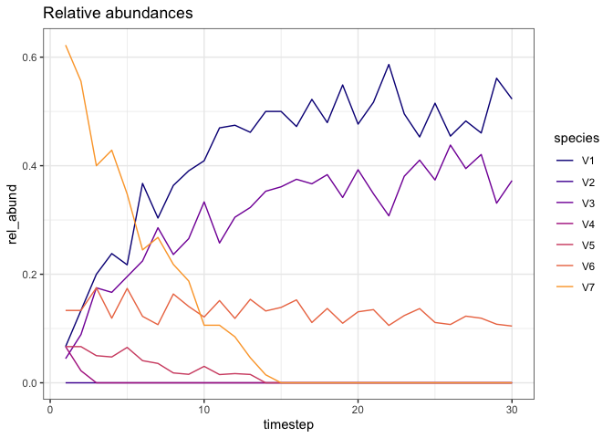
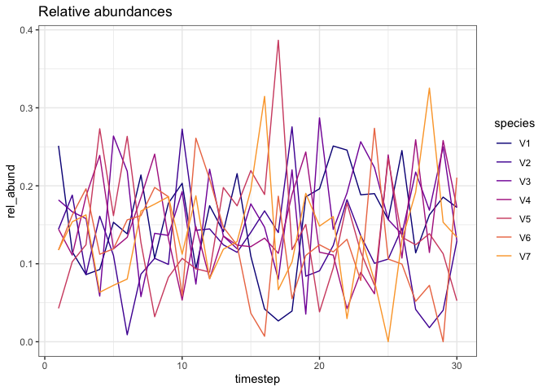
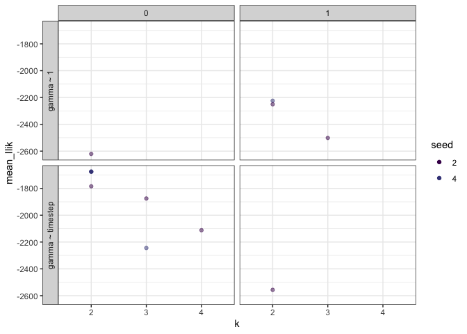

Generating sim data
================
10/1/2019

Some ground parameters
----------------------

``` r
nspp <- 7
ntimesteps <- 30
mean_nind <- 200
err_prop <- .2
```

Static with sampling error
--------------------------



Everyone changes directionally (in different directions)
--------------------------------------------------------



Static with a changepoint
-------------------------


Directional change with a changepoint
-------------------------------------


Noise
-----





