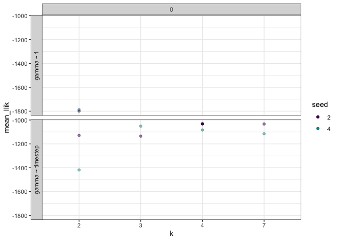

Generating sim data
================
10/1/2019

Static (with error) with changepoint
------------------------------------

Results
-------

### Static

The best model looks like it's 0 changepoints, 4 topics, ~time

Looking at it:

 
