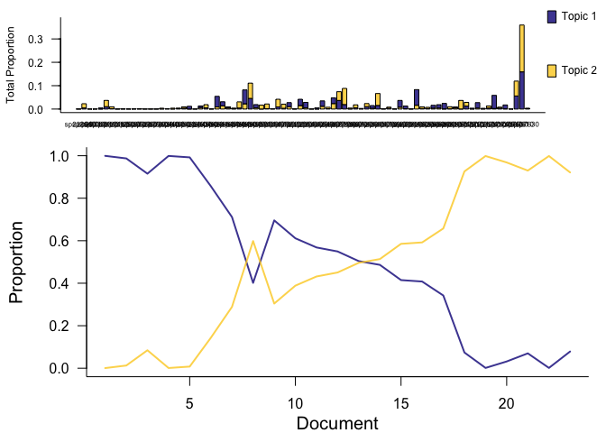
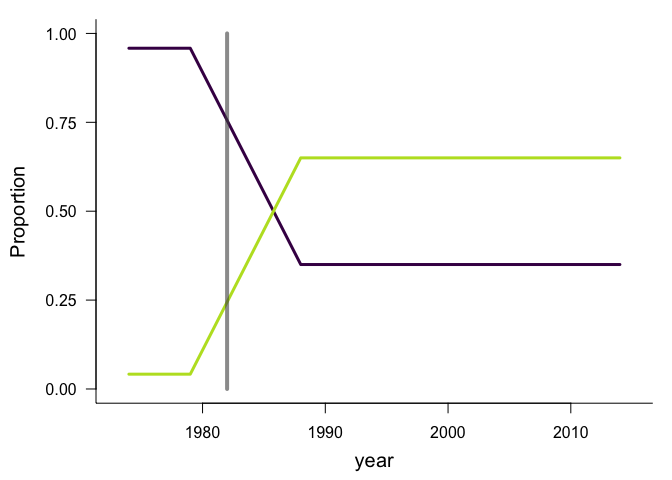

Overview January 2021
================
Renata Diaz
18 January, 2021

  - [Crossvalidaton](#crossvalidaton)

### Crossvalidaton

We had invoked cross validation to try and do model selection based on
how well the model is able to predict withheld data. The goal there was
to avoid overfitting, and particularly a tendency to overfit by
assigning a different LDA topic to each timestep or each species.

I set up a crossvalidation model selection pipeline where:

  - Withhold a section of timestep(s) + a buffer
  - Fit numerous LDA and TS combinations to the training data
  - Test the fitted model’s performance as its ability to predict the
    withheld observations
  - Use many subsets per model specification and aggregate

There are some variants and details in the crossvalidation methods:

  - A single LDA seed + number of topics, fit to slightly different
    subsets of a dataset, can lead to **very** different gamma and beta
    matrices. This makes it nonsensical to re-aggregate the models fit
    to the different subsets. I switched to subsetting the LDA
    **proportions** after they have been fit.

When using cross validation, high-k models do indeed do poorly. However,
it’s hard to distinguish the number of changepoints, and large numbers
of changepoints do very well. k here is the facet panels.

<!-- -->

High numbers of changepoints win freuently:

    ## # A tibble: 10 x 10
    ##    k     seed  cpts  cpts_seed_k cpts_k mean_ll upper_97_ll lower_2_ll
    ##    <fct> <fct> <fct> <chr>       <chr>    <dbl>       <dbl>      <dbl>
    ##  1 2     16    5     5_16_2      2_5     -6167.      -6022.     -6374.
    ##  2 2     42    5     5_42_2      2_5     -6202.      -5996.     -6483.
    ##  3 2     24    5     5_24_2      2_5     -6210.      -5989.     -6519.
    ##  4 2     38    5     5_38_2      2_5     -6214.      -6031.     -6467.
    ##  5 2     34    5     5_34_2      2_5     -6225.      -6066.     -6430.
    ##  6 2     16    4     4_16_2      2_4     -6226.      -6053.     -6444.
    ##  7 2     4     5     5_4_2       2_5     -6267.      -6097.     -6527.
    ##  8 2     38    4     4_38_2      2_4     -6281.      -6080.     -6534.
    ##  9 2     6     5     5_6_2       2_5     -6283.      -6035.     -6605.
    ## 10 2     42    4     4_42_2      2_4     -6285.      -6041.     -6611.
    ## # … with 2 more variables: n_infinite <int>, in_95 <lgl>

And a lot of models, with different numbers of changepoints, do very
well:

<!-- -->

Digging into this, we can see that the best fitting model (`k = 2, seed
= 16, cpts = 5`) is not very different from a model with 1 changepoint,
and I’d argue that the extra changepoints are not picking up on
“important” dynamics. We’re getting more changepoints than we want.

    ## Running LDA with 2 topics (seed 16)

<!-- -->

    ## Running TS model with 0 changepoints and equation gamma ~ 1 on LDA model

    ## Running TS model with 1 changepoints and equation gamma ~ 1 on LDA model

    ##   Estimating changepoint distribution

    ##   Estimating regressor distribution

    ## Running TS model with 5 changepoints and equation gamma ~ 1 on LDA model

    ##   Estimating changepoint distribution

    ##   Estimating regressor distribution

<!-- --><!-- --><!-- -->
