Results
================

``` r
loadd(bbs_rtrg_1_4)

totaln <- bbs_rtrg_1_4$abundance %>%
  mutate(totaln = rowSums(.)) %>%
  mutate(year = bbs_rtrg_1_4$covariates$year)

abund_long <- totaln %>%
  select(-totaln) %>%
  tidyr::pivot_longer(-year, names_to = "species", values_to = "count") %>%
  left_join(select(totaln, year, totaln)) %>%
  mutate(prop = count / totaln)
```

    ## Joining, by = "year"

``` r
ggplot(abund_long, aes(year, prop, color = species)) +
  geom_line() +
  theme_bw() +
  scale_color_viridis_d() +
  theme(legend.position = "none")
```

<!-- -->

``` r
loadd(all_evals)

all_evals <- all_evals %>%
  mutate(k = as.factor(k),
         seed = as.factor(seed),
         cpts = as.factor(cpts),
         cpts_seed_k = paste0(cpts, "_", seed, "_", k))


ggplot(all_evals, aes(x = k, y = loglik, group = cpts_seed_k, color = cpts)) +
  geom_violin() +
#  facet_wrap(vars(cpts)) +
  theme_bw() +
  ggtitle("All models loglikelihood")
```

    ## Warning: Removed 318 rows containing non-finite values (stat_ydensity).

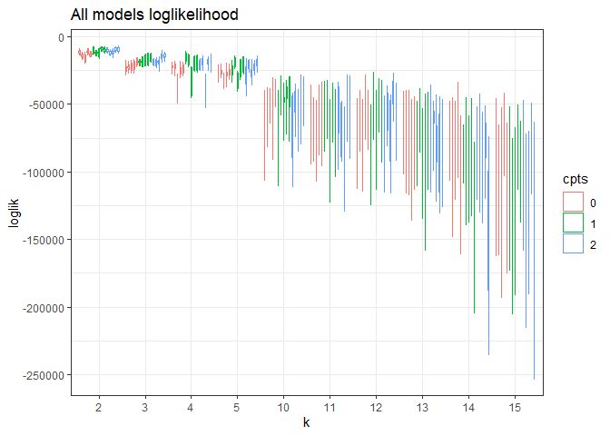<!-- -->

``` r
all_evals_summary <- all_evals %>%
  group_by(k, seed, cpts, cpts_seed_k) %>%
  summarize(mean_ll = mean(loglik),
            upper_97_ll = quantile(loglik, probs = .975),
            lower_2_ll = quantile(loglik, probs = .025),
            n_infinite = sum(is.infinite(loglik))) %>%
  ungroup() %>%
  arrange(desc(mean_ll))
```

    ## `summarise()` regrouping output by 'k', 'seed', 'cpts' (override with `.groups` argument)

``` r
highest_low_95 = max(all_evals_summary$lower_2_ll)

all_evals_summary <- all_evals_summary %>%
  mutate(in_95 = upper_97_ll >= highest_low_95)

head(all_evals_summary)
```

    ## # A tibble: 6 x 9
    ##   k     seed  cpts  cpts_seed_k mean_ll upper_97_ll lower_2_ll n_infinite in_95
    ##   <fct> <fct> <fct> <chr>         <dbl>       <dbl>      <dbl>      <int> <lgl>
    ## 1 2     6     1     1_6_2        -8860.      -7854.    -10323.          0 TRUE 
    ## 2 2     6     2     2_6_2        -9435.      -8091.    -10892.          0 TRUE 
    ## 3 2     8     2     2_8_2        -9684.      -7863.    -11924.          0 TRUE 
    ## 4 2     8     1     1_8_2       -10001.      -8162.    -11708.          0 TRUE 
    ## 5 2     10    2     2_10_2      -10138.      -8270.    -11582.          0 TRUE 
    ## 6 2     10    1     1_10_2      -10357.      -8597.    -12415.          0 TRUE

``` r
all_evals_summary[1:15,]
```

    ## # A tibble: 15 x 9
    ##    k     seed  cpts  cpts_seed_k mean_ll upper_97_ll lower_2_ll n_infinite in_95
    ##    <fct> <fct> <fct> <chr>         <dbl>       <dbl>      <dbl>      <int> <lgl>
    ##  1 2     6     1     1_6_2        -8860.      -7854.    -10323.          0 TRUE 
    ##  2 2     6     2     2_6_2        -9435.      -8091.    -10892.          0 TRUE 
    ##  3 2     8     2     2_8_2        -9684.      -7863.    -11924.          0 TRUE 
    ##  4 2     8     1     1_8_2       -10001.      -8162.    -11708.          0 TRUE 
    ##  5 2     10    2     2_10_2      -10138.      -8270.    -11582.          0 TRUE 
    ##  6 2     10    1     1_10_2      -10357.      -8597.    -12415.          0 TRUE 
    ##  7 2     6     0     0_6_2       -11073.      -9188.    -12975.          0 TRUE 
    ##  8 2     10    0     0_10_2      -11754.      -9557.    -13477.          0 TRUE 
    ##  9 2     2     1     1_2_2       -11926.     -10420.    -13368.          0 FALSE
    ## 10 2     4     2     2_4_2       -11963.      -9605.    -14578.          0 TRUE 
    ## 11 2     4     1     1_4_2       -11981.      -9367.    -15281.          0 TRUE 
    ## 12 2     2     2     2_2_2       -11995.     -10206.    -13709.          0 TRUE 
    ## 13 2     8     0     0_8_2       -13227.     -11430.    -14581.          0 FALSE
    ## 14 3     8     2     2_8_3       -14212.     -11936.    -17208.          0 FALSE
    ## 15 3     6     2     2_6_3       -14398.     -11112.    -17202.          0 FALSE

``` r
ggplot(filter(all_evals, cpts_seed_k %in% all_evals_summary$cpts_seed_k[1:25]), aes(x = k, y = loglik, group = cpts_seed_k, color = cpts)) +
  geom_boxplot() +
#  facet_wrap(vars(cpts)) +
  theme_bw() +
  ggtitle("Best 25 models loglikelihood")
```

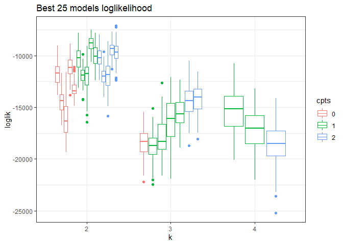<!-- -->

``` r
ggplot(filter(all_evals, cpts_seed_k %in% filter(all_evals_summary, in_95)$cpts_seed_k), aes(x = k, y = loglik, group = cpts_seed_k, color = cpts)) +
  geom_boxplot() +
#  facet_wrap(vars(cpts)) +
  theme_bw() +
  ggtitle("Models w/LL overlapping top 95%")
```

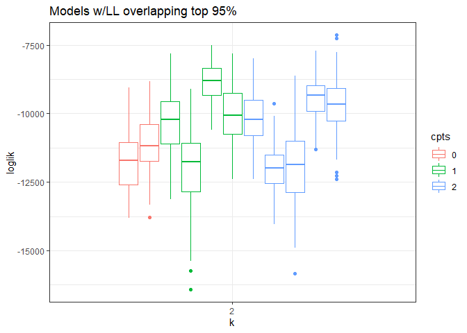<!-- -->

``` r
#plot(ldas_only$`k: 14, seed: 8`)

lda_2_6 <- LDATS::LDA_set_user_seeds(bbs_rtrg_1_4$abundance, 2, 6)
```

    ## Running LDA with 2 topics (seed 6)

``` r
plot_lda_comp(lda_2_6)

plot_lda_year(lda_2_6, bbs_rtrg_1_4$covariates$year)
```

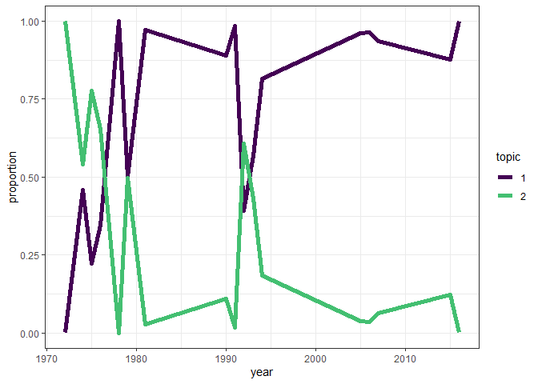<!-- -->

``` r
# 
# loadd(ldats_fit_bbs_rtrg_1_11_2L_6_1L)
# 
# for(i in 1:23){
#   plot(ldats_fit_bbs_rtrg_1_11_2L_6_1L[[i]]$fitted_lda)
# plot(ldats_fit_bbs_rtrg_1_11_2L_6_1L[[i]]$fitted_ts, selection = "mode")
# }
```

``` r
ts_2_6_1 <- LDATS::TS_on_LDA(lda_2_6, as.data.frame(bbs_rtrg_1_4$covariates), timename = 'year', formulas = ~ 1, nchangepoints = c(0:2), control = LDATS::TS_control(nit = 1000))
```

    ## Running TS model with 0 changepoints and equation gamma ~ 1 on LDA model k: 2, seed: 6

    ## Running TS model with 1 changepoints and equation gamma ~ 1 on LDA model k: 2, seed: 6

    ##   Estimating changepoint distribution

    ##   Estimating regressor distribution

    ## Running TS model with 2 changepoints and equation gamma ~ 1 on LDA model k: 2, seed: 6

    ##   Estimating changepoint distribution

    ##   Estimating regressor distribution

``` r
for(i in 1:3) {
plot(ts_2_6_1[[i]], selection = "mode")
}
```

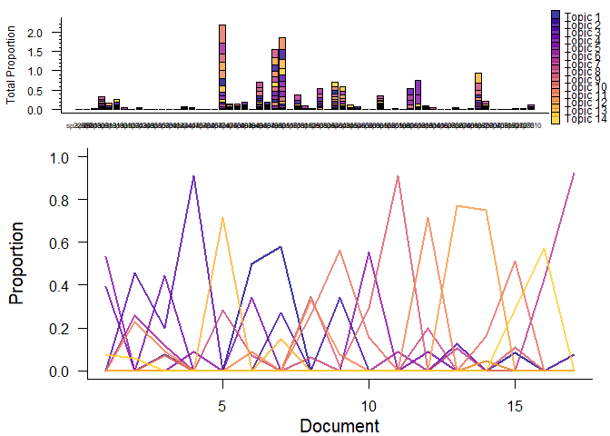<!-- -->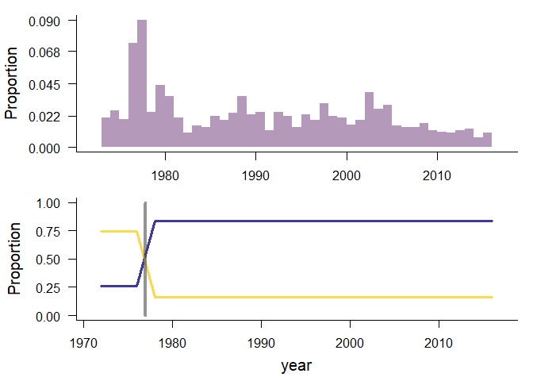<!-- -->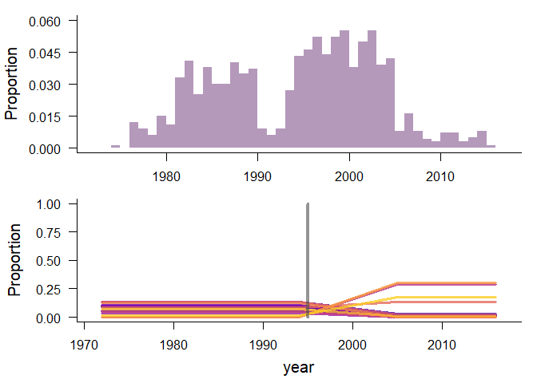<!-- -->

``` r
# 
# full_subset <- subset_data_one(bbs_rtrg_1_4, 1, 2)
# full_subset$train <- full_subset$full
# 
# 
# ts_pred_n <- get_abund_probabilities(full_subset, lda_2_6[[1]], ts_2_6_1[[1]])
# 
# ts_pred_n <- lapply(ts_pred_n, FUN = function(a_df) return (mutate(as.data.frame(a_df), year = bbs_rtrg_1_4$covariates$year)))
# 
# names(ts_pred_n) <- 1:length(ts_pred_n)
# 
# ts_pred_n <- bind_rows(ts_pred_n, .id = "sim")
# 
# colnames(ts_pred_n)[2:62] <- colnames(bbs_rtrg_1_4$abundance)
# 
# ts_pred_n <- ts_pred_n %>%
#   mutate(sim_year = paste0(year, "_", sim)) %>%
#   select(-sim, -year) %>%
#   tidyr::pivot_longer(-sim_year, names_to = "species", values_to = "predicted_prop") %>%
#   mutate(year = as.numeric(substr(sim_year, 0, 4)))
# 
# ts_pred_n <- left_join(ts_pred_n, abund_long, by = c("species", "year"))
# 
# top_ten_spp <- names(sort(apply(bbs_rtrg_1_4$abundance, 2, FUN = mean), decreasing = T)[1:10])
# 
# ggplot(filter(ts_pred_n, species=="sp4740"), aes(year, predicted_prop)) +
#   geom_point() +
#   geom_line(aes(year, prop)) +
#   theme_bw() +
#   facet_wrap(vars(species), scales = "free_y")

# 
# ts_sample_sizes <- rowSums(full_subset$full$abundance)
# 
# ts_pred_abund <- as.data.frame(full_subset$train$abundance)
# 
# for(i in 1:nrow(ts_pred_abund)) {
#   ts_pred_abund[i,] <- as.vector(rmultinom(n = 1, size = ts_sample_sizes[i], prob = ts_pred_n[[1]][i, ]))
# }
# 
# ts_pred_abund <- ts_pred_abund %>%
#   mutate(year = bbs_rtrg_1_4$covariates$year)\
```

``` r
lda_14_8 <- LDATS::LDA_set_user_seeds(bbs_rtrg_1_4$abundance, 14, 8)
```

    ## Running LDA with 14 topics (seed 8)

``` r
plot_lda_comp(lda_14_8)

plot_lda_year(lda_14_8, bbs_rtrg_1_4$covariates$year)
```

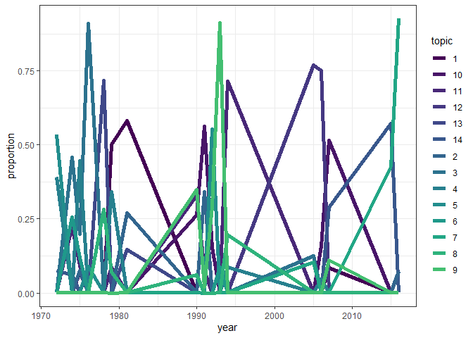<!-- -->

``` r
# 
# loadd(ldats_fit_bbs_rtrg_1_11_2L_6_1L)
# 
# for(i in 1:23){
#   plot(ldats_fit_bbs_rtrg_1_11_2L_6_1L[[i]]$fitted_lda)
# plot(ldats_fit_bbs_rtrg_1_11_2L_6_1L[[i]]$fitted_ts, selection = "mode")
# }

ts_14_8 <- LDATS::TS_on_LDA(lda_14_8, as.data.frame(bbs_rtrg_1_4$covariates), timename = 'year', formulas = ~ 1, nchangepoints = c(0:2), control = LDATS::TS_control(nit = 1000))
```

    ## Running TS model with 0 changepoints and equation gamma ~ 1 on LDA model k: 14, seed: 8

    ## Running TS model with 1 changepoints and equation gamma ~ 1 on LDA model k: 14, seed: 8

    ##   Estimating changepoint distribution

    ##   Estimating regressor distribution

    ## Running TS model with 2 changepoints and equation gamma ~ 1 on LDA model k: 14, seed: 8

    ##   Estimating changepoint distribution

    ##   Estimating regressor distribution

``` r
for(i in 1:length(ts_14_8)) {
  plot(ts_14_8[[i]])
}
```

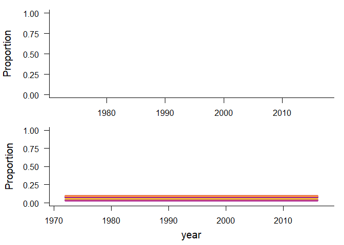<!-- -->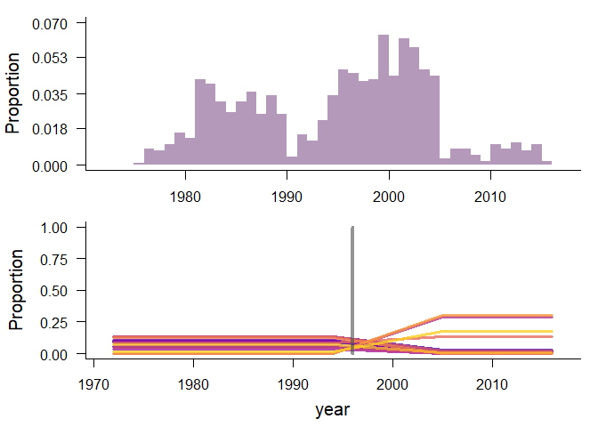<!-- -->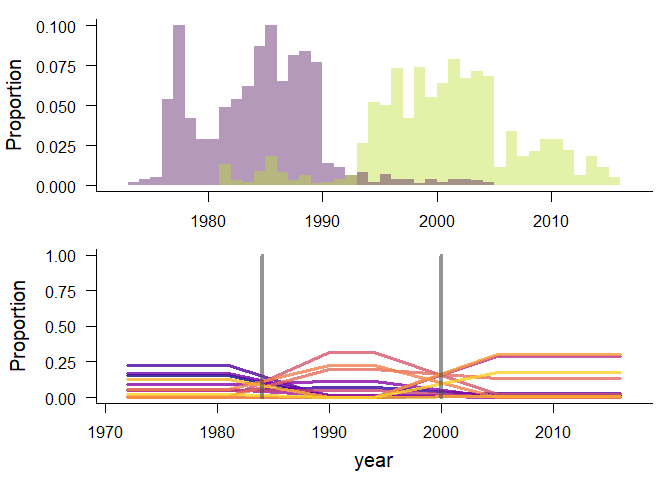<!-- -->
