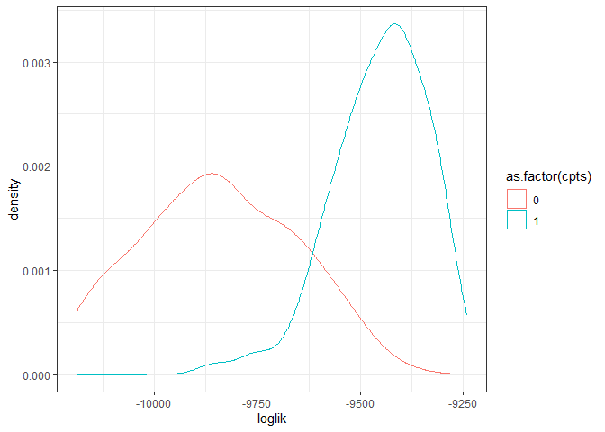

LDATS on a dataset that likes lots of topics
================

``` r
datasets <- build_bbs_datasets_plan()

m <- which(grepl(datasets$target, pattern = "rtrg_1_11")) # wants many topics

dat <- eval(unlist(datasets$command[m][[1]]))
```

This community has a total of 82 species surveyed in 23 years from 1974
to 2014.

``` r
dat_long <- dat$abundance %>%
  mutate(year = dat$covariates$year,
         totalannual = rowSums(dat$abundance))  %>%
  tidyr::pivot_longer(c(-year, -totalannual),names_to = "species", values_to = "abundance") %>%
  mutate(propannual = abundance / totalannual)


ggplot(dat_long, aes(year, propannual, color = species)) +
  geom_line() +
  theme_bw() +
  scale_color_viridis_d() +
  theme(legend.position = "none") +
  ggtitle("Proportional abundance of all species")
```

<!-- -->

### Training/test subsetting

From this data structure, we want to split it into \[many\]
training/test subsets.

For now, I will allow *each timestep* to be a test year. For the subset
for which a given year is the test year, I will additionally withhold 2
timesteps on either side as a buffer.

Each training/test object must have the following components:

  - Training data + covariates table/vector
  - Test data + covariates table/vector

<!-- end list -->

``` r
subset_data_all <- function(full_dataset, buffer_size = 2) {
  
  subsetted_data = lapply(1:nrow(full_dataset$abundance), FUN = subset_data_one, full_dataset = full_dataset, buffer_size = buffer_size)
  
}

subset_data_one <- function(full_dataset, test_timestep, buffer_size) {
  
  timesteps_to_withold <- c((test_timestep - 2):(test_timestep + 2))
  timesteps_to_withold <- timesteps_to_withold[ 
    which(timesteps_to_withold %in% 1:nrow(full_dataset$abundance))]
  
  timesteps_to_keep <- 1:nrow(full_dataset$abundance)
  timesteps_to_keep <- timesteps_to_keep[ which(!(timesteps_to_keep %in% timesteps_to_withold  ))]
  
  test_data <- list(
    abundance = full_dataset$abundance[ test_timestep, ],
    covariates = full_dataset$covariates[ test_timestep, ]
  )
  
  train_data <- list(
    abundance = full_dataset$abundance[ timesteps_to_keep, ],
    covariates = full_dataset$covariates[ timesteps_to_keep, ])
  
  subsetted_dataset <- list(
    train = train_data,
    test = test_data,
    full = full_dataset,
    test_timestep = test_timestep,
    buffer_size = buffer_size
  )
  
  return(subsetted_dataset)
  
}


subsetted_dat <- subset_data_all(dat)
```

### Fitting a LDA + TS model to every subset

``` r
ldats_subset_one <- function(subsetted_dataset_item, 
                             k,
                             seed,
                             cpts,
                             nit) {
  
  fitted_lda <- LDA_set_user_seeds(
    document_term_table = subsetted_dataset_item$train$abundance,
    topics = k,
    seed = seed)[[1]]
  
  fitted_ts <- TS_on_LDA(fitted_lda,
                         document_covariate_table = as.data.frame(subsetted_dataset_item$train$covariates),
                         timename = "year",
                         formulas = ~1,
                         nchangepoints = cpts,
                         control = TS_control(nit = nit))[[1]]
  
  abund_probabilities <- get_abund_probabilities(
    subsetted_dataset_item,
    fitted_lda,
    fitted_ts
  )
  
  test_logliks  <- get_test_loglik(
    subsetted_dataset_item,
    abund_probabilities
  )
  
  subsetted_dataset_item$fitted_lda <- fitted_lda
  subsetted_dataset_item$fitted_ts <- fitted_ts
  subsetted_dataset_item$abund_probabilities <- abund_probabilities
  subsetted_dataset_item$test_logliks <- test_logliks
  subsetted_dataset_item$model_info <- list(k = k, seed = seed, cpts = cpts, nit = nit)
  
  return(subsetted_dataset_item)
  
}


get_test_loglik <- function(
  subsetted_dataset_item,
  abund_probabilities
) {
  
  test_logliks <- lapply(abund_probabilities, FUN = get_one_test_loglik, subsetted_dataset_item = subsetted_dataset_item)
  
  return(unlist(test_logliks))
  
}


get_one_test_loglik <- function(
  subsetted_dataset_item,
  abund_probabilities_one
) {
  
  test_dat <- subsetted_dataset_item$test$abundance
  
  test_row_number <- subsetted_dataset_item$test_timestep
  
  test_loglik <- dmultinom(x = test_dat, prob = abund_probabilities_one[test_row_number,], log = TRUE)
  
  return(test_loglik)
}

get_abund_probabilities <- function(
  subsetted_dataset_item,
  fitted_lda,
  fitted_ts
) {
  
  betas <- exp(fitted_lda@beta)
  
  nsims = nrow(fitted_ts$etas)
  
  thetas <- lapply(1:nsims, FUN = get_one_theta, subsetted_dataset_item = subsetted_dataset_item, fitted_ts = fitted_ts)
  
  abund_probabilities <- lapply(thetas, FUN = function(theta, betas) return(theta %*% betas), betas = betas)
}

get_one_theta <- function(subsetted_dataset_item,
                          fitted_ts,
                          sim = 1) {
  covars <- subsetted_dataset_item$full$covariates$year
  
  ncovar <- 1
  
  nseg <- ifelse(is.null(fitted_ts$rhos), 1, ncol(fitted_ts$rhos) + 1)
  
  ntopics <- ncol(fitted_ts$data$gamma)
  
  ndocs <- nrow(subsetted_dataset_item$full$covariates)
  
  X <- matrix(nrow = ndocs, ncol = ncovar, data = unlist(covars), byrow = FALSE)
  
  model_Eta <- fitted_ts$etas[sim, ]
  
  Eta_matrix <- matrix(nrow = ncovar  * nseg, ncol = ntopics,
                       data = c(rep(0, times = ncovar * nseg), model_Eta), byrow = FALSE)
  
  rho = fitted_ts$rhos[sim,]
  
  tD <- unlist(subsetted_dataset_item$full$covariates$year)
  
  Theta <- LDATS::sim_TS_data(X, Eta_matrix, rho, tD, err = 0)
  
  Theta <- softmax(Theta)
  
  return(Theta)
}

compose_ts_loglik <- function(many_fits) {
  
  nsims <- many_fits[[1]]$model_info$nit
  
  ts_logliks <- sum(unlist(lapply(many_fits, FUN = function(fits, nsims) return(fits$test_logliks[ sample.int(n = nsims, size = 1)]), nsims = nsims)))
  
}

estimate_ts_loglik <- function(many_fits, nests) {
  
  return(list(
    model_info = many_fits[[1]]$model_info,
    loglik_ests = replicate(n = nests, compose_ts_loglik(many_fits), simplify = T)))
}
```

``` r
ldats_one <- ldats_subset_one(subsetted_dat[[1]], 2, 2, 0, 100)

ldats_all <- lapply(subsetted_dat, FUN = ldats_subset_one, k = 2, seed = 2, cpts = 0, nit = 100)

ldats_all_logliks <- estimate_ts_loglik(ldats_all, nests = 100)

ldats_all_logliks
```

``` r
ldats_0_cpts <- lapply(subsetted_dat, FUN = ldats_subset_one, k = 2, seed = 2, cpts = 0, nit = 100)
```

    ## Running LDA with 2 topics (seed 2)

    ## Running TS model with 0 changepoints and equation gamma ~ 1 on LDA model

    ## Running LDA with 2 topics (seed 2)

    ## Running TS model with 0 changepoints and equation gamma ~ 1 on LDA model

    ## Running LDA with 2 topics (seed 2)

    ## Running TS model with 0 changepoints and equation gamma ~ 1 on LDA model

    ## Running LDA with 2 topics (seed 2)

    ## Running TS model with 0 changepoints and equation gamma ~ 1 on LDA model

    ## Running LDA with 2 topics (seed 2)

    ## Running TS model with 0 changepoints and equation gamma ~ 1 on LDA model

    ## Running LDA with 2 topics (seed 2)

    ## Running TS model with 0 changepoints and equation gamma ~ 1 on LDA model

    ## Running LDA with 2 topics (seed 2)

    ## Running TS model with 0 changepoints and equation gamma ~ 1 on LDA model

    ## Running LDA with 2 topics (seed 2)

    ## Running TS model with 0 changepoints and equation gamma ~ 1 on LDA model

    ## Running LDA with 2 topics (seed 2)

    ## Running TS model with 0 changepoints and equation gamma ~ 1 on LDA model

    ## Running LDA with 2 topics (seed 2)

    ## Running TS model with 0 changepoints and equation gamma ~ 1 on LDA model

    ## Running LDA with 2 topics (seed 2)

    ## Running TS model with 0 changepoints and equation gamma ~ 1 on LDA model

    ## Running LDA with 2 topics (seed 2)

    ## Running TS model with 0 changepoints and equation gamma ~ 1 on LDA model

    ## Running LDA with 2 topics (seed 2)

    ## Running TS model with 0 changepoints and equation gamma ~ 1 on LDA model

    ## Running LDA with 2 topics (seed 2)

    ## Running TS model with 0 changepoints and equation gamma ~ 1 on LDA model

    ## Running LDA with 2 topics (seed 2)

    ## Running TS model with 0 changepoints and equation gamma ~ 1 on LDA model

    ## Running LDA with 2 topics (seed 2)

    ## Running TS model with 0 changepoints and equation gamma ~ 1 on LDA model

    ## Running LDA with 2 topics (seed 2)

    ## Running TS model with 0 changepoints and equation gamma ~ 1 on LDA model

    ## Running LDA with 2 topics (seed 2)

    ## Running TS model with 0 changepoints and equation gamma ~ 1 on LDA model

    ## Running LDA with 2 topics (seed 2)

    ## Running TS model with 0 changepoints and equation gamma ~ 1 on LDA model

    ## Running LDA with 2 topics (seed 2)

    ## Running TS model with 0 changepoints and equation gamma ~ 1 on LDA model

    ## Running LDA with 2 topics (seed 2)

    ## Running TS model with 0 changepoints and equation gamma ~ 1 on LDA model

    ## Running LDA with 2 topics (seed 2)

    ## Running TS model with 0 changepoints and equation gamma ~ 1 on LDA model

    ## Running LDA with 2 topics (seed 2)

    ## Running TS model with 0 changepoints and equation gamma ~ 1 on LDA model

``` r
ldats_0_cpts_ll <- estimate_ts_loglik(ldats_0_cpts, nests = 100)

ldats_1_cpts <- lapply(subsetted_dat, FUN = ldats_subset_one, k = 2, seed = 2, cpts = 1, nit = 100)
```

    ## Running LDA with 2 topics (seed 2)

    ## Running TS model with 1 changepoints and equation gamma ~ 1 on LDA model

    ##   Estimating changepoint distribution

    ##   Estimating regressor distribution

    ## Running LDA with 2 topics (seed 2)

    ## Running TS model with 1 changepoints and equation gamma ~ 1 on LDA model

    ##   Estimating changepoint distribution

    ##   Estimating regressor distribution

    ## Running LDA with 2 topics (seed 2)

    ## Running TS model with 1 changepoints and equation gamma ~ 1 on LDA model

    ##   Estimating changepoint distribution

    ##   Estimating regressor distribution

    ## Running LDA with 2 topics (seed 2)

    ## Running TS model with 1 changepoints and equation gamma ~ 1 on LDA model

    ##   Estimating changepoint distribution

    ##   Estimating regressor distribution

    ## Running LDA with 2 topics (seed 2)

    ## Running TS model with 1 changepoints and equation gamma ~ 1 on LDA model

    ##   Estimating changepoint distribution

    ##   Estimating regressor distribution

    ## Running LDA with 2 topics (seed 2)

    ## Running TS model with 1 changepoints and equation gamma ~ 1 on LDA model

    ##   Estimating changepoint distribution

    ##   Estimating regressor distribution

    ## Running LDA with 2 topics (seed 2)

    ## Running TS model with 1 changepoints and equation gamma ~ 1 on LDA model

    ##   Estimating changepoint distribution

    ##   Estimating regressor distribution

    ## Running LDA with 2 topics (seed 2)

    ## Running TS model with 1 changepoints and equation gamma ~ 1 on LDA model

    ##   Estimating changepoint distribution

    ##   Estimating regressor distribution

    ## Running LDA with 2 topics (seed 2)

    ## Running TS model with 1 changepoints and equation gamma ~ 1 on LDA model

    ##   Estimating changepoint distribution

    ##   Estimating regressor distribution

    ## Running LDA with 2 topics (seed 2)

    ## Running TS model with 1 changepoints and equation gamma ~ 1 on LDA model

    ##   Estimating changepoint distribution

    ##   Estimating regressor distribution

    ## Running LDA with 2 topics (seed 2)

    ## Running TS model with 1 changepoints and equation gamma ~ 1 on LDA model

    ##   Estimating changepoint distribution

    ##   Estimating regressor distribution

    ## Running LDA with 2 topics (seed 2)

    ## Running TS model with 1 changepoints and equation gamma ~ 1 on LDA model

    ##   Estimating changepoint distribution

    ##   Estimating regressor distribution

    ## Running LDA with 2 topics (seed 2)

    ## Running TS model with 1 changepoints and equation gamma ~ 1 on LDA model

    ##   Estimating changepoint distribution

    ##   Estimating regressor distribution

    ## Running LDA with 2 topics (seed 2)

    ## Running TS model with 1 changepoints and equation gamma ~ 1 on LDA model

    ##   Estimating changepoint distribution

    ##   Estimating regressor distribution

    ## Running LDA with 2 topics (seed 2)

    ## Running TS model with 1 changepoints and equation gamma ~ 1 on LDA model

    ##   Estimating changepoint distribution

    ##   Estimating regressor distribution

    ## Running LDA with 2 topics (seed 2)

    ## Running TS model with 1 changepoints and equation gamma ~ 1 on LDA model

    ##   Estimating changepoint distribution

    ##   Estimating regressor distribution

    ## Running LDA with 2 topics (seed 2)

    ## Running TS model with 1 changepoints and equation gamma ~ 1 on LDA model

    ##   Estimating changepoint distribution

    ##   Estimating regressor distribution

    ## Running LDA with 2 topics (seed 2)

    ## Running TS model with 1 changepoints and equation gamma ~ 1 on LDA model

    ##   Estimating changepoint distribution

    ##   Estimating regressor distribution

    ## Running LDA with 2 topics (seed 2)

    ## Running TS model with 1 changepoints and equation gamma ~ 1 on LDA model

    ##   Estimating changepoint distribution

    ##   Estimating regressor distribution

    ## Running LDA with 2 topics (seed 2)

    ## Running TS model with 1 changepoints and equation gamma ~ 1 on LDA model

    ##   Estimating changepoint distribution

    ##   Estimating regressor distribution

    ## Running LDA with 2 topics (seed 2)

    ## Running TS model with 1 changepoints and equation gamma ~ 1 on LDA model

    ##   Estimating changepoint distribution

    ##   Estimating regressor distribution

    ## Running LDA with 2 topics (seed 2)

    ## Running TS model with 1 changepoints and equation gamma ~ 1 on LDA model

    ##   Estimating changepoint distribution

    ##   Estimating regressor distribution

    ## Running LDA with 2 topics (seed 2)

    ## Running TS model with 1 changepoints and equation gamma ~ 1 on LDA model

    ##   Estimating changepoint distribution

    ##   Estimating regressor distribution

``` r
ldats_1_cpts_ll <- estimate_ts_loglik(ldats_1_cpts, nests = 100)

# 
# ldats_2_cpts <- lapply(subsetted_dat, FUN = ldats_subset_one, k = 2, seed = 2, cpts = 2, nit = 100)
# 
# ldats_2_cpts_ll <- estimate_ts_loglik(ldats_2_cpts, nests = 100)


bundle_lls <- function(list_of_lls) {
  
  ll_dfs <- lapply(list_of_lls, make_ll_df)
  
  bind_rows(ll_dfs)
}

make_ll_df <- function(ll) {
  
  cbind(data.frame(loglik = ll$loglik_ests), as.data.frame(ll$model_info))
  
}

ll_comparison <- bundle_lls(list(ldats_0_cpts_ll, ldats_1_cpts_ll))


library(ggplot2)

ggplot(ll_comparison, aes(x = loglik, group = as.factor(cpts), color = as.factor(cpts))) +
  geom_density() +
  theme_bw()
```

<!-- -->

K, let’s plot these as panels…

``` r
ts_bottom_plot <- function (x, cols = set_TS_summary_plot_cols(), bin_width = 1, 
  xname = NULL, border = NA, selection = "median", LDATS = FALSE) 
{
  rc <- cols$rho
  rho_cols <- set_rho_hist_colors(x$rhos, rc$cols, rc$option, 
    rc$alpha)
  #rho_hist(x, rho_cols, bin_width, xname, border, TRUE, LDATS)
  gc <- cols$gamma
  gamma_cols <- set_gamma_colors(x, gc$cols, gc$option, gc$alpha)
  pred_gamma_TS_plot(x, selection, gamma_cols, xname, TRUE, 
    LDATS)
}

plot_panels <- function(section_index = 1, no_cpt_list, one_cpt_list){
  
  plot(no_cpt_list[[section_index]]$fitted_lda)
  ts_bottom_plot(no_cpt_list[[section_index]]$fitted_ts)
  ts_bottom_plot(one_cpt_list[[section_index]]$fitted_ts, selection = "mode")
}
# }
# 
# for(i in 1:23) {
# plot_panels(i, ldats_0_cpts, ldats_1_cpts)
# }
```

``` r
one_with_cpt <- ldats_1_cpts[[2]]$fitted_ts

plot(one_with_cpt)
```

<!-- -->

``` r
all_thetas <- (lapply(1:100, FUN =  get_one_theta, subsetted_dataset_item = subsetted_dat[[2]], fitted_ts = one_with_cpt))
for(i in 1:length(all_thetas)) {
  all_thetas[[i]] <- as.data.frame(all_thetas[[i]])
  all_thetas[[i]]$timestep = dat$covariates$year
 all_thetas[[i]]$sim = i
}


names(all_thetas) <- 1:100
all_thetas <- bind_rows(all_thetas) 

all_thetas <- all_thetas %>%
  mutate(sim = as.factor(sim)) #%>%
 # tidyr::pivot_longer(cols = c(V1, V2), names_to = "topic", values_to = "prop")

ggplot(all_thetas, aes(timestep, V1, group = sim)) +
  geom_line(alpha = .1, size = 2) +
  geom_line(aes(timestep, V2, group = sim), alpha = .1, size = 2, color = "green") +
  theme_bw() +
  theme(legend.position = "none") +
  ylim(0, 1)
```

<!-- -->
