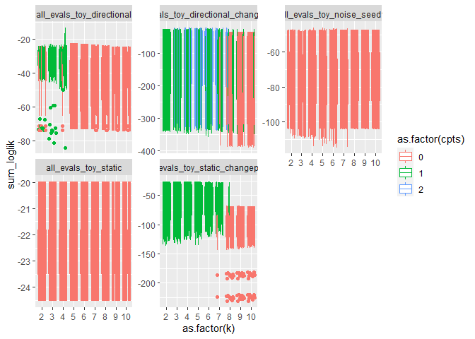
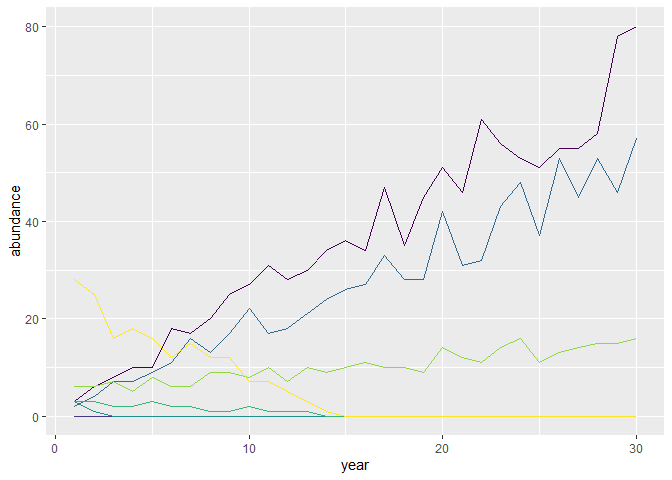
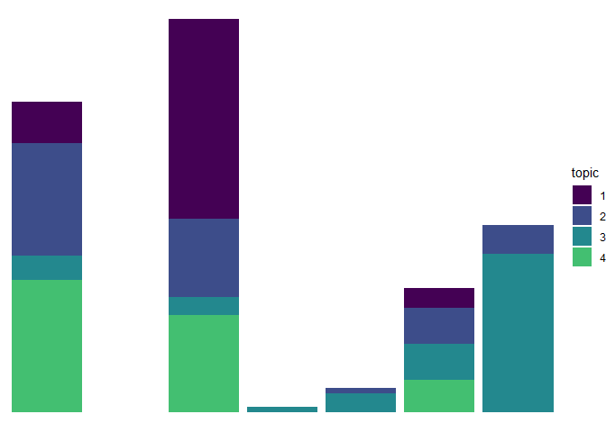
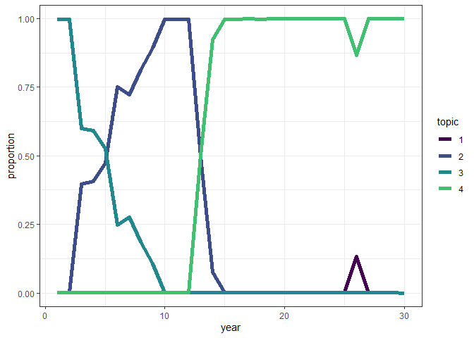
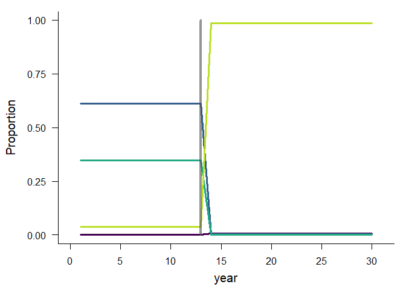
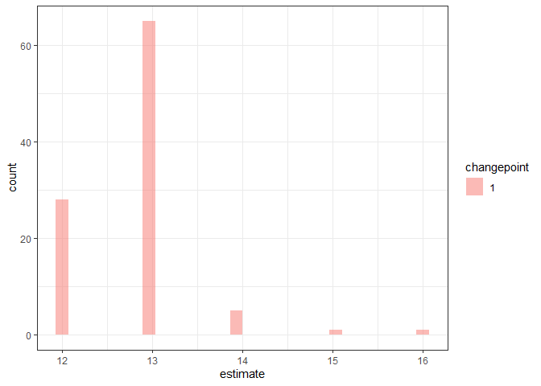

Hybrid results 10/2020
================

Including history of the crossval approach, how I’ve arrived at a
combined crossval + AIC approach, and what I see as paths from here….

<!-- -->

    ## `summarise()` regrouping output by 'dataset', 'k', 'seed' (override with `.groups` argument)

<!-- -->

    ## # A tibble: 6 x 6
    ## # Groups:   dataset [2]
    ##   dataset                       k  seed  cpts mean_sum_ll dat_rank
    ##   <chr>                     <int> <int> <int>       <dbl>    <int>
    ## 1 all_evals_toy_static          3    14     0       -22.6        1
    ## 2 all_evals_toy_static          2     2     0       -22.6        2
    ## 3 all_evals_toy_static          2     6     0       -22.6        3
    ## 4 all_evals_toy_static          3     6     0       -22.6        4
    ## 5 all_evals_toy_static          5    12     0       -22.6        5
    ## 6 all_evals_toy_directional     4     4     1       -28.8        1

## static\_changepoint

    ## # A tibble: 6 x 6
    ## # Groups:   dataset [1]
    ##   dataset                              k  seed  cpts mean_sum_ll dat_rank
    ##   <chr>                            <int> <int> <int>       <dbl>    <int>
    ## 1 all_evals_toy_static_changepoint     2    20     1       -53.8        1
    ## 2 all_evals_toy_static_changepoint     4    20     1       -54.1        2
    ## 3 all_evals_toy_static_changepoint     4    22     1       -54.4        3
    ## 4 all_evals_toy_static_changepoint     4    12     1       -54.6        4
    ## 5 all_evals_toy_static_changepoint     3    10     1       -54.6        5
    ## 6 all_evals_toy_static_changepoint     5    20     1       -54.7        6

<!-- -->

    ## Running LDA with 2 topics (seed 20)

<!-- --><!-- --><!-- -->

    ## Running TS model with 1 changepoints and equation gamma ~ 1 on LDA model k: 2, seed: 20

    ##   Estimating changepoint distribution

    ##   Estimating regressor distribution

<!-- -->

    ## `stat_bin()` using `bins = 30`. Pick better value with `binwidth`.

<!-- -->

## directional\_changepoint

    ## # A tibble: 6 x 6
    ## # Groups:   dataset [1]
    ##   dataset                                   k  seed  cpts mean_sum_ll dat_rank
    ##   <chr>                                 <int> <int> <int>       <dbl>    <int>
    ## 1 all_evals_toy_directional_changepoint     5     4     2       -154.        1
    ## 2 all_evals_toy_directional_changepoint     7     8     2       -154.        2
    ## 3 all_evals_toy_directional_changepoint     6     8     2       -154.        3
    ## 4 all_evals_toy_directional_changepoint     5    18     2       -155.        4
    ## 5 all_evals_toy_directional_changepoint     5     8     2       -156.        5
    ## 6 all_evals_toy_directional_changepoint     6    10     2       -156.        6

<!-- -->

    ## Running LDA with 5 topics (seed 4)

<!-- --><!-- --><!-- -->

    ## Running TS model with 2 changepoints and equation gamma ~ 1 on LDA model k: 5, seed: 4

    ##   Estimating changepoint distribution

    ##   Estimating regressor distribution

<!-- -->

    ## `stat_bin()` using `bins = 30`. Pick better value with `binwidth`.

<!-- -->
\#\# directional

    ## # A tibble: 6 x 6
    ## # Groups:   dataset [1]
    ##   dataset                       k  seed  cpts mean_sum_ll dat_rank
    ##   <chr>                     <int> <int> <int>       <dbl>    <int>
    ## 1 all_evals_toy_directional     4     4     1       -28.8        1
    ## 2 all_evals_toy_directional     4     6     1       -30.8        2
    ## 3 all_evals_toy_directional     4     2     1       -30.8        3
    ## 4 all_evals_toy_directional     4    12     1       -30.9        4
    ## 5 all_evals_toy_directional     4    14     1       -31.0        5
    ## 6 all_evals_toy_directional     4    10     1       -31.0        6

<!-- -->

    ## Running LDA with 4 topics (seed 4)

<!-- --><!-- --><!-- -->

    ## Running TS model with 1 changepoints and equation gamma ~ 1 on LDA model k: 4, seed: 4

    ##   Estimating changepoint distribution

    ##   Estimating regressor distribution

<!-- -->

    ## `stat_bin()` using `bins = 30`. Pick better value with `binwidth`.

<!-- -->
