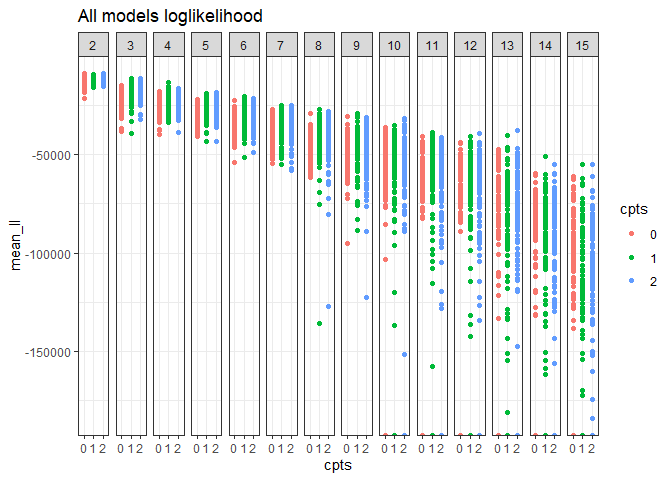
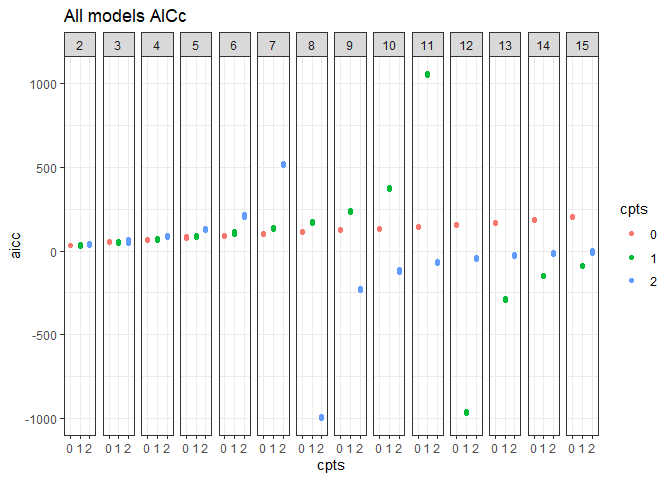
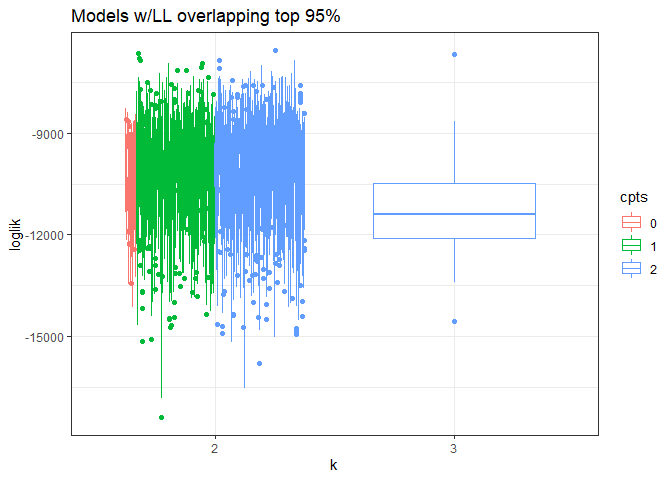
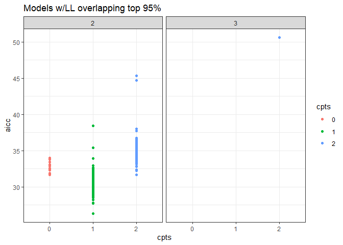

AIC
================

``` r
library(MATSS)
library(dplyr)
```

    ## 
    ## Attaching package: 'dplyr'

    ## The following objects are masked from 'package:stats':
    ## 
    ##     filter, lag

    ## The following objects are masked from 'package:base':
    ## 
    ##     intersect, setdiff, setequal, union

``` r
library(ggplot2)
# 
# 
# ## Set up the cache and config
# db <- DBI::dbConnect(RSQLite::SQLite(), here::here("analysis", "drake", "drake-cache-aic.sqlite"))
# cache <- storr::storr_dbi("datatable", "keystable", db)
# cache$del(key = "lock", namespace = "session")
# 
# loadd(bbs_rtrg_1_11)
```

``` r
aic_evals <- read.csv(here::here("all_evals_bbs_rtrg_1_11_aicc.csv")) %>%
  select(-X) %>%
  rename(cpts = ncpts)
ll_evals <- read.csv(here::here("all_evals_bbs_rtrg_1_11.csv"))

ll_evals <- left_join(ll_evals, aic_evals) %>%
  filter(!is.na(aicc))
```

    ## Joining, by = c("k", "seed", "cpts", "nit")

``` r
all_evals <- ll_evals %>%
  mutate(k = as.factor(k),
         seed = as.factor(seed),
         cpts = as.factor(cpts),
         cpts_seed_k = paste0(cpts, "_", seed, "_", k),
         cpts_k = paste0(k, "_", cpts))

# 
# ggplot(all_evals, aes(x = k, y = loglik, group = cpts_seed_k, color = cpts)) +
#   geom_boxplot() +
#   theme_bw() +
#   ggtitle("All models loglikelihood")

all_evals_summary <- all_evals %>%
  group_by(k, seed, cpts, cpts_seed_k, cpts_k, aicc) %>%
  summarize(mean_ll = mean(loglik),
            upper_97_ll = quantile(loglik, probs = .975),
            lower_2_ll = quantile(loglik, probs = .025),
            n_infinite = sum(is.infinite(loglik))) %>%
  ungroup() %>%
  arrange(desc(mean_ll))
```

    ## `summarise()` regrouping output by 'k', 'seed', 'cpts', 'cpts_seed_k', 'cpts_k' (override with `.groups` argument)

``` r
ggplot(all_evals_summary, aes(x = cpts, y = mean_ll, color = cpts)) +
  geom_point() +
facet_wrap(vars(k), nrow = 1) +
  theme_bw() +
  ggtitle("All models loglikelihood")
```

<!-- -->

``` r
ggplot(all_evals_summary, aes(x = cpts, y = aicc, color = cpts)) +
  geom_point() +
facet_wrap(vars(k), nrow = 1) +
  theme_bw() +
  ggtitle("All models AICc")
```

<!-- -->

``` r
highest_low_95 = max(all_evals_summary$lower_2_ll)

all_evals_summary <- all_evals_summary %>%
  mutate(in_95 = upper_97_ll >= highest_low_95)

head(all_evals_summary)
```

    ## # A tibble: 6 x 11
    ##   k     seed  cpts  cpts_seed_k cpts_k  aicc mean_ll upper_97_ll lower_2_ll
    ##   <fct> <fct> <fct> <chr>       <chr>  <dbl>   <dbl>       <dbl>      <dbl>
    ## 1 2     106   2     2_106_2     2_2     31.7  -8797.      -7335.    -10208.
    ## 2 2     78    2     2_78_2      2_2     32.2  -8822.      -7487.    -10320.
    ## 3 2     148   0     0_148_2     2_0     33.4  -8967.      -8565.     -9382.
    ## 4 2     168   2     2_168_2     2_2     33.7  -8976.      -7603.    -10947.
    ## 5 2     148   1     1_148_2     2_1     38.5  -9057.      -8594.     -9556.
    ## 6 2     148   2     2_148_2     2_2     44.7  -9090.      -8646.     -9558.
    ## # ... with 2 more variables: n_infinite <int>, in_95 <lgl>

``` r
ggplot(filter(all_evals, cpts_seed_k %in% filter(all_evals_summary, in_95)$cpts_seed_k), aes(x = k, y = loglik, group = cpts_seed_k, color = cpts)) +
  geom_boxplot() +
#  facet_wrap(vars(cpts)) +
  theme_bw() +
  ggtitle("Models w/LL overlapping top 95%")
```

<!-- -->

``` r
ggplot(distinct(select(filter(all_evals, cpts_seed_k %in% filter(all_evals_summary, in_95)$cpts_seed_k), k, aicc, cpts_seed_k, cpts)), aes(x = cpts, y = aicc, color = cpts)) +
  geom_point() +
facet_wrap(vars(k)) +
  theme_bw() +
  ggtitle("Models w/LL overlapping top 95%")
```

<!-- -->
