Testing changepoint sensitivity
================
Renata Diaz
04 March, 2021

  - [Simulating data](#simulating-data)
  - [TS on LDAs](#ts-on-ldas)
      - [Gradual transition](#gradual-transition)
      - [Very rapid](#very-rapid)
      - [Slower](#slower)
      - [Random](#random)
  - [Missing timesteps](#missing-timesteps)
      - [Making data](#making-data)
      - [Gradual](#gradual)
      - [Rapid](#rapid)
      - [Slower](#slower-1)
      - [Random](#random-1)
  - [Overall posterior ests](#overall-posterior-ests)

Can we use the posterior of the changepoint estimates to infer
sudden/gradual transitions?

For a summary skip to Overall posterior ests. These are some very simple
and easy toy situations that seem to make the argument that the width of
the posterior estimates (95% or +/- 2 SD) corresponds intuitively to how
rapid the transition is; however, that missing time steps in which a
changepoint occurs can spread things out.

I don’t think this is everything to do to stress-test this. There might
be more complex situations in the real data that subvert this intuition.

# Simulating data

``` r
library(LDATS)
library(dplyr)
```

    ## 
    ## Attaching package: 'dplyr'

    ## The following objects are masked from 'package:stats':
    ## 
    ##     filter, lag

    ## The following objects are masked from 'package:base':
    ## 
    ##     intersect, setdiff, setequal, union

``` r
library(ggplot2)

theme_set(theme_bw())

load(here::here("old_but_mb_useful", "bbs_1_11.RData"))

an_lda <- LDATS::LDA_set(bbs_rtrg_1_11$abundance, topics = 2, nseeds = 1)[[1]] # this to get an LDA object, which we will then trojan horse various ways
```

    ## Running LDA with 2 topics (seed 2)

``` r
# plot actual gammas
plot(an_lda@gamma[,1])
```

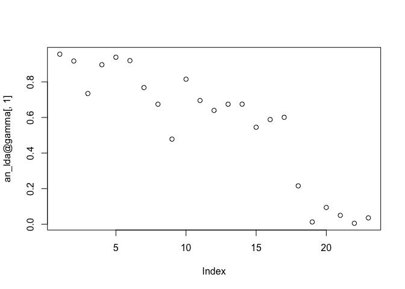<!-- -->

``` r
# super gradual transition

gradual_gamma1 <- 1 - ((1/23) * c(1:23))
#plot(gradual_gamma1)

gradual_gamma1_err <- gradual_gamma1 + rnorm(23, 0, .1)
plot(gradual_gamma1_err)
```

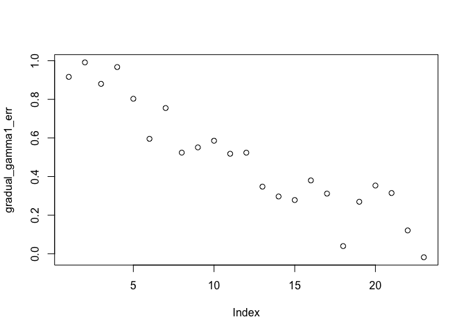<!-- -->

``` r
# super rapid

sudden_gamma1 <- c(rep(.95, times = 11), rep(.05, times = 12))
#plot(sudden_gamma1)

sudden_gamma1_err <- sudden_gamma1 + rnorm(23, 0, .05)

sudden_gamma1_err[ sudden_gamma1_err > 1] <- 1
sudden_gamma1_err[ sudden_gamma1_err < 0] <- 0

plot(sudden_gamma1_err)
```

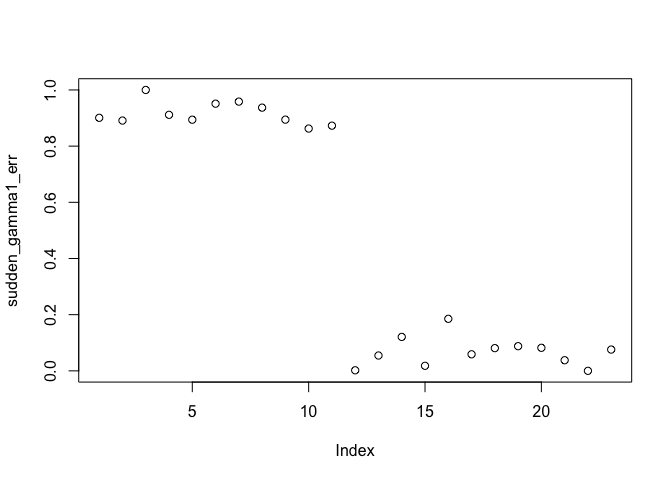<!-- -->

``` r
medium_gamma1 <- c(rep(.95, 7), (.9 - (1/9) * c(1:9)), rep(.05, 7))

medium_gamma1_err <- medium_gamma1 + rnorm(23, 0, .05)

medium_gamma1_err[ medium_gamma1_err > 1] <- 1
medium_gamma1_err[ medium_gamma1_err < 0] <- 0

plot(medium_gamma1_err)
```

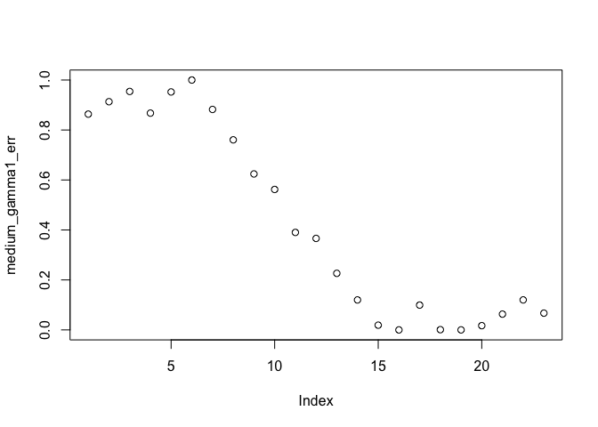<!-- -->

``` r
# random

random_gamma1 <- runif(23, 0, 1)
plot(random_gamma1)
```

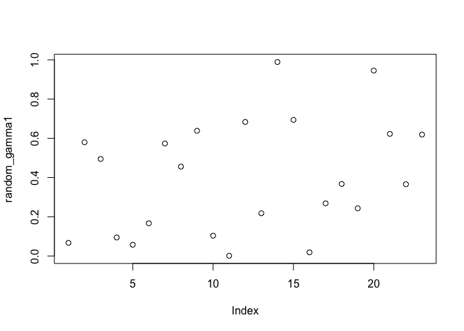<!-- -->

# TS on LDAs

## Gradual transition

``` r
gradual_lda <- an_lda
gradual_lda@gamma <- cbind(gradual_gamma1_err, 1- gradual_gamma1_err)

plot(gradual_lda)
```

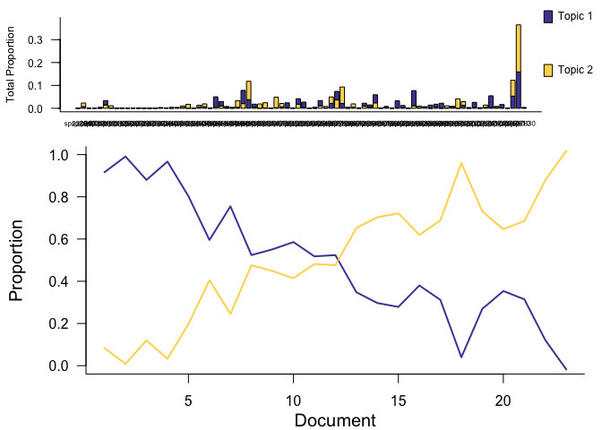<!-- -->

``` r
gradual_ts <- TS_on_LDA(gradual_lda, data.frame(tstep = c(1:23)), formulas = c(~1), nchangepoints = c(0,1,2), timename = "tstep", control = TS_control(nit = 1000))
```

    ## Running TS model with 0 changepoints and equation gamma ~ 1 on LDA model

    ## Running TS model with 1 changepoints and equation gamma ~ 1 on LDA model

    ##   Estimating changepoint distribution

    ##   Estimating regressor distribution

    ## Running TS model with 2 changepoints and equation gamma ~ 1 on LDA model

    ##   Estimating changepoint distribution

    ##   Estimating regressor distribution

``` r
gradual_ts_selected <-select_TS(gradual_ts)

plot(gradual_ts_selected)
```

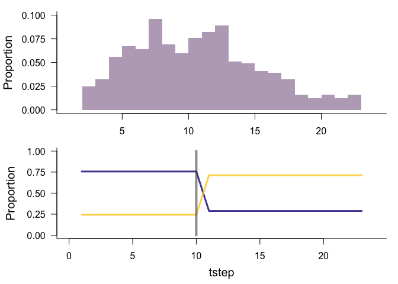<!-- -->

## Very rapid

``` r
sudden_lda <- an_lda
sudden_lda@gamma <- cbind(sudden_gamma1_err, 1- sudden_gamma1_err)

plot(sudden_lda)
```

<!-- -->

``` r
sudden_ts <- TS_on_LDA(sudden_lda, data.frame(tstep = c(1:23)), formulas = c(~1), nchangepoints = c(0,1,2), timename = "tstep", control = TS_control(nit = 1000))
```

    ## Running TS model with 0 changepoints and equation gamma ~ 1 on LDA model

    ## Running TS model with 1 changepoints and equation gamma ~ 1 on LDA model

    ##   Estimating changepoint distribution

    ##   Estimating regressor distribution

    ## Running TS model with 2 changepoints and equation gamma ~ 1 on LDA model

    ##   Estimating changepoint distribution

    ##   Estimating regressor distribution

``` r
sudden_ts_selected <-select_TS(sudden_ts)

plot(sudden_ts_selected)
```

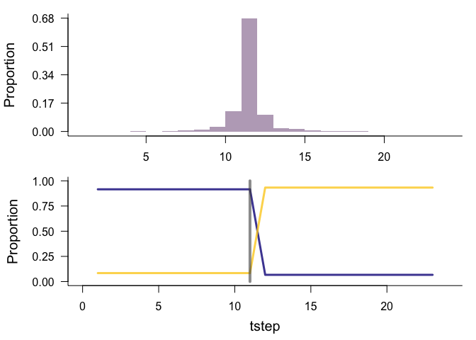<!-- -->

## Slower

``` r
medium_lda <- an_lda
medium_lda@gamma <- cbind(medium_gamma1_err, 1- medium_gamma1_err)

plot(medium_lda)
```

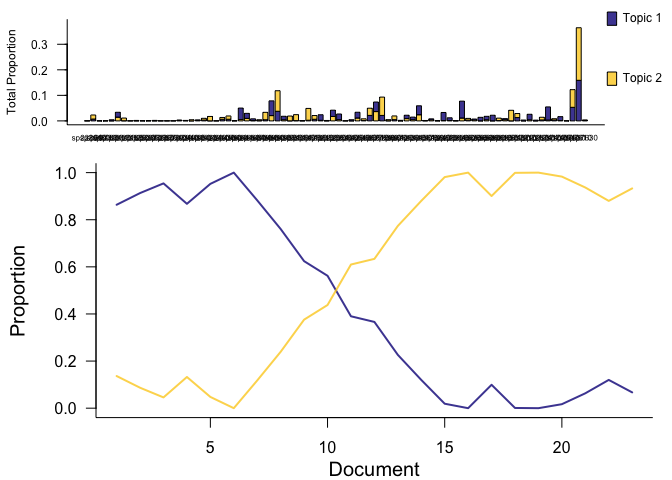<!-- -->

``` r
medium_ts <- TS_on_LDA(medium_lda, data.frame(tstep = c(1:23)), formulas = c(~1), nchangepoints = c(0,1,2), timename = "tstep", control = TS_control(nit = 1000))
```

    ## Running TS model with 0 changepoints and equation gamma ~ 1 on LDA model

    ## Running TS model with 1 changepoints and equation gamma ~ 1 on LDA model

    ##   Estimating changepoint distribution

    ##   Estimating regressor distribution

    ## Running TS model with 2 changepoints and equation gamma ~ 1 on LDA model

    ##   Estimating changepoint distribution

    ##   Estimating regressor distribution

``` r
medium_ts_selected <-select_TS(medium_ts)

plot(medium_ts_selected)
```

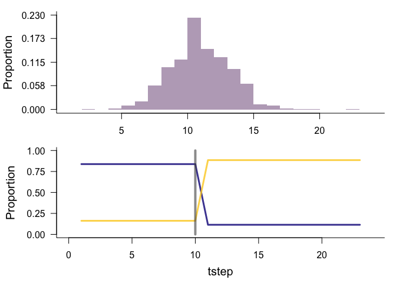<!-- -->

## Random

``` r
random_lda <- an_lda
random_lda@gamma <- cbind(random_gamma1, 1- random_gamma1)

plot(random_lda)
```

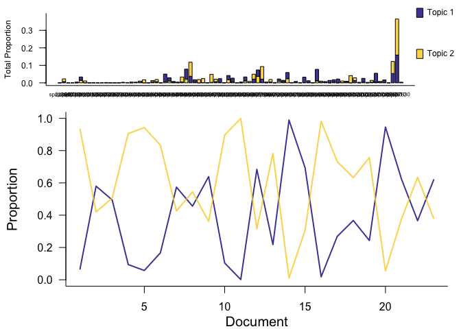<!-- -->

``` r
random_ts <- TS_on_LDA(random_lda, data.frame(tstep = c(1:23)), formulas = c(~1), nchangepoints = c(0,1,2), timename = "tstep", control = TS_control(nit = 1000))
```

    ## Running TS model with 0 changepoints and equation gamma ~ 1 on LDA model

    ## Running TS model with 1 changepoints and equation gamma ~ 1 on LDA model

    ##   Estimating changepoint distribution

    ##   Estimating regressor distribution

    ## Running TS model with 2 changepoints and equation gamma ~ 1 on LDA model

    ##   Estimating changepoint distribution

    ##   Estimating regressor distribution

``` r
random_ts_selected <-select_TS(random_ts)

plot(random_ts_selected)
```

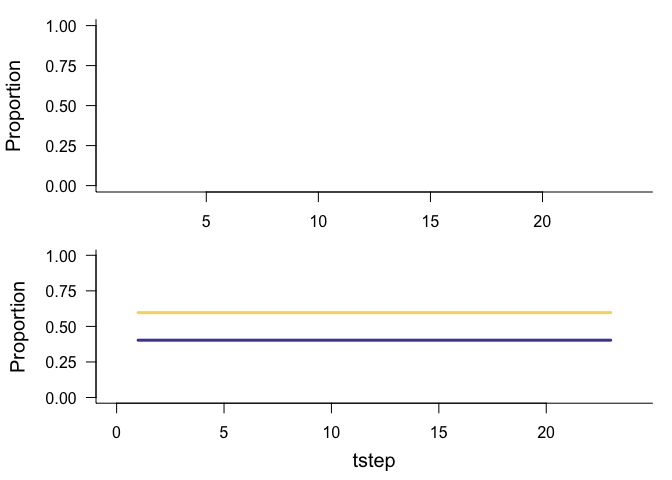<!-- -->

# Missing timesteps

## Making data

``` r
gradual_ns_gamma1_err <- gradual_gamma1_err[ c(1:10, 15:23)]
plot(gradual_ns_gamma1_err)
```

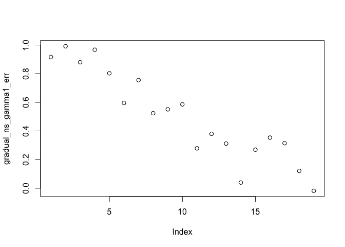<!-- -->

``` r
sudden_ns_gamma1_err <- sudden_gamma1_err[ c(1:10, 15:23)]
plot(sudden_ns_gamma1_err)
```

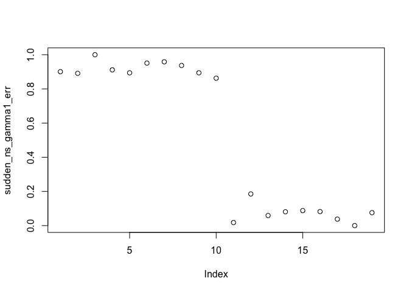<!-- -->

``` r
medium_ns_gamma1_err <- medium_gamma1_err[ c(1:10, 15:23)]
plot(medium_ns_gamma1_err)
```

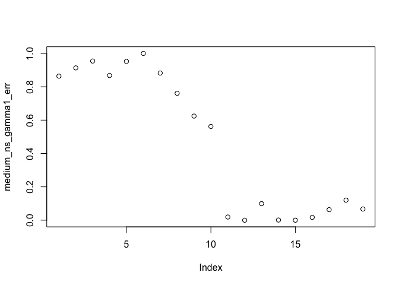<!-- -->

``` r
random_ns_gamma1<- random_gamma1[ c(1:10, 15:23)]
plot(random_ns_gamma1)
```

<!-- -->

## Gradual

``` r
gradual_ns_lda <- an_lda
gradual_ns_lda@gamma <- cbind(gradual_ns_gamma1_err, 1- gradual_ns_gamma1_err)

plot(gradual_ns_lda, xtime = c(c(1:10), c(15:23)))
```

<!-- -->

``` r
gradual_ns_ts <- TS_on_LDA(gradual_ns_lda, data.frame(tstep = c(c(1:10), c(15:23))), formulas = c(~1), nchangepoints = c(0,1,2), timename = "tstep", control = TS_control(nit = 1000))
```

    ## Running TS model with 0 changepoints and equation gamma ~ 1 on LDA model

    ## Running TS model with 1 changepoints and equation gamma ~ 1 on LDA model

    ##   Estimating changepoint distribution

    ##   Estimating regressor distribution

    ## Running TS model with 2 changepoints and equation gamma ~ 1 on LDA model

    ##   Estimating changepoint distribution

    ##   Estimating regressor distribution

``` r
gradual_ns_ts_selected <-select_TS(gradual_ns_ts)

plot(gradual_ns_ts_selected)
```

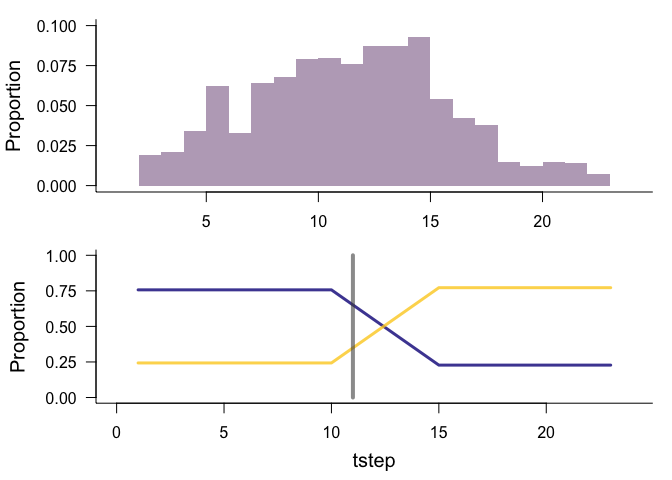<!-- -->

## Rapid

``` r
sudden_ns_lda <- an_lda
sudden_ns_lda@gamma <- cbind(sudden_ns_gamma1_err, 1- sudden_ns_gamma1_err)

plot(sudden_ns_lda, xtime = c(c(1:10), c(15:23)))
```

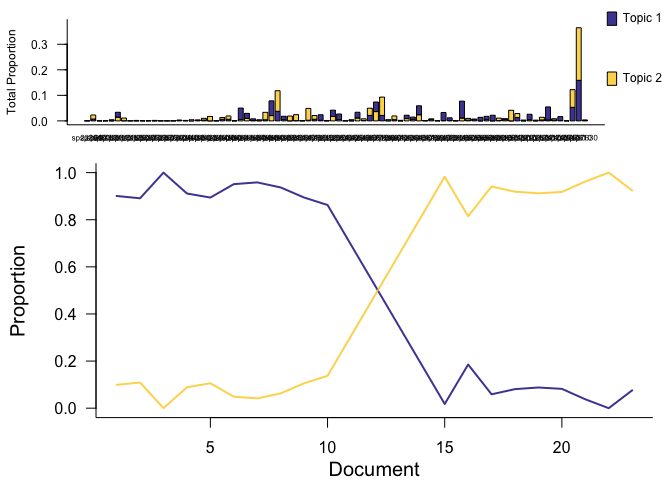<!-- -->

``` r
sudden_ns_ts <- TS_on_LDA(sudden_ns_lda, data.frame(tstep = c(c(1:10), c(15:23))), formulas = c(~1), nchangepoints = c(0,1,2), timename = "tstep", control = TS_control(nit = 1000))
```

    ## Running TS model with 0 changepoints and equation gamma ~ 1 on LDA model

    ## Running TS model with 1 changepoints and equation gamma ~ 1 on LDA model

    ##   Estimating changepoint distribution

    ##   Estimating regressor distribution

    ## Running TS model with 2 changepoints and equation gamma ~ 1 on LDA model

    ##   Estimating changepoint distribution

    ##   Estimating regressor distribution

``` r
sudden_ns_ts_selected <-select_TS(sudden_ns_ts)

plot(sudden_ns_ts_selected)
```

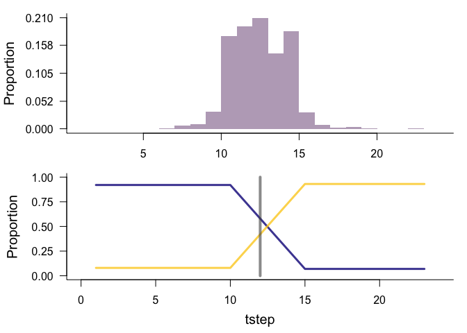<!-- -->

## Slower

``` r
medium_ns_lda <- an_lda
medium_ns_lda@gamma <- cbind(medium_ns_gamma1_err, 1- medium_ns_gamma1_err)

plot(medium_ns_lda)
```

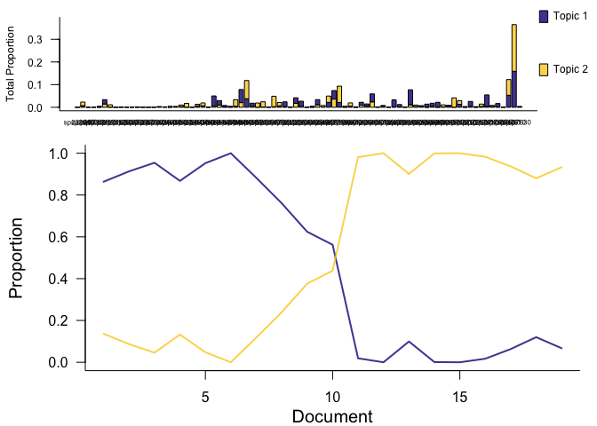<!-- -->

``` r
medium_ns_ts <- TS_on_LDA(medium_ns_lda, data.frame(tstep = c(c(1:10), c(15:23))), formulas = c(~1), nchangepoints = c(0,1,2), timename = "tstep", control = TS_control(nit = 1000))
```

    ## Running TS model with 0 changepoints and equation gamma ~ 1 on LDA model

    ## Running TS model with 1 changepoints and equation gamma ~ 1 on LDA model

    ##   Estimating changepoint distribution

    ##   Estimating regressor distribution

    ## Running TS model with 2 changepoints and equation gamma ~ 1 on LDA model

    ##   Estimating changepoint distribution

    ##   Estimating regressor distribution

``` r
medium_ns_ts_selected <-select_TS(medium_ns_ts)

plot(medium_ns_ts_selected)
```

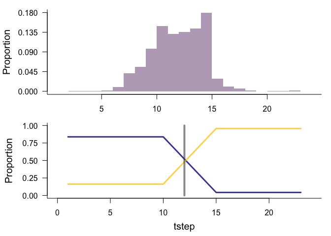<!-- -->

## Random

``` r
random_ns_lda <- an_lda
random_ns_lda@gamma <- cbind(random_ns_gamma1, 1- random_ns_gamma1)

plot(random_ns_lda)
```

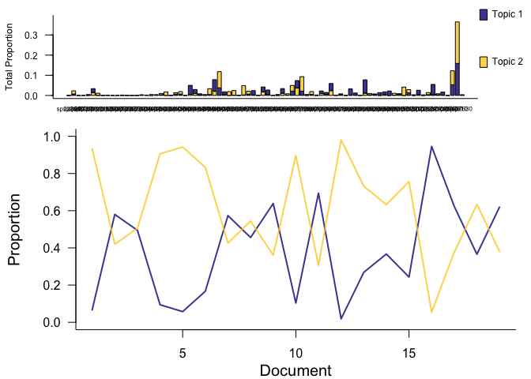<!-- -->

``` r
random_ns_ts <- TS_on_LDA(random_ns_lda, data.frame(tstep = c(c(1:10), c(15:23))), formulas = c(~1), nchangepoints = c(0,1,2), timename = "tstep", control = TS_control(nit = 1000))
```

    ## Running TS model with 0 changepoints and equation gamma ~ 1 on LDA model

    ## Running TS model with 1 changepoints and equation gamma ~ 1 on LDA model

    ##   Estimating changepoint distribution

    ##   Estimating regressor distribution

    ## Running TS model with 2 changepoints and equation gamma ~ 1 on LDA model

    ##   Estimating changepoint distribution

    ##   Estimating regressor distribution

``` r
random_ns_ts_selected <-select_TS(random_ns_ts)

plot(random_ns_ts_selected)
```

<!-- -->

# Overall posterior ests

Pulling the estimates for the changepoint location for the 6 scenarios
where the best model finds a changepoint (a random-noise one does not).

These are: a sudden transition, a slow transition over the whole TS, and
a more gradual transition occuring over the middle section of the TS.

Additionally, for each situation, I’ve created a non-sequential version
where the middle chunk of timesteps are removed. These are the timesteps
where the changepoints occur. Those are identified in these plots as
"\_ns".

Mean estimates and error bars for 95% interval of estimates:

``` r
ts_s <- list(
  sudden = sudden_ts_selected,
  sudden_ns = sudden_ns_ts_selected,
  gradual = gradual_ts_selected,
  gradual_ns = gradual_ns_ts_selected,
  medium = medium_ts_selected,
  medium_ns = medium_ns_ts_selected,
  random = random_ts_selected,
  random_ns = random_ns_ts_selected
)

extract_rhos <- function(ts_obj) {
  
  return(ts_obj$rho_summary)
  
}

ts_rhos <- lapply(ts_s, extract_rhos)

ts_rhos <- bind_rows(ts_rhos)

ts_rhos$datname <- names(ts_s)[ 1:6]

colnames(ts_rhos)[4:5] <- c("Lower", "Upper")

ggplot(ts_rhos, aes(Mean, datname, color = grepl("ns", datname))) +
  geom_point() +
  geom_errorbarh(aes(xmin = Lower, xmax = Upper))
```

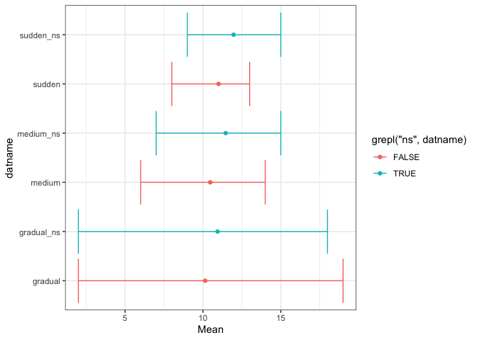<!-- -->

Means +/- two standard deviations:

``` r
ggplot(ts_rhos, aes(Mean, datname, color = grepl("ns", datname))) +
  geom_point() +
  geom_errorbarh(aes(xmin = Mean + 2 * SD, xmax = Mean - 2 * SD))
```

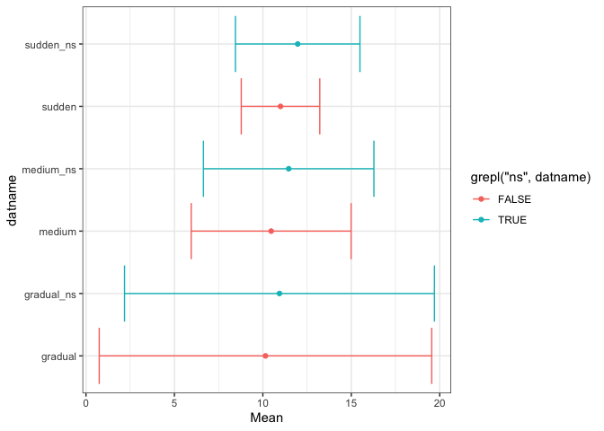<!-- -->
