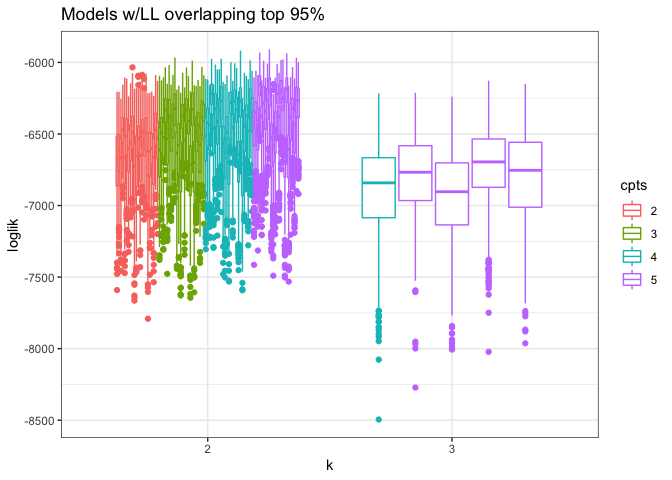
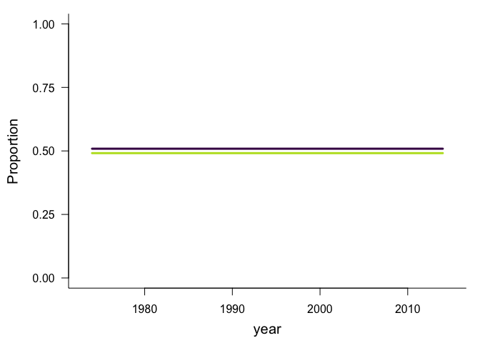
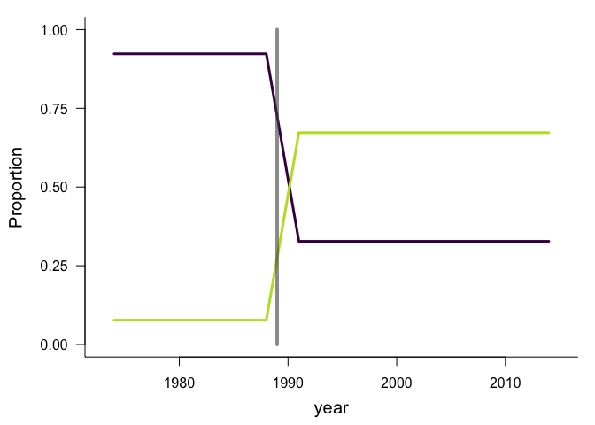
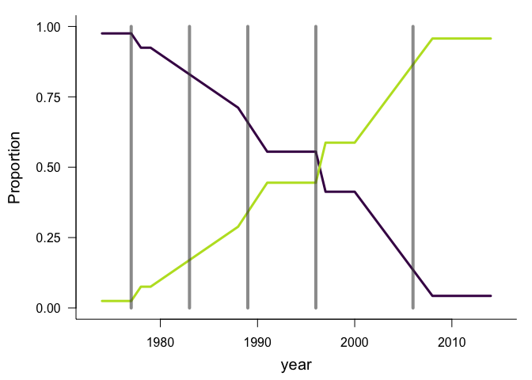

Model selection problem
================

<!-- So I don't know what to do with this. -->

<!-- * If we select an LDA + TS combo based **only** on AICc, I worry that we fall into overfitting: -->

<!-- ```{r aicc results} -->

<!-- ggplot(all_evals_summary, aes(x = cpts, y = aicc, color = cpts)) + -->

<!--   geom_point() + -->

<!-- facet_wrap(vars(k), nrow = 1) + -->

<!--   theme_bw() + -->

<!--   ggtitle("All models AICc") -->

<!-- ``` -->

<!-- Specifically, for k = up to 7 things maybe make sense: -->

<!-- ```{r} -->

<!-- ggplot(filter(all_evals_summary, as.numeric(k) <= 4), aes(x = cpts, y = aicc, color = cpts)) + -->

<!--   geom_point() + -->

<!-- facet_wrap(vars(k), nrow = 1) + -->

<!--   theme_bw() + -->

<!--   ggtitle("All models AICc") -->

<!-- ggplot(filter(all_evals_summary, as.numeric(k) <= 6), aes(x = cpts, y = aicc, color = cpts)) + -->

<!--   geom_point() + -->

<!-- facet_wrap(vars(k), nrow = 1) + -->

<!--   theme_bw() + -->

<!--   ggtitle("All models AICc") -->

<!-- ``` -->

<!-- For relatively few topics, I almost feel OK using AICc.  -->

<!-- As we expand to large numbers of topics, though: -->

<!-- ```{r} -->

<!-- ggplot(all_evals_summary, aes(x = cpts, y = aicc, color = cpts)) + -->

<!--   geom_point() + -->

<!-- facet_wrap(vars(k), nrow = 1) + -->

<!--   theme_bw() + -->

<!--   ggtitle("All models AICc") -->

<!-- ``` -->

<!-- We start to get 8 or 12 topic models that have *extremely low* AICc. We also start to see 10-15 topic models that are doing better than the 2-4 topic models. -->

<!-- This makes me suspicious. -->

We had invoked cross validation to try and do model selection based on
how well the model is able to predict withheld data. The goal there was
to avoid overfitting, and particularly a tendency to overfit by
assigning a different LDA topic to each timestep or each species.

When using cross validation, high-k models do indeed do poorly:

``` r
ggplot(all_evals_summary, aes(x = cpts, y = mean_ll, color = cpts)) +
  geom_point() +
facet_wrap(vars(k), nrow = 1) +
  theme_bw() +
  ggtitle("All models loglikelihood")
```

<!-- -->

But it’s difficult to distinguish between **changepoint** models:

``` r
highest_low_95 = max(all_evals_summary$lower_2_ll)

all_evals_summary <- all_evals_summary %>%
  mutate(in_95 = upper_97_ll >= highest_low_95)

head(all_evals_summary)
```

    ## # A tibble: 6 x 10
    ##   k     seed  cpts  cpts_seed_k cpts_k mean_ll upper_97_ll lower_2_ll n_infinite
    ##   <fct> <fct> <fct> <chr>       <chr>    <dbl>       <dbl>      <dbl>      <int>
    ## 1 2     16    5     5_16_2      2_5     -6167.      -6022.     -6374.          0
    ## 2 2     42    5     5_42_2      2_5     -6202.      -5996.     -6483.          0
    ## 3 2     24    5     5_24_2      2_5     -6210.      -5989.     -6519.          0
    ## 4 2     38    5     5_38_2      2_5     -6214.      -6031.     -6467.          0
    ## 5 2     34    5     5_34_2      2_5     -6225.      -6066.     -6430.          0
    ## 6 2     16    4     4_16_2      2_4     -6226.      -6053.     -6444.          0
    ## # … with 1 more variable: in_95 <lgl>

``` r
ggplot(filter(all_evals, cpts_seed_k %in% filter(all_evals_summary, in_95)$cpts_seed_k), aes(x = k, y = loglik, group = cpts_seed_k, color = cpts)) +
  geom_boxplot() +
#  facet_wrap(vars(cpts)) +
  theme_bw() +
  ggtitle("Models w/LL overlapping top 95%")
```

<!-- -->

``` r
source(here::here("analysis", "fxns", "crossval_fxns.R"))
load(here::here("old_but_mb_useful", "bbs_1_11.RData"))

dat <- bbs_rtrg_1_11

lda_8 <- LDATS::LDA_set_user_seeds(dat$abundance, topics = 2, seed = 16)
```

    ## Running LDA with 2 topics (seed 16)

``` r
plot(lda_8)
```

<!-- -->

``` r
ts_8 <- LDATS::TS_on_LDA(lda_8[[1]], as.data.frame(dat$covariates), formulas = ~1, nchangepoints = c(0, 1, 5), timename = "year", control = LDATS::TS_control(nit = 100))
```

    ## Running TS model with 0 changepoints and equation gamma ~ 1 on LDA model

    ## Running TS model with 1 changepoints and equation gamma ~ 1 on LDA model

    ##   Estimating changepoint distribution

    ##   Estimating regressor distribution

    ## Running TS model with 5 changepoints and equation gamma ~ 1 on LDA model

    ##   Estimating changepoint distribution

    ##   Estimating regressor distribution

``` r
for(i in 1:3){ 
gamma_plot(ts_8[[i]], selection = "mode")
}
```

<!-- --><!-- --><!-- -->
