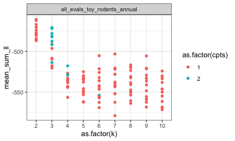
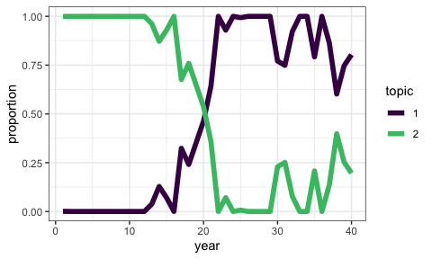
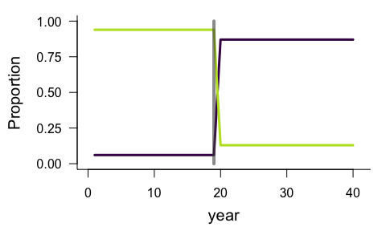
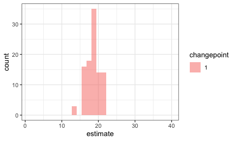

Overview
================
Renata Diaz
01 March, 2021

  - [Overview](#overview)
      - [Usefulness of the approach](#usefulness-of-the-approach)
      - [Applied to BBS](#applied-to-bbs)
  - [Technical details](#technical-details)
      - [Model selection](#model-selection)
  - [Sample results](#sample-results)
      - [What changepoints mean now](#what-changepoints-mean-now)
      - [What topics mean now](#what-topics-mean-now)
      - [Portal, reduced to annual
        samples](#portal-reduced-to-annual-samples)
      - [A BBS route](#a-bbs-route)

# Overview

## Usefulness of the approach

I am now thinking of LDATS as a tool for detecting & describing temporal
structure in timeseries of community composition. Community composition
may be relatively static over time, or might shift gradually or rapidly
between two or more transient states. A major challenge in detecting,
let alone explaining or predicting, such shifts relates to the high
dimensionality of most community data. The researcher has to choose
whether to focus on a few abundant or apparent species, use a
dimensionality reduction algorithm, or use a distance metric - neither
of which approaches is inherently suited to temporal community data.
LDATS accomplishes dimensionality reduction and temporal analysis, and
(now) optimizes the dimensionality reduction to facilitate accurate, but
parsimonious, description of specifically temporal dynamics.

## Applied to BBS

We take a macroecological approach to detecting and describing shifts
between community states for North American bird communities over the
past 40 years. We ask:

1.  How common it is to have a) relatively little temporal structure,
    meaning static or temporally randomish dynamics, or b) transitions
    between multiple states?
2.  (Potentially) Do these transitions tend to occur rapidly or
    gradually?

Beyond the scope here, this method could also be useful combined with
other data streams & community-specific hypotheses to ask:

*Do transitions - in particular rapid ones - coincide with periods of
overall low abundance? * Which species/groups are responsible for the
change? \* What endogenous or exogenous factors coincide with periods of
change? \* environmental shifts; key species crashing out; etc \* If
there are regional or national patterns in if or when transitions occur
\* e.g. New England is static but there are multiple states for
communities from the Southwest \* or, communities nationwide underwent a
shift between 1990-95

# Technical details

  - Following Christensen et al (and in a change from past years in
    MATSS-LDATS), we do not try to fit temporal dynamics - i.e. slope -
    within a time chunk. This is because fitting slopes allows the model
    to fit even very rapid, changepoint like dynamics within a single
    chunk. All models are fit as intercept-only within chunks. (`formula
    = response ~ 1`)
  - Also following C., we may be able to use the (un)certainty of the
    changepoint model’s estimates of when the changepoints occur to
    infer how rapidly or gradually a transition took place. I am still
    testing this for coarser (40-sample v 400-sample) datasets.
  - We proceed using the softmax transformation. **Juniper** - is this
    acceptable (even if not ideal)? My impression was that the softmax
    was most problematic when we were fitting slopes, but you’re the
    expert on these details.

## Model selection

**I want to give everyone, and especially technically-inclined folks,
the chance to investigate this, ask any questions, and raise any
concerns.**

Here in brief; see technical\_details.Rmd for details and figures.

The original LDATS implementation first selects an LDA via AIC and then
selects a TS model via AIC. This tends to select an LDA with a lot of
topics. The TS model then struggles to fit anything to the (very high
dimensional) topic proportions. See
<https://github.com/diazrenata/ldats2020/blob/master/orig_results.md>
for some example results.

I tried a combined/holistic selection process using leave-one-out
crossvalidation. That is, we try all possible combinations of numbers of
topics and numbers of changepoints, and pick the best *combination* of
number of topics and number of changepoints according to how well it
predicts withheld data. See here for some example results from this
procedure:
<https://github.com/diazrenata/ldats2020/blob/master/crossval_results.md>

Crossvalidation effectively curbs the tendency to have too many topics,
but tends to fit a lot of *changepoints*. We did not have this problem
when we selected the changepoints with AIC, because AIC penalizes for
additional parameters. A changepoint has to improve the fit so much that
it is “worth” the parameter penalty. However, with crossvalidation,
there is no penalty for parameters directly. Overly-complex models are
supposed to be selected against because they will be overfit and will do
a bad job predicting test data. The problem is that having an extra
changepoint doesn’t necessarily make a model so complex it is bad at
prediction - the change associated with the changepoint can be minimal
or nonexistent. This means extra changepoints can sometimes make the fit
a little better but rarely make it a lot worse.

A possible solution is to select the number of changepoints via AIC, so
we get the parameter penalty, and select the number of topics via
crossvalidation, so we get a topic structure that helps us capture the
gist of the whole community dynamics via a simple TS model. This is
tricky because 1) we can’t use AIC to compare TS models fit to different
LDAs, and 2) we need the TS fit in order to do crossvalidation on the
LDA.

A possible approach is to restrict the models considered via
crossvalidation to the best-scoring TS model for each particular LDA
fit. That is, for a particular LDA (2 topics, seed = 100), we fit a
bunch of TS models (0, 1, 2, 5 changepoints). We compare the TS models
via AIC, and enter *only the best-fitting TS model for each LDA* into
crossvalidation. We then use crossvalidation to pick the LDA model that,
when combined with its best-fitting TS model, allows for the best
performance at predicting withheld data.

That is, we might be comparing “2 topics, seed = 100, 2 changepoints”
with “5 topics, seed = 10, 0 changepoints”, and finding that the 2 topic
LDA, with 2 changepoints, does a better job recovering the actual
species abundances than a 5 topic LDA with no changepoints.

This seems to work. However, I would not have done it this way if not
for the string of issues discussed above. It’s unconventional\! See
below for sample results.

# Sample results

## What changepoints mean now

The presence & number of changepoints tells us how many community states
the model is using to describe the data and when the system changed from
one state to another.

The presence of a changepoint means there was a transition, but not
necessarily a *rapid* one. The uncertainty around *when* the changepoint
occurred may reflect how rapid it was.

Note that a transition doesn’t need to be a total overhaul of the
community/“regime shift” for the model to find a changepoint. It has to
be reasonably substantial and consistent, but just flagging that
transitions between states \!= regime shift.

## What topics mean now

In this application, the number of topics and the species composition of
the topics is less intuitively informative than in the Portal
application. Here, the topic structure doesn’t seem to be picking up on
“functional” community types with fine variation in their relative
proportions over time. Rather, we tend to see one topic corresponding to
the community state in one time period, and, if there is a transition to
another community state, another topic post-transition.

<!-- I think this is because of two related things. One, we have fewer time samples, so less capacity to detect fine scale dynamics. Two, we specifically look for the set of topics that allows the change point model to achieve a good fit, which means the topics need to have relatively simple temporal dynamics.  -->

## Portal, reduced to annual samples

(I am not doing monthly Portal because of the seasonal signal.)

This is a plot of the model performance (mean loglikelihood over
crossvalidation folds) on the y-axis, versus the number of topics (k) on
the x-axis. The colors are the number of changepoints. For a given
number of topics and changepoints, different dots are for LDA models fit
with different seeds.

High-topic models perform very poorly. The best performing models are
those with 2 topics and 1 changepoint.

    ## `summarise()` has grouped output by 'dataset', 'k', 'seed'. You can override using the `.groups` argument.

<!-- -->

Here are the 5 performing models. The top 4 all have 2 topics and 1
changepoint.

    ## # A tibble: 5 x 6
    ## # Groups:   dataset [1]
    ##   dataset                          k  seed  cpts mean_sum_ll dat_rank
    ##   <chr>                        <int> <int> <int>       <dbl>    <int>
    ## 1 all_evals_toy_rodents_annual     2     6     1       -461.        1
    ## 2 all_evals_toy_rodents_annual     2    30     1       -462.        2
    ## 3 all_evals_toy_rodents_annual     2    24     1       -467.        3
    ## 4 all_evals_toy_rodents_annual     2    18     1       -470.        4
    ## 5 all_evals_toy_rodents_annual     3    18     2       -471.        5

Here is what that model looks like. The LDA topics look to me like
“PP/PB/DO/DM” and “Everything else, including spectabs”.

    ## Running LDA with 2 topics (seed 6)

<!-- -->

These are the temporal dynamics for the LDA topics. The temporal shift
is a shift from “Everything else” to the small granivore/small krat
cocktail:

<!-- -->

Fitting the TS model to those LDA topics, we (unsuprisingly) get a
single changepoint around year 20.

    ## Running TS model with 1 changepoints and equation gamma ~ 1 on LDA model k: 2, seed: 6

    ##   Estimating changepoint distribution

    ##   Estimating regressor distribution

<!-- -->

    ## `stat_bin()` using `bins = 30`. Pick better value with `binwidth`.

    ## Warning: Removed 2 rows containing missing values (geom_bar).

<!-- -->

## A BBS route

Here is a totally arbitrary BBS route.

Again, the model loglikelihoods for models with different numbers of
topics (x axis) and changepoints (color). Again, very high topic models
do poorly. This one has a peak for a 3-topic LDA with 2 changepoints:

    ## `summarise()` has grouped output by 'dataset', 'k', 'seed'. You can override using the `.groups` argument.

<!-- -->

Here are the top 10. 9/10 of them have the same number of topics and
changepoints.

    ## # A tibble: 10 x 6
    ## # Groups:   dataset [1]
    ##    dataset                     k  seed  cpts mean_sum_ll dat_rank
    ##    <chr>                   <int> <int> <int>       <dbl>    <int>
    ##  1 all_evals_bbs_rtrg_1_11     3     8     2       -464.        1
    ##  2 all_evals_bbs_rtrg_1_11     3    12     2       -467.        2
    ##  3 all_evals_bbs_rtrg_1_11     3     6     2       -470.        3
    ##  4 all_evals_bbs_rtrg_1_11     3     4     2       -470.        4
    ##  5 all_evals_bbs_rtrg_1_11     3    14     2       -473.        5
    ##  6 all_evals_bbs_rtrg_1_11     3    10     2       -476.        6
    ##  7 all_evals_bbs_rtrg_1_11     4    12     2       -480.        7
    ##  8 all_evals_bbs_rtrg_1_11     3    22     2       -484.        8
    ##  9 all_evals_bbs_rtrg_1_11     3    18     2       -488.        9
    ## 10 all_evals_bbs_rtrg_1_11     3    20     2       -489.       10

Here is what that model looks like.

First, the actual species dynamics - I unfortunately don’t find these
plots terribly informative:

<!-- -->

Plotting the LDA topic composition and the temporal dynamics of the LDA
topics:

    ## Running LDA with 3 topics (seed 8)

    ## Running TS model with 2 changepoints and equation gamma ~ 1 on LDA model

    ##   Estimating changepoint distribution

    ##   Estimating regressor distribution

<!-- --><!-- -->

And estimates from the changepoint model:

<!-- -->

    ## `stat_bin()` using `bins = 30`. Pick better value with `binwidth`.

    ## Warning: Removed 4 rows containing missing values (geom_bar).

<!-- -->
