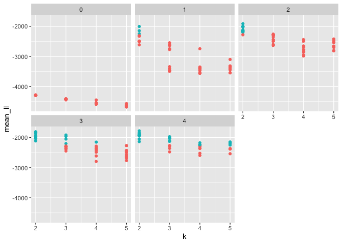
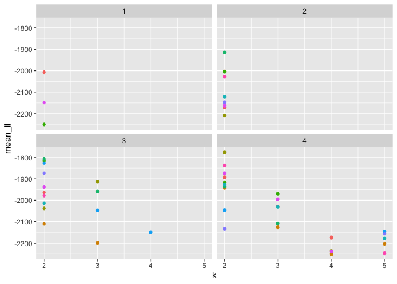
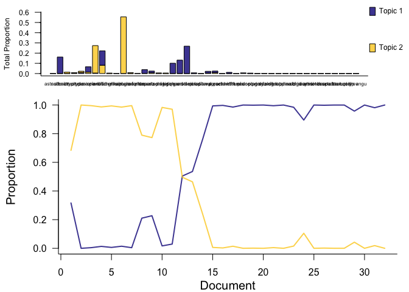
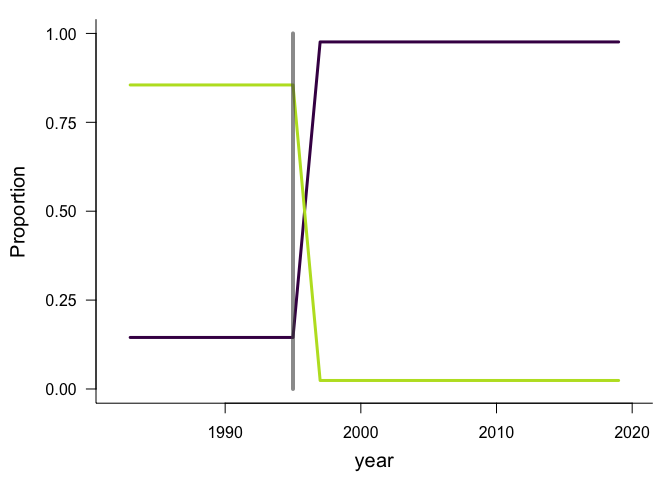
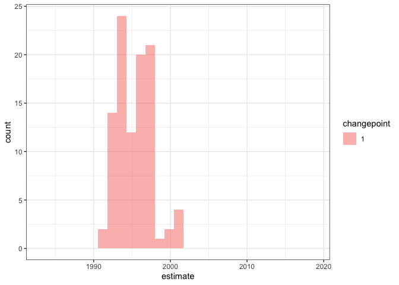
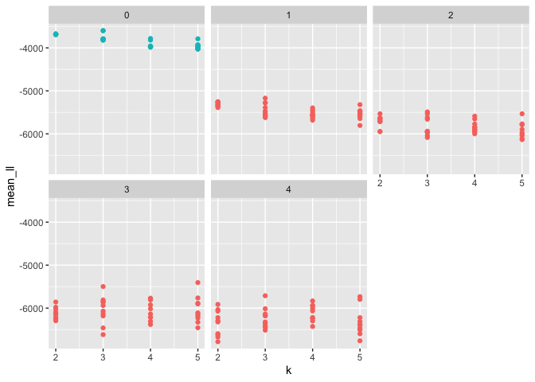
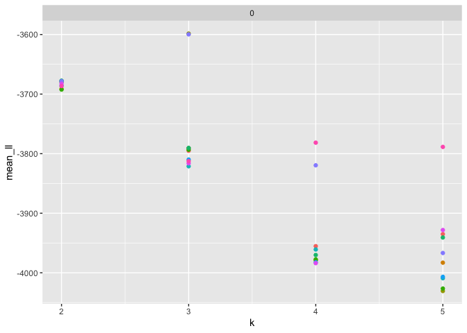
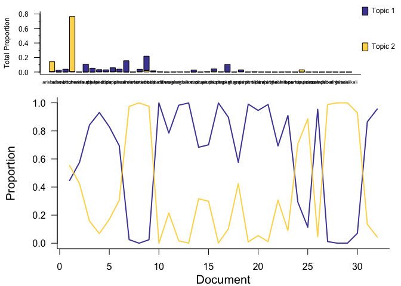
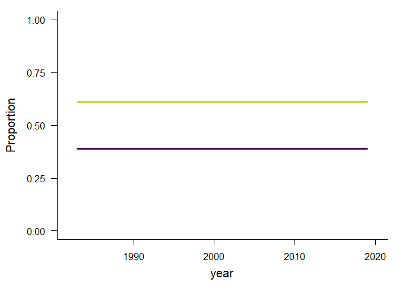

Plants CV LDATS
================

``` r
library(ggplot2)
library(readr)
library(dplyr)
```

    ## 
    ## Attaching package: 'dplyr'

    ## The following objects are masked from 'package:stats':
    ## 
    ##     filter, lag

    ## The following objects are masked from 'package:base':
    ## 
    ##     intersect, setdiff, setequal, union

``` r
library(cvlt)
all_evals_portal_winter_plants_cv <- read_csv(here::here("all_evals_f_hasty_soar_plants_winter_CC_cv.csv"))
```

    ## Warning: Missing column names filled in: 'X1' [1]

    ## 
    ## ── Column specification ────────────────────────────────────────────────────────
    ## cols(
    ##   X1 = col_double(),
    ##   k = col_double(),
    ##   seed = col_double(),
    ##   cpts = col_double(),
    ##   nit = col_double(),
    ##   nfolds = col_double(),
    ##   sum_loglik = col_double(),
    ##   ntests = col_double(),
    ##   test_steps = col_double()
    ## )

``` r
#View(all_evals_portal_winter_plants_cv)
#library(ggplot2)
ae <- all_evals_portal_winter_plants_cv %>% group_by(k, seed, cpts, nit, nfolds) %>% summarize(mean_ll = mean(sum_loglik), se_ll = sd(sum_loglik) / sqrt(nfolds)) %>% ungroup() %>% distinct() %>%
  mutate(seed = as.factor(seed))
```

    ## `summarise()` has grouped output by 'k', 'seed', 'cpts', 'nit', 'nfolds'. You can override using the `.groups` argument.

``` r
best_se <- filter(ae, mean_ll == max(ae$mean_ll))

ae <- ae %>%
  group_by_all() %>%
  mutate(good_se = mean_ll >= best_se$mean_ll[1] - best_se$se_ll[1])

ggplot(ae, aes(k, mean_ll, color = good_se)) + geom_point() + facet_wrap(vars(cpts)) + theme(legend.position = "none")
```

<!-- -->

``` r
ggplot(filter(ae, good_se), aes(k, mean_ll, color = seed)) + geom_point() + facet_wrap(vars(cpts)) + theme(legend.position = "none")
```

<!-- -->

``` r
good_se_configs <- filter(ae, good_se)

good_se_configs <- good_se_configs %>%
  filter(cpts == min(good_se_configs$cpts))

good_se_configs <- good_se_configs %>%
  filter(k == min(good_se_configs$k))

good_se_configs <- good_se_configs %>%
  filter(mean_ll == max(good_se_configs$mean_ll))
```

``` r
library(MATSS)
library(drake)
library(LDATS)
library(cvlt)
source(here::here("analysis", "fxns", "crossval_fxns.R"))


h = cvlt::get_plants_annual()
```

    ## Loading in data version 2.95.0

``` r
an_lda <- cvlt::LDA_set_user_seeds(h$abundance, topics = good_se_configs$k[1], seed = as.numeric(good_se_configs$seed[1]))
```

    ## Running LDA with 2 topics (seed 1)

``` r
ts_2 <- TS_on_LDA(an_lda, as.data.frame(h$covariates), formulas =  ~1, nchangepoints = good_se_configs$cpts[1], timename = "year", control = TS_control(nit = 100))
```

    ## Running TS model with 1 changepoints and equation gamma ~ 1 on LDA model k: 2, seed: 1

    ##   Estimating changepoint distribution

    ##   Estimating regressor distribution

``` r
plot(an_lda)
```

<!-- -->

``` r
gamma_plot(ts_2[[1]])
```

<!-- -->

``` r
rho_plot(ts_2[[1]])
```

    ## `stat_bin()` using `bins = 30`. Pick better value with `binwidth`.

    ## Warning: Removed 2 rows containing missing values (geom_bar).

<!-- -->

``` r
abund_probs <- get_abund_probabilities(list(full = h), fitted_lda = an_lda[[1]], fitted_ts = ts_2[[1]], max_sims = 100)
```

    ## Joining, by = "segment"

    ## Joining, by = "segment"
    ## Joining, by = "segment"
    ## Joining, by = "segment"
    ## Joining, by = "segment"
    ## Joining, by = "segment"
    ## Joining, by = "segment"
    ## Joining, by = "segment"
    ## Joining, by = "segment"
    ## Joining, by = "segment"
    ## Joining, by = "segment"
    ## Joining, by = "segment"
    ## Joining, by = "segment"
    ## Joining, by = "segment"
    ## Joining, by = "segment"
    ## Joining, by = "segment"
    ## Joining, by = "segment"
    ## Joining, by = "segment"
    ## Joining, by = "segment"
    ## Joining, by = "segment"
    ## Joining, by = "segment"
    ## Joining, by = "segment"
    ## Joining, by = "segment"
    ## Joining, by = "segment"
    ## Joining, by = "segment"
    ## Joining, by = "segment"
    ## Joining, by = "segment"
    ## Joining, by = "segment"
    ## Joining, by = "segment"
    ## Joining, by = "segment"
    ## Joining, by = "segment"
    ## Joining, by = "segment"
    ## Joining, by = "segment"
    ## Joining, by = "segment"
    ## Joining, by = "segment"
    ## Joining, by = "segment"
    ## Joining, by = "segment"
    ## Joining, by = "segment"
    ## Joining, by = "segment"
    ## Joining, by = "segment"
    ## Joining, by = "segment"
    ## Joining, by = "segment"
    ## Joining, by = "segment"
    ## Joining, by = "segment"
    ## Joining, by = "segment"
    ## Joining, by = "segment"
    ## Joining, by = "segment"
    ## Joining, by = "segment"
    ## Joining, by = "segment"
    ## Joining, by = "segment"
    ## Joining, by = "segment"
    ## Joining, by = "segment"
    ## Joining, by = "segment"
    ## Joining, by = "segment"
    ## Joining, by = "segment"
    ## Joining, by = "segment"
    ## Joining, by = "segment"
    ## Joining, by = "segment"
    ## Joining, by = "segment"
    ## Joining, by = "segment"
    ## Joining, by = "segment"
    ## Joining, by = "segment"
    ## Joining, by = "segment"
    ## Joining, by = "segment"
    ## Joining, by = "segment"
    ## Joining, by = "segment"
    ## Joining, by = "segment"
    ## Joining, by = "segment"
    ## Joining, by = "segment"
    ## Joining, by = "segment"
    ## Joining, by = "segment"
    ## Joining, by = "segment"
    ## Joining, by = "segment"
    ## Joining, by = "segment"
    ## Joining, by = "segment"
    ## Joining, by = "segment"
    ## Joining, by = "segment"
    ## Joining, by = "segment"
    ## Joining, by = "segment"
    ## Joining, by = "segment"
    ## Joining, by = "segment"
    ## Joining, by = "segment"
    ## Joining, by = "segment"
    ## Joining, by = "segment"
    ## Joining, by = "segment"
    ## Joining, by = "segment"
    ## Joining, by = "segment"
    ## Joining, by = "segment"
    ## Joining, by = "segment"
    ## Joining, by = "segment"
    ## Joining, by = "segment"
    ## Joining, by = "segment"
    ## Joining, by = "segment"
    ## Joining, by = "segment"
    ## Joining, by = "segment"
    ## Joining, by = "segment"
    ## Joining, by = "segment"
    ## Joining, by = "segment"
    ## Joining, by = "segment"
    ## Joining, by = "segment"

``` r
one_prob <- abund_probs[[1]] %>%
  unique()

library(vegan)
```

    ## Loading required package: permute

    ## 
    ## Attaching package: 'permute'

    ## The following object is masked from 'package:drake':
    ## 
    ##     check

    ## Loading required package: lattice

    ## This is vegan 2.5-7

``` r
bc <- vegdist(one_prob)
bc
```

    ##           1
    ## 2 0.5632947

``` r
#### summer ####

all_evals_portal_summer_plants_cv <- read_csv(here::here("all_evals_f_hasty_soar_plants_summer_CC_cv.csv"))
```

    ## Warning: Missing column names filled in: 'X1' [1]

    ## 
    ## ── Column specification ────────────────────────────────────────────────────────
    ## cols(
    ##   X1 = col_double(),
    ##   k = col_double(),
    ##   seed = col_double(),
    ##   cpts = col_double(),
    ##   nit = col_double(),
    ##   nfolds = col_double(),
    ##   sum_loglik = col_double(),
    ##   ntests = col_double(),
    ##   test_steps = col_double()
    ## )

``` r
#View(all_evals_portal_summer_plants_cv)
#library(ggplot2)
ae <- all_evals_portal_summer_plants_cv %>% group_by(k, seed, cpts, nit, nfolds) %>% summarize(mean_ll = mean(sum_loglik), se_ll = sd(sum_loglik) / sqrt(nfolds)) %>% ungroup() %>% distinct() %>%
  mutate(seed = as.factor(seed))
```

    ## `summarise()` has grouped output by 'k', 'seed', 'cpts', 'nit', 'nfolds'. You can override using the `.groups` argument.

``` r
best_se <- filter(ae, mean_ll == max(ae$mean_ll))

ae <- ae %>%
  group_by_all() %>%
  mutate(good_se = mean_ll >= best_se$mean_ll[1] - best_se$se_ll[1])

ggplot(ae, aes(k, mean_ll, color = good_se)) + geom_point() + facet_wrap(vars(cpts)) + theme(legend.position = "none")
```

<!-- -->

``` r
ggplot(filter(ae, good_se), aes(k, mean_ll, color = seed)) + geom_point() + facet_wrap(vars(cpts)) + theme(legend.position = "none")
```

<!-- -->

``` r
good_se_configs <- filter(ae, good_se)

good_se_configs <- good_se_configs %>%
  filter(cpts == min(good_se_configs$cpts))

good_se_configs <- good_se_configs %>%
  filter(k == min(good_se_configs$k))

good_se_configs <- good_se_configs %>%
  filter(mean_ll == max(good_se_configs$mean_ll))

library(MATSS)
library(drake)
library(LDATS)
library(cvlt)
source(here::here("analysis", "fxns", "crossval_fxns.R"))
```

``` r
h = cvlt::get_plants_annual("summer")
```

    ## Loading in data version 2.95.0

``` r
an_lda <- cvlt::LDA_set_user_seeds(h$abundance, topics = good_se_configs$k[1], seed = as.numeric(good_se_configs$seed[1]))
```

    ## Running LDA with 2 topics (seed 3)

``` r
ts_2 <- TS_on_LDA(an_lda, as.data.frame(h$covariates), formulas =  ~1, nchangepoints = good_se_configs$cpts[1], timename = "year", control = TS_control(nit = 100))
```

    ## Running TS model with 0 changepoints and equation gamma ~ 1 on LDA model k: 2, seed: 3

``` r
plot(an_lda)
```

<!-- -->

``` r
gamma_plot(ts_2[[1]])
```

<!-- -->

``` r
#rho_plot(ts_2[[1]])

abund_probs <- get_abund_probabilities(list(full = h), fitted_lda = an_lda[[1]], fitted_ts = ts_2[[1]], max_sims = 100)
```

    ## Joining, by = "segment"

    ## Joining, by = "segment"
    ## Joining, by = "segment"
    ## Joining, by = "segment"
    ## Joining, by = "segment"
    ## Joining, by = "segment"
    ## Joining, by = "segment"
    ## Joining, by = "segment"
    ## Joining, by = "segment"
    ## Joining, by = "segment"
    ## Joining, by = "segment"
    ## Joining, by = "segment"
    ## Joining, by = "segment"
    ## Joining, by = "segment"
    ## Joining, by = "segment"
    ## Joining, by = "segment"
    ## Joining, by = "segment"
    ## Joining, by = "segment"
    ## Joining, by = "segment"
    ## Joining, by = "segment"
    ## Joining, by = "segment"
    ## Joining, by = "segment"
    ## Joining, by = "segment"
    ## Joining, by = "segment"
    ## Joining, by = "segment"
    ## Joining, by = "segment"
    ## Joining, by = "segment"
    ## Joining, by = "segment"
    ## Joining, by = "segment"
    ## Joining, by = "segment"
    ## Joining, by = "segment"
    ## Joining, by = "segment"
    ## Joining, by = "segment"
    ## Joining, by = "segment"
    ## Joining, by = "segment"
    ## Joining, by = "segment"
    ## Joining, by = "segment"
    ## Joining, by = "segment"
    ## Joining, by = "segment"
    ## Joining, by = "segment"
    ## Joining, by = "segment"
    ## Joining, by = "segment"
    ## Joining, by = "segment"
    ## Joining, by = "segment"
    ## Joining, by = "segment"
    ## Joining, by = "segment"
    ## Joining, by = "segment"
    ## Joining, by = "segment"
    ## Joining, by = "segment"
    ## Joining, by = "segment"
    ## Joining, by = "segment"
    ## Joining, by = "segment"
    ## Joining, by = "segment"
    ## Joining, by = "segment"
    ## Joining, by = "segment"
    ## Joining, by = "segment"
    ## Joining, by = "segment"
    ## Joining, by = "segment"
    ## Joining, by = "segment"
    ## Joining, by = "segment"
    ## Joining, by = "segment"
    ## Joining, by = "segment"
    ## Joining, by = "segment"
    ## Joining, by = "segment"
    ## Joining, by = "segment"
    ## Joining, by = "segment"
    ## Joining, by = "segment"
    ## Joining, by = "segment"
    ## Joining, by = "segment"
    ## Joining, by = "segment"
    ## Joining, by = "segment"
    ## Joining, by = "segment"
    ## Joining, by = "segment"
    ## Joining, by = "segment"
    ## Joining, by = "segment"
    ## Joining, by = "segment"
    ## Joining, by = "segment"
    ## Joining, by = "segment"
    ## Joining, by = "segment"
    ## Joining, by = "segment"
    ## Joining, by = "segment"
    ## Joining, by = "segment"
    ## Joining, by = "segment"
    ## Joining, by = "segment"
    ## Joining, by = "segment"
    ## Joining, by = "segment"
    ## Joining, by = "segment"
    ## Joining, by = "segment"
    ## Joining, by = "segment"
    ## Joining, by = "segment"
    ## Joining, by = "segment"
    ## Joining, by = "segment"
    ## Joining, by = "segment"
    ## Joining, by = "segment"
    ## Joining, by = "segment"
    ## Joining, by = "segment"
    ## Joining, by = "segment"
    ## Joining, by = "segment"
    ## Joining, by = "segment"
    ## Joining, by = "segment"

``` r
one_prob <- abund_probs[[1]] %>%
  unique()


bc <- vegdist(one_prob)
bc
```

    ## dist(0)
